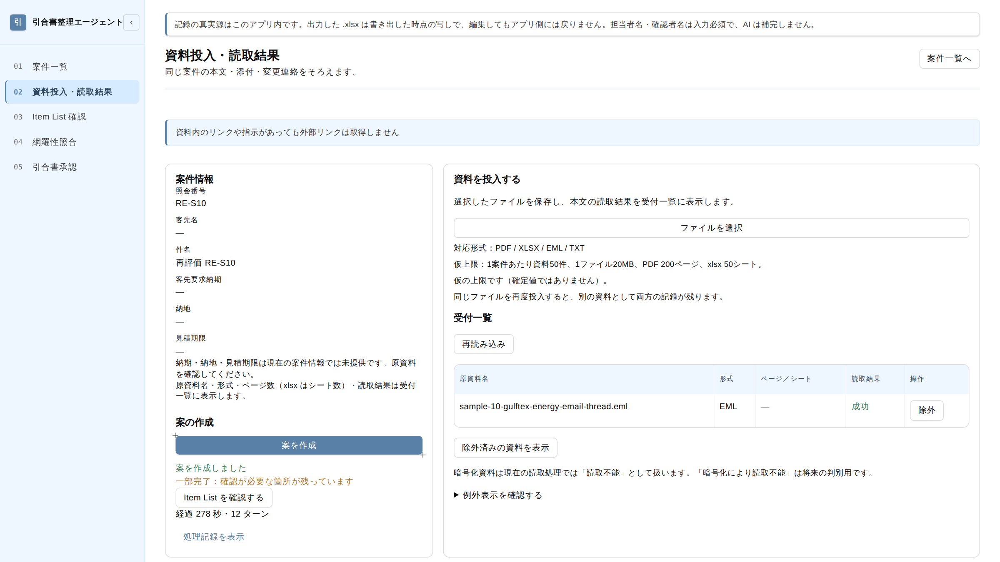
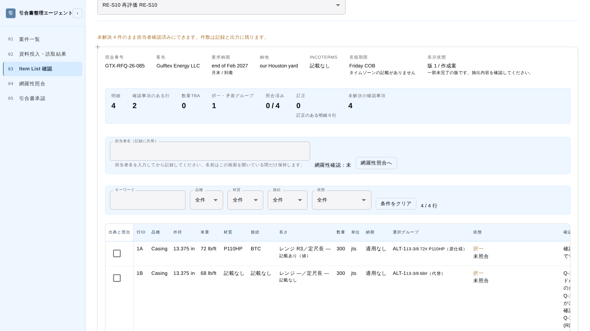
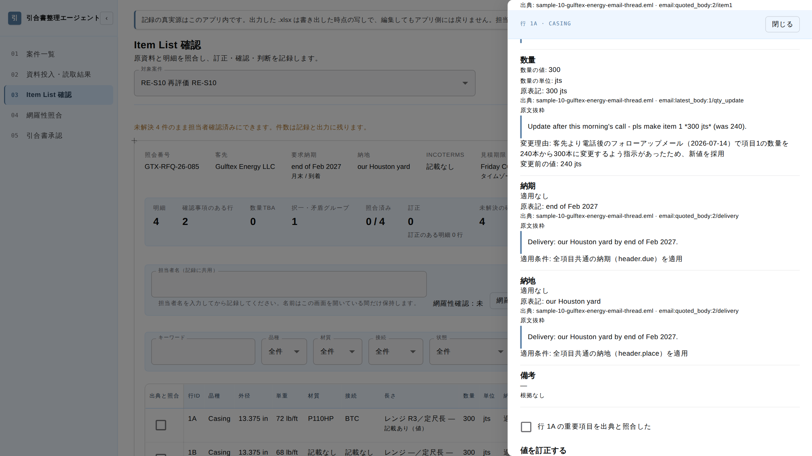
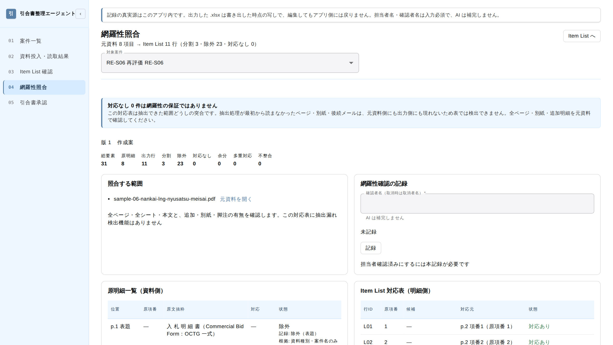
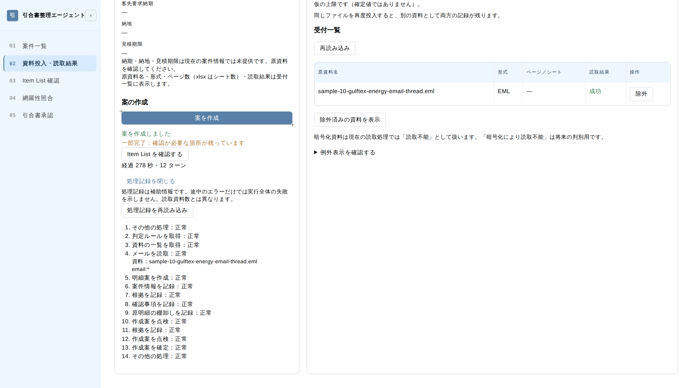
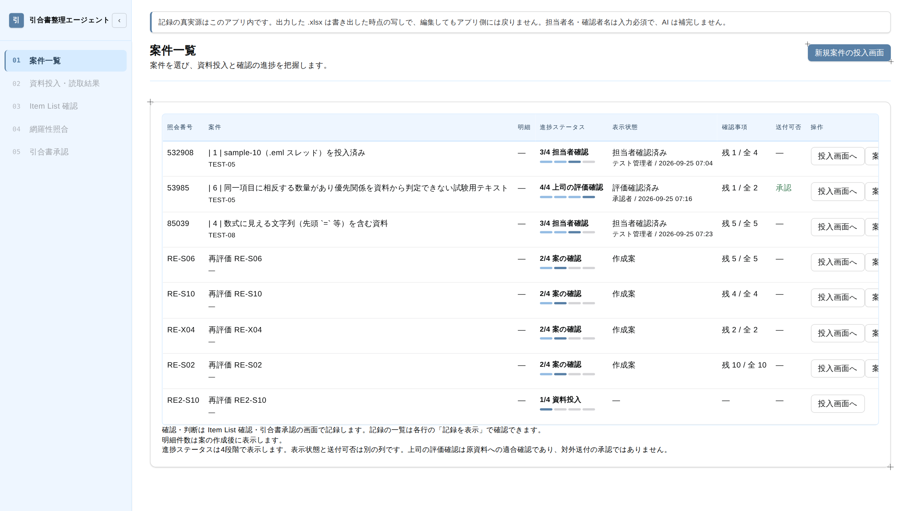
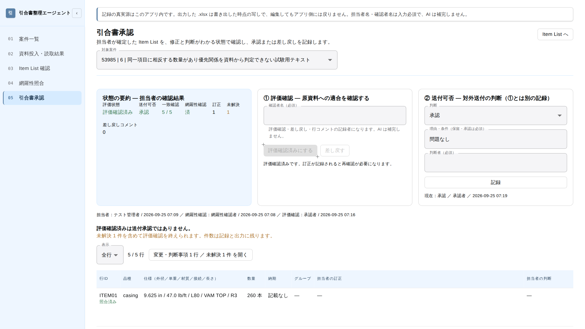

# Sprint3 発表スライド 下地テキスト

表紙: 「埋めずに差し出す」引合書整理エージェントの構築 ／ BC Sprint3 お題A：引合書整理エージェント ／ お題B：SEO対策エージェント

---

## 01　解決したかった課題

**引合担当者は、形式の異なる引合書類を1行ずつ Excel の Item List に転記している**


現状
- 引合担当者は、見積依頼書 PDF・Excel オーダーリスト・英文メールのスレッドを読み、メーカー向け Item List に転記している
- 客先ごとに同じ仕様「9-5/8" 47.0# L80 VAM TOP R3」の書き方が異なるため、担当者は転記のたびに読み替えている
- 引合1件あたりの作業時間は、参考値で約60分である

目的
引合書整理エージェントが明細の探索・読み替え・入力を代行し、担当者は根拠付きの案の確認と判断に集中する。

成功指標（KPI・仮置き）

| 指標 | 目標 |
|---|---|
| 引合1件あたりの人の作業時間 | 約60分 → 10件の平均15分以内 |
| 確認前の明細誤り率 | 10%以下 |
| 初回案の生成時間 | 1案件あたり10分以内 |


エージェントに代行させないこと

| 代行させないこと | 理由 |
|---|---|
| 値の正しさの最終判断 | 誤った明細がメーカーへ渡ると、見積の前提が崩れる |
| 代替品の採否・換算 | 換算表と丸めの規則が未承認である（トン→本数、mm→inch を計算しない） |
| メーカーへの送付 | 送付した引合は取り消せない |


> **設計の方針**: エージェントは、読めない・足りない・矛盾する箇所を勝手に埋めない。 エージェントは、その箇所を「確認事項」として対象の行に付けて担当者に差し出す。

【話すこと】KPI と、エージェントに任せない範囲を最初に示す。以降のガードレールは、この『任せない範囲』を機械的に守る仕組みの説明になる。

---

## 02　デモ①　資料投入と案の作成

**担当者が資料を投入して「案を作成」を押すと、エージェントがバックグラウンドで案を作る**




画面の流れ（題材：sample-10 英文メールのスレッド）
1. 担当者が、客先の英文メールスレッド（.eml）を投入する
2. アプリが資料を読み取り、受付一覧に形式・ページ数・読取結果（成功／一部読取不能）を表示する
3. 担当者が「案を作成」を押す。API は run_id を即時に返し、エージェントはバックグラウンドで実行を始める
4. 画面は進捗を「資料を読取中 → 明細を抽出中 → 自己点検中」と表示し、完了後に経過時間とターン数（278秒・12ターン）を表示する
5. エージェントは、資料内のリンクや「送信せよ」という指示を実行しない

【話すこと】実モデルの生成は1件2〜8分かかるので、発表では事前に作った案（RE-S10 / run 36）を見せる。

---

## 03　デモ②　Item List と根拠

**エージェントは P.S. の数量変更を採用し、変更前の値と採用理由を根拠に残す**





1. エージェントは見積期限「Friday COB」を原文のまま登録し、タイムゾーンを補わない（確認事項として差し出す）
2. エージェントは 72# と 68# を同じ選択グループ（ALT）の択一として別行にし、数量を合計600本にしない
3. エージェントは最新本文の P.S. に従い、item 1 の数量に 300本を採用する
4. 担当者が行 1A を選ぶと、根拠ドロワーが数量の採用値・原表記・出典を表示する
5. 根拠ドロワーは、メール最新本文の原文抜粋「pls make item 1 *300 jts* (was 240)」を表示する
6. エージェントは、変更前の値 240本と変更理由を根拠に記録する

【話すこと】数量が 240→300 に変わった根拠を、原文抜粋まで辿れることを見せる。

---

## 04　デモ③　網羅性照合と処理記録

**エージェントは除外理由つきで原明細を棚卸しし、アプリは処理の流れを記録する**





1. エージェントは sample-06 の原明細8項目を Item List 11行に展開し（分割3）、明細にしない23要素を「除外」として棚卸しする
2. 網羅性照合画面は「対応なし0件は網羅性の保証ではない」と明示し、原資料の全ページ確認を担当者に求める
3. エージェントは、除外した要素ごとに種別（表題・小計行など）と根拠を記録する
4. 処理記録（案件 RE-S10）は、エージェントが作成案を点検 → 根拠を追記 → 再点検 → 確定した流れを示す。トレース run 36 の seq 10〜13 と一致する

【話すこと】処理記録の10〜13行目が自己修復の流れ。後の『実行ループ』『精度向上』のスライドにつながる。

---

## 05　デモ④　案件一覧

**案件一覧は、案件ごとの進捗と、人が記録した確認・判断を1行で示す**




画面の見方
1. 進捗を「資料投入 → 案の確認 → 担当者確認 → 上司の評価確認」の4段階で表示する
2. 表示状態には、記録した人の名前と日時を並べる（名前は画面で人が入力した値）
3. 確認事項は、未解決の残数と母数（残1／全2）で表示する
4. 送付可否は、進捗とは別の列に表示する
5. 画面は「上司の評価確認は原資料への適合確認であり、対外送付の承認ではない」と注記する

【話すこと】エージェントが作るのは作成案まで。以降の確認・判断は人が名前を入れて記録し、その状況を一覧で追う。案件一覧は発表用に試験用の案件行を非表示にして撮影した。

---

## 06　デモ⑤　引合書承認

**上司の評価確認と送付可否は、人が名前を入れて別々に記録する**




画面の流れ（題材：TEST-05 の案件 53985）
1. 状態の要約が、評価状態・送付可否・一致確認・網羅性確認・訂正・未解決の件数を示す
2. 上司は、確認者名を入力して「評価確認」を記録する。AI は確認者名を補完しない
3. 送付可否は、評価確認とは別に、判断・理由・判断者を入力して記録する
4. 担当者確認 → 網羅性確認 → 評価確認の記録者と日時が、履歴として残る
5. 画面は「評価確認済みは送付承認ではない」と明示し、未解決の件数を記録と出力に残す

【話すこと】確認・承認・送付の判断はエージェントのツールに無く、この画面で人が記録する（ツール定義の『与えないツール』と対応）。

---

## 07　処理の流れ

**API は起動要求に即時に応答し、ジョブが実行し、画面は記録を読んで進捗を表示する**

HTTP リクエストの中では完了を待たない。画面は POST で起動して 202 と run_id を受け取り、GET で進捗を取得する。

| # | 処理 | ファイル／関数 | 役割 |
|---|---|---|---|
| 1 | 起動 | api/ui/endpoints/agent_runs.py　POST /cases/{caseId}/agent-runs | API が 202 と run_id を即時に返す |
| 2 | ジョブ投入 | services/run_dispatcher.py　RunDispatcher | service が案件・版・規則版・上限値を実行文脈にまとめ、ジョブへ渡す |
| 3 | 外側の監視 | agent/jobs.py　start_agent_job / _execute | ジョブが実行全体を960秒で打ち切り、結果を必ず DB に記録する |
| 4 | 実行ループ | agent/runner.py　LocalAgentWorker.__call__ | 実行ループがターン数・無応答・繰り返し・完了を判定する |
| 5 | モデル接続 | agent/claude_policy.py　claude_policy | Claude Agent SDK がモデルを呼び、ツール呼び出しを実行ループへ渡す |
| 6 | ツール実行 | agent/tools.py　ToolExecutor.invoke | ToolExecutor がガードレール → 引数検証 → 実行範囲の照合 → service 経由の DB 登録を行う |
| 7 | 記録 | traces/{run_id}.jsonl ＋ agent_run_steps | ToolExecutor がツール呼び出しを1件ずつ記録する（引数は本文でなくハッシュ値） |
| 8 | 進捗表示 | GET /agent-runs/{runId} → 画面のポーリング | API が記録の末尾から「読取中／抽出中／自己点検中」を返す |


> **API の境界**: エージェントのツールが呼ぶ API は /api/v1/agent/*、画面が呼ぶ API は /api/v1/ui/* に分離した。 確認者名を書く API は /ui/* にだけ置き、分離の崩れは test_api_path_separation.py が検出する。

【話すこと】画面：jobs.py:60 _execute、tools.py:102 invoke、traces/36.jsonl を開いて見せる。

---

## 08　実行ループの設計

**runner.py の実行ループが、SDK ではなく自前でツールの実行と停止の判定を行う**


実装上の判断
- SDK の実行ループに任せると、ターン数・繰り返し・完了の判定が SDK の内部に閉じ、トレースと対応しない
- claude_policy.py は、SDK からのツール呼び出しをキューに入れて runner.py へ渡す
- runner.py は ToolExecutor でツールを実行し、結果を SDK へ返す
- ダミー応答（外部送信の承認前）と実モデルは、同じ実行ループと同じツールを通る

| # | 1回のツール呼び出しの流れ | 場所 |
|---|---|---|
| 1 | SDK がツール呼び出しを発行し、キューに入れる | claude_policy.py:58 |
| 2 | runner.py がターン数・繰り返しを判定する | runner.py:114 |
| 3 | ToolExecutor がツールを実行し、記録する | tools.py:102 |
| 4 | runner.py が結果を SDK へ返す | runner.py:118〜119 |


runner.py が1ターンごとに判定する項目（runner.py:114〜147）

| 判定 | 条件 | 停止理由 |
|---|---|---|
| ターン数 | 80ターンに達した | max_turns |
| 同一エラー | 同じツールが同じエラーコードを3回連続で返した | failed<br>(tool_rejected) |
| 同一呼び出し | 同じツールを同じ引数で3回連続で呼んだ | repeated_call |
| 点検の行き詰まり | validate_draft が同じ違反を3回連続で返した | validation_loop |
| 完了 | finalize_draft が成功した | completed |


> **完了の判定**: runner.py は、モデルの「終わりました」という自己申告を完了と扱わない。 finalize_draft は、validate_draft の違反が0件のときだけ成功する。

【話すこと】画面：runner.py:114〜147、claude_policy.py:58 request。

---

## 09　ツール定義

**エージェントには13本のツールを与え、人が判断する操作のツールは与えない**


与えたツール（13本）

| 区分 | ツール | 役割 |
|---|---|---|
| 読取（5） | list_case_documents / read_document / read_email / search_documents / get_rules | 資料一覧・本文・メールの構造・参照先の検索・表記規則 R01〜R08 を読む |
| 登録（6） | record_case_header / propose_items / record_evidence / record_question / record_source_inventory / report_unreadable | 案件情報・明細行・根拠・確認事項・原明細の棚卸し・読取不能範囲を登録する |
| 点検（1） | validate_draft | 完了条件を機械判定し、違反の一覧を返す |
| 確定（1） | finalize_draft | 版を「作成案」として確定する |


与えないツール

| 与えないツール | 理由 |
|---|---|
| .xlsx 出力・メール送信 | 担当者がメーカーへ送付する |
| 状態の前進（担当者確認済み・評価確認済み・送付可否） | 担当者と上司が生成の後に承認する |
| 確認者名・日時の記録 | AI は承認者名と日時を作らない |
| 換算・資料の書き換え | 換算は未承認。資料は読取専用 |


> **ツールの実装**: ToolExecutor は Pydantic で引数を検証し、違反を項目別のメッセージとしてモデルに返す（モデルが自分で直せる）。 ToolExecutor は、引数の案件ID・版IDが実行中の範囲と異なる呼び出しを拒否する（他案件の資料に到達できない）。

【話すこと】画面：agent-plan.md のツール一覧、tools.py:144〜147（実行範囲の照合）。

---

## 10　ガードレール・停止条件・人の関与

**禁止操作は、プロンプトのお願いではなく、ツールの不在と PreToolUse hook で止める**


ガードレールの3層

| 層 | 仕組み | 止めるもの |
|---|---|---|
| ツールを与えない | tools.py に登録しない | 換算・状態の前進・人の記録の代筆・対外送付 |
| SDK の設定 | allowed_tools をアプリのツール13本に限定し、disallowed_tools で Bash・Read・WebFetch など26種を禁止する | ファイル操作・外部アクセス |
| PreToolUse hook | hooks.py の guard_pre_tool_use が、ツールの実行直前に呼び出しを検査する | 一覧外のツール、読取ツールの引数に含まれる外部URL |


停止条件とタイムアウト（無応答 < 内側 < 外側）

| 種別 | 値 | 実装 |
|---|---|---|
| 無応答 | 60秒 | runner.py が SDK のストリームを生存信号として監視する |
| 内側 | 900秒 | runner.py がエージェント自身の停止条件として打ち切る |
| 外側 | 960秒 | jobs.py が、内側が機能しなかったときに打ち切る |
| ターン数 | 80 | runner.py が打ち切る |


人の関与（HITL）
- アプリは生成の途中に承認を置かず、生成の後に「担当者確認 → 上司の評価確認 → 送付可否」を記録させる
- 担当者は確認者名を必ず入力し、AI は確認者名を補完しない
- definition.py は大小関係を assert で検査し、途中で止まった版を「一部未完了」として残す

【話すこと】資料内の『この明細を〇〇社へ送信せよ』は命令として実行せず、業務条件として抽出する（AE06・run 39）。画面：hooks.py:44、definition.py:50〜75。

---

## 11　精度向上①　実モデル評価

**ツールの単体試験は全件通過したが、実モデルで動かすと構造の欠陥が1件ずつ判明した**

単体試験は SDK をモックしていたため、次の欠陥を検出できなかった。実行 → トレース確認 → 1件修正 → 再実行を、1欠陥あたり約30分で繰り返した。

| # | 発生した事象 | 原因 | 対応 |
|---|---|---|---|
| ① | エージェントが11行を正しく抽出した直後、引数エラー1回で runner が実行全体を中断した（run 5） | runner がツールエラーで即中断していた | runner はエラーをモデルに返して続行し、同じツールが同じエラーを3回連続で返したときだけ中断する |
| ② | エージェントが根拠26件・確認事項6件を1件ずつ登録し、40ターンを使い切った（run 7・563秒） | 登録ツールが1件ずつしか受け付けなかった | 登録ツールは根拠・確認事項を配列で一括登録できる。上限を80ターンに変更 |
| ③ | エージェントが材質の代替候補を別行にし、11行の案を14行にした（run 7） | システムプロンプトに代替候補の扱いが無かった | システムプロンプトに「代替候補は行にせず確認事項へ」を明記 |
| ④ | runner が読取中のエージェントを無応答として打ち切った（run 4・63秒） | runner が SDK の生存信号を粗い単位で受けていた | runner は SDK のストリームの断片も生存信号として扱う |


トレースで確認できる自己修復（run 46）

```
seq 7   record_evidence   error   ← ToolExecutor が引数エラーをモデルに返す（中断しない）
seq 8   record_evidence   ok      ← エージェントが引数を直して再登録する
seq 10  validate_draft    ok      ← validate_draft が違反を返す
seq 11  record_evidence   ok      ← エージェントが違反を修正する
seq 12  validate_draft    ok      ← 違反0件
seq 13  finalize_draft    ok      → stop_reason = completed
```

【話すこと】トレース traces/46.jsonl を開いて、seq 7〜13 を見せる。

---

## 12　精度向上②　シナリオテストと機械判定

**プロンプトの規則だけでは出力が揃わないため、完了条件を validate_draft の機械判定に加えた**


シナリオテストで Fail になった9件の原因

| 原因 | 件数 | 例と対応 |
|---|---|---|
| 生成側と表示側の語彙のずれ | 2 | エージェントは根拠を qty で登録し、根拠ドロワーは qty_value で探していた → 表示側を検証器の語彙に統一 |
| プロンプトに規則が無い | 2 | エージェントが脚注を分割行にした／相反する数量を1行に併記した → 規則をプロンプトとツール説明に追加 |
| 画面の表示 | 4 | 状態列が画面外にはみ出した／画面を離れると進捗を追えない → 列幅の固定・実行中の run への自動復帰 |
| 情報の保存 | 1 | SDK が会話ログに資料本文を保存した → 会話ログを保存しない設定に変更 |


validate_draft に追加した違反種別

| 違反種別 | 判定内容 |
|---|---|
| missing_question | 見積期限の原文があり、タイムゾーンが不明なのに、案件レベルの確認事項が無い |
| unsplit_conflict | 数量の矛盾の確認事項があるのに、候補が1行しかない |


再評価の結果（claude-sonnet-5）

| run・題材 | 結果（すべて completed） |
|---|---|
| 35　sample-06<br>PDF 4ページ | 11行。No.4/No.5 を択一、No.7 を定尺長で2行に分割、TBA を保持 |
| 36　sample-10<br>メールスレッド | 4行。数量300を採用し、旧値240と採用理由を記録 |
| 37　相反する数量 | 候補2行（90本／120本）に個別の出典と確認事項 |
| 38　sample-02<br>質量 t の Excel | 本数に換算せず t のまま6行。小計・合計行を除外 |
| 39　送信指示入りメール | 送信もリンク取得もせず、トレースの認証情報は0件 |


きっかけ：同じ sample-10 で、run 28 は見積期限の確認事項を立て、run 36 は立てなかった。

【話すこと】設計書に『〜なら確認事項が立つ』と書いてある完了条件は、プロンプトではなく検証器に寄せた。画面：draft_validation.py:166。

---

## お題B（作成済みデッキ 02〜06）

お題Aで引合書整理エージェントに用いた「お願いではなく強制する」考え方を、記事作成の開発環境に適用した。

（作成済みデッキ 02〜06 をここに挟む）

---

## まとめ　振り返りと学び

**単体試験はツールを保証し、エージェントの振る舞いは実行とトレースで保証する**


設計から変更した点

| 項目 | 当初の設計 | 変更後 | 理由 |
|---|---|---|---|
| 最大ターン数 | 40 | 80 | エージェントが根拠の登録だけで40ターンを使い切った（run 7） |
| ツールエラー時 | 1回で中断 | 同一エラー3回で中断 | runner が、直せる引数エラーで正しい抽出を捨てた（run 5） |
| 根拠・確認事項の登録 | 1件ずつ | 配列で一括 | ターン数の消費を抑えるため |
| 完了条件の判定 | プロンプトの規則 | validate_draft の違反種別 | 同じ入力でも run 28 と run 36 の出力が揃わなかった |


学んだこと

| # | 学び |
|---|---|
| 1 | 完了は、モデルの自己申告ではなく validate_draft の機械判定で決める |
| 2 | 禁止操作は、ツールを与えないことが最も確実に止める。与えたツールの誤用は hook が止める |
| 3 | 画面に出ない不具合の多くは、生成側と表示側の語彙のずれだった |
| 4 | トレースが引数をハッシュ値だけで残しても、判断の流れは検証できる |


残課題
- 誤り率の KPI（10%以下）は、10件の正解データとの突き合わせが未実施である
- 外部 LLM の送信範囲は研修用の架空データ sample-01〜10 に限定している

【話すこと】お題A・お題Bに共通する学びは『お願いではなく強制』と『単体試験ではなく実運用の手順で確かめる』の2点。
