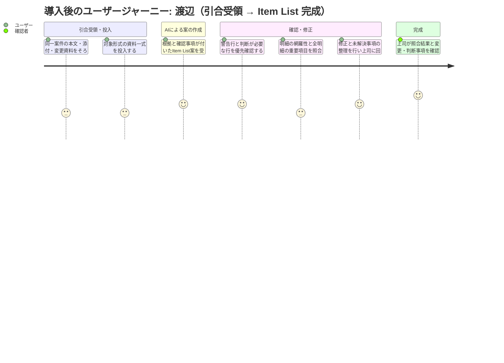

# 要求定義書: OCTG 引合 Item List 作成エージェント

> Vモデル: 要求分析 / 対応する検証: 受入テスト
> このプロジェクトで「誰の・どんな課題を・なぜ解決するか」を定義する。
> 参照資料: `references/proposal.pptx`（AIエージェント導入のご提案）、`references/sample-01〜10`（引合サンプル10件）

## 1. 背景・課題

### 背景

商社（双葉物産 鋼管本部 鋼管第二部）では、東京における仕入業務の負担が重く、ビジネス現場である外地への人員配置が加速できていない。鋼管部門の「引合」「発注」業務（6領域・18タスク）には AI エージェントで省人化できる業務が多数存在し、コスト削減余地がある。

そこで「引合受領・引合連絡」領域の PoC として、**引合書類を読んで Item List（メーカー向け Excel）を作る**業務を AI エージェント化する。AI と人間の分業により一人あたりが担当可能な地域・客先を増やし、外地への人員再配置を加速することを目指す。

Sprint 3 ではこの「引合書類 → Item List 作成」に範囲を絞る。独立した案件概要の作成・スケジュール管理（プロジェクト概要文・ガント等）と、過去経緯の確認・対応方針策定は対象外とする。一方、Item List に必要な照会番号・客先要求納期・納地等のヘッダ情報と明細条件の抽出は対象とする。見積期限と客先要求納期は区別し、正式な出力項目は `02-requirement.md` で定義する。

### Sprint 3 の対象範囲と前提

利用環境はローカル単一利用者のPoCとし、アプリ独自の認証・認可・マルチユーザー機能は対象外とする。担当者・上司・業務責任者は記録上の役割として扱う。OS・保存先のアクセス管理は別途必要とする。初版でも担当者の照合、上司の評価確認、送付可否の区別は必須だが、確認・修正・状態の記録は.xlsxへの手動記入を認める。ツール内の自動記録・サマリ生成・状態更新は後続スコープとする。

以下を Sprint 3 のスコープ案とし、業務責任者が `02-requirement` の確定時に承認する。

- **対象**: 担当者が1案件分としてまとめて投入した PDF・Excel・メールファイル（.eml）・メール本文テキストから、Item List の初回案を作成する。投入時点で含まれる P.S.・後続メール・Rev.・脚注・別紙の変更情報も確認対象とする。
- **対象外**: メール / Teams への自動接続・自動収集、作成済み Item List への後日の差分更新、人が修正した既存版との自動マージ、メーカーへの自動送付。後日変更の業務自体は存在するが、Sprint 3 の自動化対象には含めない。
- **入力条件**: 日本語・英語を対象とし、sample-04 / 07 / 10 を含む .eml を直接投入できること。本文・引用部・送受信日時など、変更の前後関係の判断に必要な情報を保持する。本文テキストを投入する場合も同等の情報を保持し、順序が判定できなければ確認事項とする。担当者による手動変換が必要な場合、その作業時間も KPI に含める。具体的な入力制限は `02-requirement.md` で定義する。
- **読めない・足りない場合**: 読取不能箇所、参照先の未投入、対象外形式を明示し、全件を処理できたように扱わない。必要な資料の収集と同一案件であることの確認は担当者が行う。

### 正確性と人による確認の原則

- 表記統一、単位換算、仕様の同等性判断を区別する。異なるグレード・接続・仕様を、表記が似ていることだけで同一視しない。原文と変換後の値を追跡可能にする。
- 換算は必要な条件と業務承認済みの換算・丸め規則がそろう場合に限る。トンから本数への換算などで必要な条件が不足する場合、推測で値を確定せず、原単位・原数量と不足条件を示す。
- 変更の適用対象や前後関係が明確な場合のみ反映する。資料間の矛盾、TBA、代替・択一指定、参照先不明は確認事項として残し、AI が業務判断を代行しない。
- 品種・数量・単位・外径・肉厚／単重・グレード・接続・レンジ・客先要求納期・納地・変更事項などの重要項目ごとに、根拠となる資料と位置（ページ、シート・セル、メール・該当箇所等）を追跡できること。換算条件、変更前後の根拠、変更を採用した理由も確認できること。案件共通の納期・納地等を明細に適用する場合も、その根拠を追跡できること。
- 担当者の確認は、AI が示す出典箇所と全明細の重要項目の値との一致確認を基本とし、原資料全体の再読解は通常手順としない。ただし、原資料の明細一覧（別紙・追加明細を含む）との突合による欠落・重複の確認は別途行う。警告行を優先確認し、矛盾・根拠不足がある箇所は周辺文脈を読む。警告がないことを正確性の保証とはしない。
- 上司・確認者は、根拠付き Item List、担当者の照合結果、修正箇所、変更・判断事項、未解決事項一覧を確認する。担当者の全件照合を踏まえ、変更・判断・未解決事項を中心に確認し、必要箇所の原資料に戻って最終承認する。未解決事項のある案と完成版を区別し、対外送付可否は人が判断する。

### 現状

- 外地の現地担当者や客先から、メール / Teams / 添付ファイルで引合が届く。
- 東京の担当者が引合書類（見積依頼書 PDF、英文 RFQ、入札明細書、調達仕様書、Excel オーダーリスト、メール本文直書き、転送メール、英文メールスレッド）を読み、明細を1行ずつ社内の Item List（Excel フォーマット）に手で転記している。
- 全ての業務がマニュアルで行われており、人間への業務負荷が高い。業務負荷が高いため、担当可能な地域・客先が限定される。
- 引合書類は客先ごとに形式・表記・単位が異なり、同じ「9-5/8" 47.0# L80 VAM TOP R3」でも書き方が全て違う。転記のたびに読み替えが必要になる。
- メール末尾の P.S. やスレッドの後続メール、Rev. 履歴で数量や品目が変更されることがあり、見落とすとメーカーに誤った引合を出してしまう。

### 課題一覧

| # | 課題 | 影響度 | 優先度 |
|---|------|--------|--------|
| 1 | **引合書類の形式のばらつき**（PDF / Excel / メール本文、日本語 / 英語、表形式 / 文章形式、明細が別紙・別ページ）により、書類ごとに読み方を変えて転記する必要があり、1件あたりの対応時間が長い | 高 | 高 |
| 2 | 単位・表記の不統一（外径 in / mm、単重 lb/ft / 肉厚 mm、数量 本 / jts / MT / t / 個 / pcs、グレード表記 L80 / L-80 / HCL80 / SM95TT 等）を人手で読み替えており、手間と間違いの元になっている。トン→本数換算は「貴社にて実施」と求められることもある | 高 | 中 |
| 3 | P.S.・後続メール・Rev. 履歴・脚注による変更事項（数量変更、代替品追加、択一指定、TBA、「本文3.2項による」等の間接参照）の見落としリスクがあり、ミスがメーカー引合の差し戻しや客先信用の低下につながる | 高 | 中 |
| 4 | **課題#1〜3の結果として生じるビジネス影響**: 東京担当者の負荷が高く、担当可能な客先・地域が限定される。結果として外地への人員配置が進まない | 高 | 高 |

## 2. ゴール

### ビジネスゴール

引合業務を AI エージェントで省人化し、コスト削減とともにビジネス現場である外地への人員再配置を加速する。Sprint 3 の PoC では、「引合書類 → Item List 作成」の省人化効果と精度を示し、他ライン（発注業務・他部門）への横展開の判断材料を得る。

### ユーザーゴール

東京の担当者が、形式のばらついた引合書類の**明細の探索・読み替え・手入力の負担を減らし、根拠付きの Item List 案の確認・修正と判断に集中できる**状態になる。これにより、代替可否の確認、メーカー選定、対外折衝に時間を使えるようにする。

### 成功指標（KPI）

以下の数値は仮置きとする。手作業の基準値を実測し、業務責任者が評価対象・正解データ・採点規則と併せて受入評価開始前に承認する。評価結果を見て合否基準を変更しない。

| 指標 | 目標値 | 測定方法 |
|------|--------|---------|
| 引合1件あたりの人の作業時間 | 従来の参考値 約60分（未実測・計測範囲未確認。担当者＋上司の合計を改めて実測）→ **10件の平均15分以内**（仮置き） | 入力資料の準備・手動変換・投入、担当者の確認・修正、上司の確認・承認に要する実作業時間の合計を、同じ範囲の手作業と比較する。案件ごとの値と最大値も報告する |
| 処理開始から完成までの経過時間 | 初回 PoC で実測し、運用上の許容値を検討 | 資料一式がそろい準備を開始した時点から上司の評価確認完了までを計測する。AI 処理待ち・承認待ちを含め、人の作業時間と区別して記録する。客先への問合せ待ちは別記する |
| 確認前の明細誤り率 | **10%以下**（仮置き） | 正解明細との対応付けにより、`06-scenario-test.md` の採点規則で算出する |
| 評価確認後の明細・重要項目の誤り | 評価対象10件すべてで **0件** | 業務承認済みの正解データと突合し、欠落・余分・重複・誤統合・重要項目の誤り・変更反映漏れを確認する |
| 人が内容に手を入れた明細の割合 | **20%以下**（仮置き） | AI 初回出力と最終承認版を比較する。誤り修正と、業務判断・任意調整を区別して記録し、`06-scenario-test.md` の規則で集計する |

### 評価・受入の原則

本書のKPIにおける完成・最終確認は、原資料への適合について上司が評価確認を完了した状態を指す。原資料のTBA等を正しく保持した案件も評価を完了できる。対外送付の承認とは区別し、詳細な状態は02で定義する。

- **評価範囲**: 手元のサンプル引合10件すべてを開発・調整と受入時の適合確認に使用する。今回の合格は、この10件への適合と作業時間削減の確認を意味する。未知案件への精度・一般化や実運用への適用可否は別途検証・判断する。
- **品質**: 品種・数量・単位・外径・肉厚／単重・グレード・接続・レンジ・客先要求納期・納地・変更事項、および代替・択一・TBA 等の条件を評価する。欠落・余分・重複・誤統合も対象に含める。
- **正解データ**: 業務に精通した担当者が作成し、上司・確認者が承認する。原資料が曖昧な場合は、推測値ではなく原文・未確定状態・確認事項の適切な保持を正解とする。適切な未確定表示と誤りを区別し、対外送付可否は人が判断する。
- **合否**: 10件すべての評価・最終確認を完了し、評価確認後の誤り0件を含む承認済み KPI をすべて満たすこと。経過時間は初回は参考計測とする。平均15分は、担当者と上司による必要な確認を含めて成立するか検証する仮説であり、確認の省略を前提としない。
- **承認**: 業務責任者が、評価開始前に KPI・正解データ・採点規則を承認し、評価終了後に合否を承認する。詳細な採点・測定手順と承認記録は `06-scenario-test.md` で管理する。

## 3. ペルソナ

### 渡辺（メインペルソナ：東京の若手担当者）

| 項目 | 内容 |
|------|------|
| 名前 | 渡辺 |
| 年齢 | 20代 |
| 職業 | 商社 営業担当（鋼管トレーディング） |
| 部門 | 双葉物産 鋼管本部 鋼管第二部 |
| 技術スキル | Excel・Outlook・Teams は日常的に使う。OCTG の仕様（サイズ・グレード・接続・レンジ）は業務で覚えてきたが、まだ先輩に確認しながら進めることが多い |

**目標・ゴール**

- 上司から回ってきた引合を、抜け漏れなく速く Item List（Excel）に整理してメーカーに回したい
- 転記作業に時間を取られず、代替品の確認やメーカーとのやりとりなど「判断が必要な仕事」に時間を使いたい
- 担当できる客先・案件数を増やして、早く一人前として外地案件も持てるようになりたい

**課題（ペインポイント）**

- 客先ごとに書類の形式が違い、毎回「どこに何が書いてあるか」を探すところから始まる。英文 RFQ・別紙・脚注が多い調達仕様書は特に時間がかかる
- inch / mm、lb/ft、本 / jts / MT などの単位を読み替えながら転記していると、どこかで間違えそうで不安。トン→本数換算を求められると計算も必要
- メールの P.S. やスレッドの2通目、Rev.2 の変更を見落として、後から「数量違うよ」と指摘されるのが一番怖い

**利用状況**

| 利用場面 | 頻度 | 詳細 |
|---------|------|------|
| 上司・外地担当者から引合が転送されてきたとき | 週に数件 | メール本文・添付（PDF / Excel）を確認し、Item List に転記して上司に回す |
| 客先から引合の変更連絡（数量変更・品目追加）が来たとき | 引合1件につき0〜2回 | 既存の Item List に変更を反映し、変更箇所を明示して上司・メーカーに連絡する（現状業務。作成後の差分更新の自動化は Sprint 3 対象外） |
| 英文 RFQ・入札明細書を受領したとき | 月に数件 | 英語の表記・略号（jts, pcs, ppf, DDP 等）を読み替えて転記する |

### 大久保（副次ペルソナ：上司・確認者）

| 項目 | 内容 |
|------|------|
| 名前 | 大久保 |
| 年齢 | 40代 |
| 職業 | 商社 営業（鋼管トレーディング）・チームリーダー |
| 部門 | 双葉物産 鋼管本部 鋼管第二部 |
| 技術スキル | Excel・Outlook は問題なく使う。OCTG 仕様と客先・メーカー事情に精通。新しいツールは「確認が楽になるなら使う」というスタンス |

**目標・ゴール**

- 部下が作った Item List を短時間で確認し、間違いなくメーカーに引合を出したい
- 引合対応の抜け漏れによる客先・メーカーへの差し戻しをなくしたい
- 東京チームの負荷を下げ、自分やメンバーが外地・客先対応に時間を使えるようにしたい

**課題（ペインポイント）**

- 部下の転記を元書類と1行ずつ照合する確認作業に時間を取られる
- 「13Cr希望・代替提案可」「5a/5b 択一」など判断が必要な行が、転記の中に埋もれて見えにくい

**利用状況**

| 利用場面 | 頻度 | 詳細 |
|---------|------|------|
| 部下から Item List が回ってきたとき | 週に数件 | 元書類との整合、判断が必要な行の有無を確認し、メーカーへ送付する |

## 4. ユーザージャーニー

### 現状の流れ

引合を受領 → 本文・添付・別紙から明細を探す → 単位・表記を読み替える → P.S.・後続メール・Rev. の変更を確認 → Excel に手入力 → 上司が元資料と照合して承認する。

### 導入後の流れ（Sprint 3）

### メインフロー（導入後）

| # | フェーズ | 行動 | 課題・感情 | 解決 |
|---|---------|------|----------|------|
| 1 | 引合受領・投入 | 担当者が同一案件の本文・添付・変更資料をそろえて投入する | 「資料がそろっているか」が不安 | 対応する形式を共通の手順で投入し、読取不能・参照先不足を把握できる |
| 2 | 案の受領 | AI が整理した明細・根拠・確認事項を受け取る | 読み替えや変更事項の見落としが不安 | 手作業での探索・転記を減らし、重要項目の出典と変更の採用理由を確認できる |
| 3 | 確認・修正 | 担当者が警告行を優先確認し、出典箇所と全明細の重要項目を照合する。原資料の明細一覧との突合で欠落・重複も確認する | 警告のない誤りや欠落も確認したい | 項目ごとの根拠を使って照合し、不明点は推測せず確認事項として整理できる |
| 4 | 完成・引き渡し | 上司が根拠付きの案、担当者の照合結果・修正箇所、変更・判断事項、未解決事項一覧を確認して最終承認する | 上司として、全行の照合を繰り返す負担を減らし、判断が必要な箇所を把握したい | 変更・判断・未解決事項を中心に確認し、必要箇所の原資料に戻れる。未解決事項のある案と完成版を区別し、送付可否は人が判断する |

### 感情の変化（導入後の想定）

- **開始時**: 「また形式が違う引合か…」という軽い憂鬱。必要な資料をそろえて投入する。
- **AI 案の確認開始時**: 別紙の明細、トン表記、P.S. の数量変更が拾われているか、AI が示す根拠と原資料の明細一覧で確かめる。
- **確認時**: AI の案に根拠と確認事項が付いており、優先して見る箇所と原資料への戻り先が分かる。警告のない行も重要項目を照合する。
- **ゴール達成時**: 転記の手間を減らし、必要な照合・修正と上司への確認を終えられた。判断が必要な仕事に時間を使える余裕が生まれる。

## 5. 利害関係者

| 利害関係者 | 期待 |
|-----------|------|
| 業務責任者（スコープ・KPI・PoC合否の承認者） | 評価範囲と判断基準を承認し、結果に基づき PoC の合否を判断する。鋼管部門長との兼任は可能だが同一人物とは仮定しない。研修では担当者・講師が兼任可能とし、実際の担当者は評価開始前に記録する |
| 大久保（上司・確認者） | 部下から回ってくる Item List の精度が上がり、確認時間が減ること。判断が必要な行（代替可否・択一・TBA）が明示されていること |
| 外地の現地担当者 | 転送した引合が速く正確に Item List 化され、メーカー回答を早く客先に返せること |
| 客先（南邦石油、青海掘削工業、GulfTex Energy 等の資材・調達部門） | 引合内容（数量変更・代替希望・択一指定を含む）が正しく理解され、期限内に見積回答が返ってくること |
| メーカー | 単位・表記が統一された Item List で引合を受け取り、確認の手戻りなく見積できること |
| 鋼管部門長・経営層 | 引合業務の省人化効果が数値で示され、コスト削減と外地への人員再配置、他ラインへの横展開の判断材料が得られること |

---

## 次のステップ

要求の対象範囲・品質原則・KPI・合格の意味は本書を正とする。詳細は以下の文書で管理し、要求変更時は整合を確認する。

- `02-requirement.md`: 入出力項目、入力制限、換算・丸め、変更判断、出典表示、確認・承認の仕様。
- `06-scenario-test.md`: サンプル10件の評価設計、正解データ、採点式、集計・測定手順、承認記録。

両文書には具体的な仕様と評価手順を記載する。未確定事項と実際の担当者を評価開始前に業務責任者が確認・承認する。
