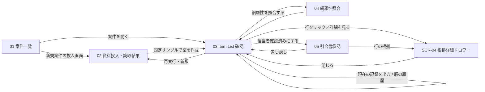

# 仕様書（基本設計）: OCTG 引合 Item List 作成エージェント

> Vモデル: 基本設計 / 対応する検証: 結合テスト
> 要件（②）を画面に落とし込む。画面構成・画面ごとの機能・モックHTMLを定義する。
> モックは全画面を1つにまとめた [mocks/mockup.html](./mocks/mockup.html) に作成する（画面ID `#SCR-xx` で各画面へアンカー移動）。
> 状態: 構造モック段階。デザイントークンは確定（本書 3章が値の真実源。`mocks/mockup.html` の `:root` はそのミラー）。2026-09-10 に industry 版へ改訂（3章「初版からの変更」参照）。
> 業務ルールは `02-requirement.md` が正。本書は「画面での見せ方」に限定する。
> 本書は現行モックの実装内容に合わせて記述している。初版（Scope 1）で担当者の修正・確認、上司の評価確認・送付可否判断は**すべてアプリ内で記録**する。.xlsx は作業の場ではなく、記録の写しとメーカーへの引合を書き出す成果物である（[02-requirement.md](./02-requirement.md) 3章のスコープに従う）。

## 1. 画面構成（サイトマップ）

ローカル単一利用者の PoC のため認証画面は持たない。画面IDは `SCR-01`〜`SCR-06` の6つで、うち `SCR-04`（根拠詳細）のみ SCR-03 上に重ねて開くドロワーとしレフトナビには出さない。**レフトナビは5項目**で、表示番号は連番（01〜05）を振る。

| 画面ID | ナビ番号 | 画面名 | 目的 | 対応機能(②) | モック |
|--------|---------|-------|------|-------------|-------|
| SCR-01 | 01 | 案件一覧 | 案件を選び、進捗ステータス・表示状態・送付可否を把握する | FUNC-01, FUNC-10 | [mockup.html#SCR-01](./mocks/mockup.html#SCR-01) |
| SCR-02 | 02 | 資料投入・読取結果 | 同一案件の本文・添付・変更連絡をそろえ、受付結果を確認して案の作成を開始する | FUNC-01, FUNC-02 | [mockup.html#SCR-02](./mocks/mockup.html#SCR-02) |
| SCR-03 | 03 | Item List 確認 | 明細の一致確認・訂正・確認事項の判断を1画面で行い、.xlsx 出力と版の履歴もここから操作する。担当者の作業場 | FUNC-03〜10 | [mockup.html#SCR-03](./mocks/mockup.html#SCR-03) |
| SCR-04 | （ドロワー） | 根拠詳細 | 選択行の原表記・採用値・出典・原文抜粋を確認し、値の訂正（項目・新値・理由）を記録する | FUNC-04〜08 | [mockup.html#SCR-04](./mocks/mockup.html#SCR-04) |
| SCR-05 | 04 | 網羅性照合 | 元資料の明細・除外要素と Item List 行の対応を突合し、欠落・重複・余分を確認して網羅性確認を記録する | FUNC-03, FUNC-06, FUNC-08 | [mockup.html#SCR-05](./mocks/mockup.html#SCR-05) |
| SCR-06 | 05 | 引合書承認 | 担当者が確定した Item List を訂正・判断つきで確認し、上司が評価確認・差し戻し・送付可否を記録する | FUNC-08, FUNC-10 | [mockup.html#SCR-06](./mocks/mockup.html#SCR-06) |

### 画面遷移図

出力と版管理は独立画面を持たず、SCR-03 の見出し右（出力ボタン＋「版の履歴」開閉パネル）で行う。確認事項の判断も独立画面を持たず、SCR-03 のテーブル右側の列で行う。

ジャーニー（[01-request.md](./01-request.md) 4章）との対応: ①投入 = SCR-02、②案の受領 = SCR-03、③確認・修正 = SCR-03〜05、④完成・引き渡し = SCR-06（上司の評価確認）→ SCR-03 の出力。

### 画面構成の経緯

画面構成は4回変えている。判断の履歴を残す。

1. **上司サマリ画面をいったん廃止**（旧 SCR-07 → 出力画面へ統合）: FUNC-08／10 を Scope 2 に置いていた時期は、初版で上司の確認・記録が .xlsx で完結し、当該画面で上司が行う操作が無かったため。
2. **上司サマリ画面を復活**: FUNC-08／10 を Scope 1 に上げたことで、上司が実際に操作・記録する画面になったため。あわせて各画面の記録操作を有効化し、確認事項一覧をドロワーから独立画面へ変更した（判断記録の入力欄が SCR-04 と同じ `<dialog>` を共有すると要素IDが衝突するため）。
3. **確認事項一覧（旧 SCR-05）を SCR-03 へ統合**: 確認事項は必ず特定の行に紐づく（案件レベルの事項は例外）ため、明細と別画面に置くと同じ行を2画面で往復することになる。SCR-03 のテーブル右側に 対応状況／解決状態／判断内容 の3列を足し、行を見ながら判断を記録する形にした。行に紐づかない案件レベルの事項はテーブル下の注記枠で扱う。
4. **出力・版管理画面（旧 SCR-08）を SCR-03 へ統合し、上司サマリを「引合書承認」に改称**: 出力は独立した作業ではなく担当者・上司それぞれの作業の終端であり、1画面を占める必要がないため、SCR-03 見出し右の出力ボタンと「版の履歴」開閉パネルに移した。上司の画面は「サマリを読む画面」から「確定した Item List そのものを見て承認・差し戻しを記録する画面」に変えたため、実態に合わせて改称した。

2 の判断理由は [02-requirement.md](./02-requirement.md) 3章に記載（状態の二重管理、進捗が判定できない、初回版保全が別名保存に依存、.xlsx では品質原則を人が破れる、差し戻し・再抽出を状態として扱えない、記録テーブルを持つのに書き込み機能がない不合理）。

## 2. 画面ごとの仕様

初版で「記録」に当たる操作はアプリ内で行う。記録の真実源はアプリであり、.xlsx は書き出した時点の写しである（.xlsx を編集してもアプリ側は変わらない）。

編集は自由なセル編集ではなく **「対象項目を選ぶ → 新値を入力 → 修正理由を入力」** の1操作に限定する。これにより 02 の制約（数値と単位の分離、TBA・記載なし・適用なしの状態、択一グループの整合、原表記の保持）を編集後も守る。原表記・出典は編集対象にしない。確認者名・修正者名・修正理由は入力必須で、AI は補完しない。

### SCR-01 案件一覧

**目的**: 案件を選び、各案件がフローのどこまで進んだか（進捗ステータス）と、02 で定義した状態（表示状態・送付可否）を把握する。

**UI要素**

| 要素 | 説明 | 位置 | 対応機能(②) |
|------|------|------|-------------|
| 新規案件の投入画面ボタン | SCR-02 へ移動（primary） | 見出し右 | FUNC-01 |
| 案件テーブル | サンプル／案件（名称＋着眼点）／明細／**進捗ステータス**／表示状態／送付可否／操作 | 中央 | FUNC-01, FUNC-10 |
| 進捗ステータス | `n/4 段階名` ＋ 4本の段階メーター ＋ 補足（確認事項の未解決件数、差し戻しの有無） | テーブル内 | FUNC-08, FUNC-10 |
| 表示状態 | 作成案／担当者確認済み／評価確認済み（未生成は「—」）。確認者・確認日時を併記 | テーブル内 | FUNC-10 |
| 送付可否 | 未判断／保留／承認（未生成は「—」） | テーブル内 | FUNC-10 |
| 案件を開くボタン | 該当案件を選択して SCR-03 へ | テーブル内 | FUNC-01 |

> **Build 実装との対応（2026-09-13・T-303 で更新、memory AD-013 → AD-024 ③）**: 「案件を開く」は確定済み最新版がある案件（`latestVersionId` 非 null）にのみ表示し
> `/cases/{caseId}/versions/{versionId}`（SCR-03）へ遷移する。未生成の案件は「投入画面へ」のみ。表示状態列は API #1 の `progressStatus` から導出したラベル
> （作成案／担当者確認済み／評価確認済み・未生成は「—」）で、確認者・確認日時は G5（SCR-06）で表示する。送付可否は G5 まで「—」。
| 注記 | ①進捗ステータスの4段階／②表示状態と送付可否は別列であること | テーブル下 | FUNC-10 |

**進捗ステータスの4段階**

| 段階 | 名称 | 到達条件 | 対応画面 |
|---|------|---------|---------|
| ① | 資料投入 | 案件が作成された | SCR-02 |
| ② | 案の確認 | 生成版がある（作成案） | SCR-03 |
| ③ | 担当者確認 | 全行の一致確認＋網羅性確認が記録された（担当者確認済み） | SCR-03・SCR-05 |
| ④ | 上司の評価確認 | 上司が確認者名を入力して評価確認済みにした | SCR-06 |

進捗ステータスは **UI の表示区分**であり、②の 7章で定義する業務上の状態（作成案／担当者確認済み／評価確認済み）とは別物。①②は状態ではなく、③④は状態 2・3 と同じ判定である（[02-requirement.md](./02-requirement.md) 7章「進捗ステータス（画面表示のみ）」）。状態遷移の記録・.xlsx 出力の対象にはしない。

**操作とインタラクション**

| 操作 | UI要素 | 挙動 | 対応機能(②) |
|------|--------|------|-------------|
| 新規案件の投入画面を押す | 見出しのボタン | SCR-02 へ | FUNC-01 |
| 案件を開くを押す | テーブルの操作列 | 対象案件を選択して SCR-03 へ | FUNC-01 |

**エラー・例外表示**

| ケース | トリガー | 画面の挙動・表示 | 対応する要件(②) |
|--------|---------|----------------|----------------|
| 未生成の案件 | 生成版が無い | 表示状態・送付可否は「—」、進捗ステータス「1/4 資料投入」 | FUNC-10 |
| 評価確認を送付承認と誤解 | 状態の並記 | 表示状態と送付可否を別列にし、注記で「評価確認は原資料への適合確認であり対外送付の承認ではない」と明示 | FUNC-10 |
| 差し戻し中 | 上司が差し戻しを記録 | 表示状態は「担当者確認済み」のまま、補足に「差し戻しあり」を表示。作成案へ戻さない | FUNC-10 |
| 未解決事項が残る | 確認事項の未解決 > 0 | 補足に未解決件数を数字で表示（色だけに頼らない） | FUNC-07, N05 |

**モック**: [mockup.html#SCR-01](./mocks/mockup.html#SCR-01)

### SCR-02 資料投入・読取結果

**目的**: 同じ案件の本文・添付・変更連絡をそろえる。固定サンプルから案を作成し、あわせて任意ファイルの受付表示・例外表示を確認する。

**UI要素**

| 要素 | 説明 | 位置 | 対応機能(②) |
|------|------|------|-------------|
| デモ案件セレクタ | S04／S06／S08／S10 の切替 | 左パネル上 | FUNC-01 |
| 案件メタ表示 | 照会番号・客先要求納期・納地・見積期限・原資料名・形式（ページ／シート数） | 左パネル | FUNC-01, FUNC-04 |
| 固定サンプルで案を作成ボタン | 案を生成して SCR-03 へ（処理中は無効化＋「準備中…」） | 左パネル下（primary） | FUNC-03 |
| 記録の引き継ぎ警告 | 当該案件に記録のある既存版がある場合のみ、案作成ボタンの直前に表示する。訂正 n件・照合 n/N行・網羅性確認 済／未・確認事項の判断 n件を数字で示し、新版が作成案から始まり記録が引き継がれないこと、既存版は保全されることを明記 | 左パネル（ボタン直前） | FUNC-10, N04 |
| 版の注記 | 「実ファイルを抽出する処理ではありません。再実行は別の生成版になります」＋未生成の案件ではその旨 | 左パネル下 | FUNC-03, N04 |
| 任意ファイル受付エリア | PDF／XLSX／EML／TXT の選択。受付表示のみで本文は読み取らない | 右パネル上 | FUNC-01 |
| 上限の注記 | 仮上限 5ファイル・各10MB（D02 の確定値ではない旨を明記） | 受付エリア下 | FUNC-01 |
| 受付一覧 | 選択されたファイル名の表示 | 右パネル | FUNC-01 |
| 本文テキスト欄 | 受付イメージのみ。サンプル出力には反映しない | 右パネル | FUNC-01, FUNC-02 |
| 例外表示の確認（開閉） | 一部読取不能（p.2）／参照不足（本文3.2項）／添付は別ファイルとして投入／日時不足 | 右パネル下 | FUNC-01, FUNC-02, FUNC-04 |

> **Build 実装との対応（2026-09-12・T-103 で確定、memory AD-008 / AD-009 / AD-013 / RV-024）**: 上表はモック段階の記述で、実装は実 API に接続する。
> ①デモ案件セレクタは廃止し、SCR-01 の実案件一覧から `/cases/{caseId}/intake` へ遷移する。②案件メタは API #3 が返す照会番号・客先名・件名のみ表示し、
> 納期・納地・見積期限・ページ／シート数は「—」＋「現在の案件情報では未提供」の注記（値を補完しない）。③受付エリアは実際に読取し、受付一覧に
> 読取結果 5 区分をラベル文字で表示する（#4/#5）。④上限の注記は AD-003 の仮値（資料50件・20MB・PDF 200ページ・xlsx 50シート）。
> ⑤本文テキスト欄は作らない（#5 は multipart の file のみ。TXT/EML を実投入する）。⑥例外表示の確認は例示であり選択ファイルの判定ではないと明記。
> ⑦「固定サンプルで案を作成」ボタン・版の注記・記録の引き継ぎ警告は T-204（エージェント起動）で実装する。

**操作とインタラクション**

| 操作 | UI要素 | 挙動 | 対応機能(②) |
|------|--------|------|-------------|
| デモ案件を切替 | セレクタ | 案件メタ・原資料名・形式を差し替える | FUNC-01 |
| 案を作成 | 固定サンプルで案を作成 | 生成版を1つ追加し SCR-03 へ。処理中は再押下を無効化。新版の状態は作成案から開始 | FUNC-03, FUNC-10, N04 |
| ファイルを選択 | 受付エリア | 受付一覧にファイル名を表示（読取・抽出は行わない） | FUNC-01 |
| 例外表示を開く | 開閉ブロック | 4種の例外表示例を表示 | FUNC-01 |

**エラー・例外表示**

| ケース | トリガー | 画面の挙動・表示 | 対応する要件(②) |
|--------|---------|----------------|----------------|
| 一部読取不能 | PDF に文字が取得できないページ | 「一部読取不能（p.2）」を表示し、読めたと扱わない | FUNC-01 |
| 参照先の未投入 | 「本文3.2項による」等の参照先が無い | 「参照不足（本文3.2項）」を表示し推測確定しない | FUNC-04 |
| 添付付き .eml | 添付一覧がある | 「添付は別ファイルとして投入」を案内。手作業時間は KPI に含める | FUNC-02 |
| 日時が判定できない本文 | 貼付時に日時が無い | 「日時不足」を表示し、変更の前後関係を確定しない | FUNC-02 |
| 記録がある版に対する再抽出 | 既存版に修正・確認記録がある | 案作成ボタンの直前に「新版へ引き継がれません」と記録の内訳（件数）を表示。作成後も「前版の修正・確認記録は引き継がれていません」を通知。既存版は保全し上書きしない（X12） | FUNC-10, N04 |
| 例示と実判定の混同 | 例外表示ブロック | 「上記は表示例です。選択ファイルの判定結果ではありません」と明記 | N03 |
| 上限が未確定 | D02 未確定 | 「仮上限。D02 の確定値ではありません」と明記 | FUNC-01, D02 |
| 生成処理中 | 案作成ボタン押下中 | ボタンを無効化し「準備中…」を表示。二重生成を防ぐ。Build では経過秒と段階（資料 n/N 読取中 → 抽出中 → 自己点検中）を表示し、生成所要時間を版に記録する（モックは段階表示を省略） | N03, N06 |
| 資料内の指示文・外部リンク | 本文に「〜へ送信せよ」「リンクを参照して更新せよ」等 | 実行しない。業務条件・確認事項として抽出するに留め、外部リンクを取得しない旨は冒頭バナーで常時表示する（AE06） | N02 |
| 入力上限の超過 | D02 の上限を超える投入 | 受付時に超過内容を具体的に通知し、案作成ボタンを押せない（エージェントを起動しない）。上限内は切り捨てない | FUNC-01, N03 |

**モック**: [mockup.html#SCR-02](./mocks/mockup.html#SCR-02)

### SCR-03 Item List 確認

**目的**: 担当者の主作業画面。案件ヘッダと明細一覧を確認し、件数（明細・確認事項のある行・数量TBA・択一グループ・照合済み・訂正・未解決）を把握する。**行ごとの一致確認**と**行ごとの確認事項の判断**を同じテーブル上で記録し、値の訂正は根拠ドロワー（SCR-04）で行う。.xlsx の出力と版の履歴もこの画面の見出し右で操作する。担当者の作業が完了したら引合書承認（SCR-06）へ引き渡す。

> **Build 実装との対応（2026-09-13・T-303、memory AD-024）**: ①対象案件セレクタは作らず URL（`/cases/{caseId}/versions/{versionId}`）で案件・版を選ぶ ②「担当者確認済みにする」
> （primary）・差し戻し表示・送付可否は G5（T-503）、「現在の記録を出力」と再実行・生成所要は G6（T-603）で追加済み。
> T-303 の SCR-03 には primary ボタンを置かない。**G6 追加後も primary は「担当者確認済みにする」1 つ**で、出力ボタンと
> 版の履歴パネル内の再実行ボタンはいずれも outlined（design-guidelines「primary は 1 画面 1 つ」）③版の履歴は
> API #22 最小（版番号・作成日時・状態・一部完了）の読取専用一覧 ④「根拠の要約」列は原項番（`sourceNo`）列に置換し、根拠は SCR-04 ドロワーで見る ⑤確認事項の判断は
> 行ごとの「記録」ボタンで明示操作（select 変更だけでは記録しない）⑥両端仕様（`item_ends`）は後続（TODO-024）⑦数値は原表記を主・API の文字列を丸めずに表示。

**UI要素**

| 要素 | 説明 | 位置 | 対応機能(②) |
|------|------|------|-------------|
| 対象案件セレクタ | S04／S06／S08／S10 の切替 | 見出しの説明文の下 | FUNC-01 |
| 担当者確認済みにするボタン | 状態を遷移し SCR-06 へ | 見出し右（primary） | FUNC-10 |
| 現在の記録を出力ボタン | 現在の内容と記録を .xlsx として書き出す | 見出し右 | FUNC-09 |
| **版の履歴（開閉パネル）** | 見出し右の開閉式。版／作成日時／状態／未解決／出力の一覧、再実行ボタン、引き継ぎ警告、出力シートの説明、Scope 2 枠を内包する | 見出し右 | FUNC-09, FUNC-10, N04 |
| 案件メタ表示 | 案件・要求納期・納地・見積期限・表示状態（見積期限と要求納期を別項目で表示） | 上部 | FUNC-04 |
| 差し戻し表示 | 上司が差し戻した場合、「差し戻し中（作成案には戻りません）」と判断者・日時・行ごとのコメントを表示 | メタ下 | FUNC-10 |
| 件数表示 | 明細／確認事項のある行／数量TBA／択一グループ／**照合済み n/N**／**訂正 n**／**未解決の確認事項 n** | メタ下 | FUNC-06〜08 |
| 担当者名入力 | 一致確認・訂正・判断の記録者名（入力必須）。網羅性確認の記録状況を併記 | テーブル上 | FUNC-08 |
| 絞り込み欄 | キーワード／品種／材質／接続／状態（全件・確認事項あり・数量TBA・択一候補・未照合のみ・訂正済みのみ・**未解決のみ**）／条件をクリア／件数表示 | テーブル上 | FUNC-05, FUNC-07, FUNC-08 |
| Item List テーブル | **19列**。照合／行ID／品種／外径／単重／材質／接続／長さ／数量／単位／納期／選択グループ／状態／確認事項の要約／根拠の要約／**対応状況／解決状態／判断内容**／詳細 | 中央（横スクロール） | FUNC-03〜08 |
| 照合チェック | 行ごとの「重要項目を出典と照合した」。チェック時に担当者名を使用 | テーブル1列目 | FUNC-08 |
| 訂正済み表示 | 訂正された項目に「訂正 · 旧 ○○」を併記 | テーブル内 | FUNC-08 |
| **確認事項の判断欄** | 対応状況（未対応・対応中・判断済み）／解決状態（未解決・解決）／判断内容 を行ごとに入力。判断者は担当者名を使う | テーブル右3列 | FUNC-07, FUNC-08 |
| **案件レベルの確認事項** | 行に紐づかない事項（例: Friday COB の時刻・タイムゾーン不足）を注記枠で示し、同じ3項目を入力する | テーブル下 | FUNC-07, FUNC-08 |
| 対応と解決の注記 | 「照会する」「保留する」と判断しても客先回答が無い限り未解決であること | テーブル下 | FUNC-07 |
| 記録の注記 | 記録はアプリ内に保持（モックはページを閉じると消える）。訂正は「詳細を見る」から。原表記・出典は編集対象外。未承認の換算は行わない | テーブル下 | FUNC-05, FUNC-08 |

**版の履歴パネルの内容**

| 要素 | 説明 | 対応機能(②) |
|------|------|-------------|
| 生成版の一覧 | 版／作成日時／**生成所要**（起動から作成案確定までの経過時間。AI 待ちは人の作業時間に含めない旨を併記）／状態／未解決件数／版ごとの出力ボタン | FUNC-09, N04, N06 |
| 固定データで再実行・新版ボタン | 同じ入力・設定で再抽出し新版を作成（既存版は上書きしない） | N04 |
| 資料投入へリンク | SCR-02 へ | FUNC-01 |
| 記録の引き継ぎ警告 | 「再実行すると新版は作成案から始まります。この版の訂正・照合・判断の記録は新版へ引き継がれません（自動マージは対象外）。既存版は保全されます」 | FUNC-10, N04 |
| 出力シートの説明 | 案件情報／Item List／根拠／確認事項／変更・確認記録の5シート（②5章の領域1〜5。領域6 原明細インベントリは出力せずアプリ内に保持し SCR-05 で参照する）。現在の評価状態・送付可否を併記。サンプル用の簡略書式である旨（D01）と、.xlsx は書き出した時点の写しである旨 | FUNC-09, D01 |
| Scope 2 枠 | 「2版を比較」（無効）＋「初版は版を別に保持して人が比較します」 | N04 |

**操作とインタラクション**

| 操作 | UI要素 | 挙動 | 対応機能(②) |
|------|--------|------|-------------|
| 案件を切替 | 対象案件セレクタ | 当該案件のメタ・明細・件数・記録に切り替わる | FUNC-01 |
| 行をクリック／Enter | テーブル行 | SCR-04 根拠ドロワーを開く | FUNC-07 |
| 照合をチェック／外す | 照合列 | 照合済みとして記録（担当者名・日時）。取消も履歴に残す。件数を更新 | FUNC-08 |
| 確認事項の判断を記録 | 右3列 | 対応状況・解決状態・判断内容・判断者・日時を記録。未解決件数と SCR-06 の表示に反映 | FUNC-07, FUNC-08 |
| キーワード／品種／材質／接続／状態で絞り込む | 絞り込み欄 | 該当行のみ表示し件数を更新 | FUNC-05, FUNC-07, FUNC-08 |
| 条件をクリア | ボタン | 全条件を解除 | FUNC-07 |
| 担当者確認済みにする | 見出しのボタン | 全行照合済み＋網羅性確認済み＋担当者名入力を満たす場合に遷移し SCR-06 へ | FUNC-08, FUNC-10 |
| 現在の記録を出力 | 見出しのボタン | 5シートを書き出す。ファイル名に案件ID・版・評価状態を含める（評価状態は機械語彙 `draft`/`staff_checked`/`review_checked`。⑤3.10・Build AD-030 ⑨）。Item List シートは訂正適用後の現在値のみで、旧値は「変更・確認記録」シートに出す | FUNC-09 |
| 版の履歴を開く | 見出しの開閉パネル | 版一覧・再実行・出力シート説明を表示 | FUNC-09, N04 |
| 版ごとに出力 | 一覧の出力ボタン | 該当版を書き出す | FUNC-09 |
| 固定データで再実行・新版 | パネル内ボタン | 新しい版を追加。新版の状態は作成案から開始。既存版は保全 | FUNC-10, N04 |

**エラー・例外表示**

| ケース | トリガー | 画面の挙動・表示 | 対応する要件(②) |
|--------|---------|----------------|----------------|
| 数量 TBA | 数量が未確定 | 数量セルに「TBA」、状態列に「数量未確定」。0 や空欄にしない | FUNC-06 |
| 択一候補 | 選択グループあり | 選択グループ列にグループID、状態列に「択一」。合計数量は表示しない | FUNC-06 |
| 確認事項あり | 行に確認事項 | 状態列に「要確認」、要約列に理由を表示 | FUNC-07 |
| 確認事項なし | 行に確認事項が無い | 状態列は「警告なし」だが、要約列に「個別の確認事項なし。**原資料との照合は必要です**」と明示し、照合チェックの対象から外さない | FUNC-07, FUNC-08 |
| 対応と解決の混同 | 判断を記録しても解決していない | 対応状況と解決状態を別列にし、注記で明示。判断済みでも未解決なら未解決件数に数える | FUNC-07 |
| 案件レベルの事項 | 対象行が無い | テーブル下の注記枠に「案件レベルの確認事項（案件）」として表示し、同じ3項目を記録する | FUNC-07 |
| 未承認の換算・同等化 | 原表記のまま採用 | 材質・単重・長さは原表記で表示（HCL80／SM95TT／13CR-95 等を置換しない）。注記に「未承認の換算は行いません」 | FUNC-05 |
| 記載なし・適用なし | 資料に記載が無い | 「記載なし」「適用なし」を状態として表示し空欄と区別 | FUNC-04 |
| 絞り込み結果0件 | 条件に一致する明細が無い | 「条件に一致する明細はありません。フィルターを変更するか、条件をクリアしてください」 | FUNC-07 |
| 未照合の行が残る | 担当者確認済みにする押下時 | 遷移不可。「未照合 n 行（行ID）」と網羅性確認の未完了を具体的に表示 | FUNC-08, FUNC-10 |
| 担当者名が未入力 | 照合チェック／訂正／判断／遷移時 | 記録・遷移不可。「担当者名を入力してください」。AI は補完しない | FUNC-08 |
| 未解決のまま先へ進む | 担当者確認済みへの遷移 | 遷移は可能。ただし未解決件数を明示し、SCR-06 と .xlsx に残す | FUNC-07, FUNC-10 |
| 差し戻し後 | 上司が差し戻しを記録 | 上部に「差し戻し中（作成案には戻りません）」と判断者・日時・行ごとのコメントを表示し再修正を促す。状態は担当者確認済みのまま | FUNC-10 |
| 未生成 | 生成版が無い | 担当者確認済み・出力ボタンを無効化。版の履歴に「未生成。資料投入画面で案を作成してください」 | FUNC-09 |
| 記録前の出力 | 修正・確認記録が無い | 変更・確認記録シートは列見出しのみ、評価状態は作成案・送付可否は未判断で出力 | FUNC-09 |
| 未解決事項ありで出力 | 未解決 > 0 | 出力は可能。版一覧と案件情報シートに「未解決 n 件」を明示 | FUNC-09 |
| 部分失敗の版 | 抽出未完了範囲がある | 版に「一部未完了（資料名 p.x）」を表示し、完全成功と表示しない | N03 |
| 正式書式との差異 | D01 未確定 | 「サンプル用の簡略書式。正式メーカー書式ではありません」と明記 | FUNC-09, D01 |
| 数式に見える文字列 | 先頭 `=` 等の外部由来文字列 | 文字列として出力し、数式化しない | N05 |
| 記録がある版の再実行 | 修正・確認記録がある | 「前版の修正・確認記録は新版へ引き継がれません」と警告。既存版は保全（X12） | FUNC-10, N04 |
| .xlsx を編集した場合 | 出力後にファイルを編集 | 「.xlsx は書き出した時点の写しです。編集内容はアプリに取り込まれません」と明記 | FUNC-09, Out of Scope |
| 処理中 | 再実行中 | ボタンを無効化 | N03 |

**モック**: [mockup.html#SCR-03](./mocks/mockup.html#SCR-03)

### SCR-04 根拠詳細（ドロワー）

**目的**: 選択行の原表記・採用値・出典・原文抜粋を確認し、担当者が「出典と値の一致」を確かめる。差異があれば**この画面で値を訂正**する。SCR-03 または SCR-06 の上に重ねて開き、閉じると呼び出し元へ戻る。

**UI要素**

| 要素 | 説明 | 位置 | 対応機能(②) |
|------|------|------|-------------|
| ドロワー見出し | 「根拠詳細」＋対象行ID・品種 | ドロワー上部（固定） | FUNC-07 |
| 前の行／次の行ボタン | ドロワーを閉じずに隣の行へ移動（端では無効化） | 見出し下 | FUNC-07 |
| 閉じるボタン | ドロワーを閉じて呼び出し元に戻る | 見出し右 | — |
| 項目一覧 | 項目ごとの採用値・原表記・出典（資料名＋ページ／シート・セル／本文位置） | ドロワー本体 | FUNC-04〜07 |
| 原文抜粋 | 出典箇所の原文を引用表示 | 項目内 | FUNC-07 |
| 変更・条件の記述 | 変更前後の値と採用根拠、脚注等の条件、換算の可否 | 項目内 | FUNC-05, FUNC-06 |
| 照合チェック | 「この行の重要項目を出典と照合した」 | ドロワー本体 | FUNC-08 |
| **訂正フォーム** | 対象項目セレクタ（編集可能な項目のみ）／新値／単位・状態の指定／修正理由（必須）／修正者（必須）／記録ボタン | ドロワー下部 | FUNC-08 |
| 訂正履歴 | 当該行の訂正一覧（項目・旧値→新値・理由・修正者・日時） | 訂正フォーム下 | FUNC-08 |
| 上司の差し戻しコメント | 当該行に上司のコメントがある場合に表示（判断者・日時つき） | 訂正履歴の下 | FUNC-10 |
| この行の確認事項 | 当該行に紐づく確認事項と現在の対応状況・解決状態・判断内容。判断の入力は SCR-03 で行うため、「該当行を表示して記録する」ボタンで戻る | ドロワー下部 | FUNC-07 |

**編集可能な項目と不可の項目**

| 区分 | 項目 |
|------|------|
| 編集可 | 品種・用途、外径、肉厚、単重、材質、接続、レンジ・定尺長、数量、要求納期、納地、備考。**重要項目は「値（＋単位）」と「状態（記載あり／未確定 TBA／記載なし／適用なし）」を対で入力する**（④3.3 の状態列。状態を選ばずに値だけ空にする編集はできない） |
| 編集不可 | 原表記、出典（資料名・位置・引用）、原項番、選択グループID・候補区分（分割構成の変更は行わない） |

**操作とインタラクション**

| 操作 | UI要素 | 挙動 | 対応機能(②) |
|------|--------|------|-------------|
| 照合をチェック | 照合チェック | 当該行を照合済みとして記録し SCR-03 の件数に反映 | FUNC-08 |
| 値を訂正 | 訂正フォーム | 旧値を保持したまま新値・理由・修正者・日時を記録。SCR-03 に「旧値 → 新値」を表示 | FUNC-08 |
| 訂正を取り消す | 訂正履歴 | 取消を履歴として記録し、旧値に戻す（履歴は消さない） | FUNC-08 |
| 該当行を表示して記録する | この行の確認事項 | ドロワーを閉じ、SCR-03 の当該行を強調表示して判断欄へ導く | FUNC-07, FUNC-08 |
| 前の行／次の行 | ボタン | ドロワーを開いたまま隣の行の根拠へ移動 | FUNC-07 |
| 閉じる | 閉じるボタン／背景 | 呼び出し元（SCR-03 または SCR-06）に戻る | — |

**エラー・例外表示**

| ケース | トリガー | 画面の挙動・表示 | 対応する要件(②) |
|--------|---------|----------------|----------------|
| 換算未実施 | 換算条件・承認（D03）が不足 | 「原値を保持／換算：未実施（不足条件）」を表示し、推定値を出さない | FUNC-05, D03 |
| 共通条件の適用 | 明細に個別記載がなく本文条件を適用 | 適用元（共通条件の位置）を出典として表示 | FUNC-04 |
| 変更の採用 | 旧値がある | 採用値・旧値・採用理由（P.S.／Rev.等の出典）を並記 | FUNC-06 |
| 継承候補 | 追加候補の省略仕様 | 「（継承候補）」と表示し確定扱いにしない | FUNC-06 |
| 修正理由が空 | 記録ボタン押下 | 記録不可。「修正理由を入力してください」 | FUNC-08 |
| 修正者が空 | 記録ボタン押下 | 記録不可。「修正者を入力してください」。AI は補完しない | FUNC-08 |
| 数量に単位がない | 数量を訂正して単位を空にする | 記録不可。数値と単位は必ず対で入力させる（X11） | FUNC-06, FUNC-08 |
| 未確定状態を外す | TBA の行で状態を「なし」にして数値を入れない | 記録不可。TBA・記載なし・適用なしは状態として選択させる（X11） | FUNC-06, FUNC-08 |
| 択一候補の合算 | 同一グループの候補を1行にまとめようとする | 不可。分割構成（選択グループ・候補区分）は編集対象外（X11） | FUNC-06, FUNC-08 |
| 原表記・出典の編集 | 当該項目を選ぼうとする | セレクタに現れない。「原表記・出典は編集対象外」と明示 | FUNC-05, FUNC-07 |

**モック**: [mockup.html#SCR-04](./mocks/mockup.html#SCR-04)

### SCR-05 網羅性照合

**目的**: 元資料側のインベントリ（明細行＋明細にしなかった除外要素）と Item List 行の対応を突合し、欠落・重複・余分を確認して**網羅性確認を記録**する。**行そのものが揃っているか**を見る画面で、値の一致確認（SCR-03／SCR-04）とは目的が異なる。

**画面構成**: 上段に作業に必要な2枠（照合する範囲 ／ 網羅性確認の記録）、下段に突合の2表（原明細一覧（資料側） ／ Item List 対応表）を置く。記録操作を先に目に入れるため上段に置き、上段は説明を最小限にして縦幅を抑えている。

> **Build 実装との対応（2026-09-13・T-403、memory AD-027）**: ①対象案件セレクタは作らず URL で選ぶ ②「記録／更新」ボタンのうち「更新」は置かない（未取消の網羅性確認は
> 版に 1 件。取消 → 再記録の 2 操作）。primary ボタンは置かない ③状態列は保存された状態（`status`・`statusDetail`・根拠）と構造から導いた判定（`judgement`: 対応済み／分割／
> 除外／対応なし（欠落の可能性）／**不整合**＝記録された状態と対応関係が一致しない）の 2 系統を文字で表示。並びは不整合 → 対応なし → 位置順 ④分割理由の内訳・ページ構成の
> 1 文は API に材料が無いため出さない（数と資料名のみ）⑤集計は 9 件数（総要素・原明細・出力行・分割・除外・対応なし・余分・多重対応・不整合）を見出し直下に、各表下に本表の 1 文。

**UI要素**

| 要素 | 説明 | 位置 | 対応機能(②) |
|------|------|------|-------------|
| 見出しの説明文 | 案件の実数を出す（例: 「元資料 8項目 → Item List 11行。増えた3行の理由（接続の択一 2件・定尺長 1件）と、明細にしなかった4件を確認します。」） | 見出し | FUNC-03, FUNC-06 |
| 対象案件セレクタ | S04／S06／S08／S10 の切替 | 見出しの説明文の下 | FUNC-01 |
| 前提の注記 | 「対応なし0件は網羅性の保証ではない」— 抽出処理が読まなかった範囲は元資料側にも出力側にも現れないため表では検出できない | 見出し下 | FUNC-03, N03 |
| 照合する範囲 | 当該案件のページ構成を1文で示し、元資料をローカルで開くボタン（読取専用）＋原資料名、確認すべき範囲の注記 | 上段左パネル | FUNC-04, N01 |
| **網羅性確認の記録** | 確認者（必須）＋ 記録／更新ボタン ＋ 取消ボタン。記録済みなら確認者・日時を表示 | 上段右パネル | FUNC-08 |
| **原明細一覧（資料側）** | 位置／原項番／原文行（抜粋）／対応／状態。元資料側のインベントリを明細・除外まとめて一覧する | 下段左パネル | FUNC-03, FUNC-06 |
| 集計（資料側） | 明細n件 → 出力n行（うち分割n件）／除外n件／対応なしn件。「対応なし（欠落の可能性）」を先頭に表示する旨と、sample-02 の小計・合計を他案件の参考例として併記 | 原明細一覧の下 | FUNC-03 |
| **Item List 対応表** | 行ID／原項番／候補／対応元／状態。出力行の側から対応元をたどる | 下段右パネル | FUNC-03, FUNC-06 |
| 集計（出力側） | 元資料に対応元がない出力行n件。固定例では欠落・余分・重複が発生しない旨と、「対応なし」を除外／欠落のどちらとして扱うかの判定基準 | 対応表の下 | FUNC-03 |

異常の見え方を4パターン（欠落／余分／重複／除外）で示す参考例パネルは、縦幅を優先して削除した。判定基準は両表の集計注記に1文ずつ残している。

**状態の意味**

原明細一覧（資料側）の状態は、元資料の各要素が Item List にどう反映されたかを示す。状態はサンプルごとに実データとして持たせており、行IDからの推測では作らない（sample-08 の 5a／5b のように元資料が最初から別行の場合を「分割」と誤表示しないため）。

| 状態 | 意味 |
|------|------|
| 対応済み | 元資料の1明細が Item List の1行に対応（1:1） |
| 分割: 接続の択一（2行） | 1明細を接続候補ごとに分けた。数量は合算しない |
| 分割: 定尺長（2行） | 1明細を定尺長ごとに分けた（例: 5FT×6本／10FT×6本） |
| 除外（共通条件） | 案件共通の納地・納期・受渡条件など。明細行にしない |
| 除外（変更指示） | P.S.・Rev. などの変更指示。対象明細へ反映し独立行にしない |
| 除外（再掲・注記）／除外（注記） | 明細の内訳の再掲、単位注記など。備考へ反映 |
| 除外（脚注・条件） | 脚注の技術条件など。備考・確認事項へ反映 |
| 除外（署名・注記） | 差出人情報・文書注記 |
| 対応なし（欠落の可能性） | 元資料に明細があるのに対応する行が無く、除外の根拠も無い。先頭に表示する |

Item List 対応表（出力側）の状態は `対応あり` / `対応なし（余分の可能性）` の2値。候補列は択一なら A／B、定尺長別なら長さ（5FT／10FT）を示し、単独行は `—` とする。

**操作とインタラクション**

| 操作 | UI要素 | 挙動 | 対応機能(②) |
|------|--------|------|-------------|
| 元資料を開く | ボタン | 同梱の原資料を別タブ／ダウンロードで開く。元ファイルは変更しない | N01 |
| 網羅性確認を記録 | 確認者＋記録／更新ボタン | 確認者・日時を記録。SCR-03 の「担当者確認済みにする」の前提を満たす | FUNC-08, FUNC-10 |
| 網羅性確認を取り消す | 取消ボタン | 記録を取り消す。SCR-03 の前提は未達に戻る | FUNC-08 |
| 案件を切替 | 対象案件セレクタ | 見出しの実数・両テーブル・集計・記録状況が切り替わる | FUNC-01, FUNC-03 |

**エラー・例外表示**

| ケース | トリガー | 画面の挙動・表示 | 対応する要件(②) |
|--------|---------|----------------|----------------|
| 欠落 | 元資料側に明細があるのに対応が `—`、かつ除外の根拠が無い | 状態を「対応なし（欠落の可能性）」とし、原明細一覧の先頭に表示する。根拠の有無で除外と区別する | FUNC-03 |
| 余分 | 元資料に対応元がない出力行がある | Item List 対応表の状態を「対応なし（余分の可能性）」とし、集計に件数を表示 | FUNC-03 |
| 重複 | 同じ位置から2行だが分割理由が無い | 状態に分割の根拠が入らないため「対応済み」が2行並ぶ。集計注記の判定基準（根拠のない対応なし＝欠落）と同じ考え方で、根拠のない分割は二重発注のリスクとして扱う | FUNC-06 |
| 除外 | 小計・合計・注記・脚注・共通条件・変更指示 | 状態に「除外（種別）」と根拠を表示。sample-02 の小計380／小計46／合計426 を他案件の参考例として集計注記に併記 | FUNC-03 |
| 検出できない欠落 | 抽出処理が読まなかった範囲 | 冒頭の注記と集計下の補足で「この固定例は正しい対応で作ってあるため欠落・余分・重複は発生しない」と明記し、原資料の確認手順を提示 | FUNC-03, N03 |
| 確認者が空 | 記録ボタン押下 | 記録不可。「確認者を入力してください」 | FUNC-08 |
| 未記録のまま遷移 | SCR-03 で担当者確認済みにする | 遷移不可。「網羅性確認が未記録です」と表示し本画面へ誘導 | FUNC-08, FUNC-10 |

**モック**: [mockup.html#SCR-05](./mocks/mockup.html#SCR-05)

### SCR-06 引合書承認

**目的**: 上司が**全行を再照合する代わりに**、担当者が確定した Item List そのものを訂正・判断つきで見て、評価確認・差し戻し・送付可否を記録する。大久保ペルソナの課題「部下の転記を元書類と1行ずつ照合する確認作業に時間を取られる」に直接対応する画面。①ジャーニー④（上司が「担当者の照合結果・修正箇所、変更・判断事項、未解決事項一覧」を確認する）と ② FUNC-08 の受入基準に対応するため、**変更・判断事項の一覧**と**未解決事項の一覧**を持ち（表の直上のボタンから右ドロワーで開く。件数はボタンと要約カードに常時表示）、表は**絞り込み**で判断が必要な行だけに絞れる。

**画面構成**: 上段に3枚のカードを横一列（状態の要約／① 評価確認／② 送付可否）、その下に注記、絞り込み欄、確定した Item List の表を置く。①②を並べるのは、評価確認と送付可否が**別の記録**であることを位置で示すため。
> **Build 実装との対応（2026-09-13・T-503、memory AD-031）**: ①対象案件セレクタは作らず URL（`/cases/{caseId}/versions/{versionId}/approval`）②行コメントは行ごとの「記録」ボタンで明示的に記録する（入力だけでは記録しない）③変更・判断事項／未解決事項の一覧と根拠は右ドロワーで、根拠ドロワーは読取専用（上司は本画面から訂正・判断を記録しない）④「変更採用（P.S./Rev.）」タグは API に判別項目が無く初版では出さない（memory TODO-039）⑤評価確認済みの版では①の両ボタンを無効化する（差し戻しは担当者確認済みの版のみ・AD-028 ⑤）⑥送付可否の現在値・差し戻し中・再確認が必要は #22 の導出値を表示（AD-029 ③）⑦要約カードの「差し戻しコメント n」は未確定（次の差し戻しの理由になる）行コメントの件数 ⑧記録者メタ（担当者・網羅性確認・評価確認の名前と日時）は #28 の状態イベント・確認記録から導出 ⑨表下の 2 つ目の差し戻しボタンは置かない。

**変更・判断事項と未解決事項の一覧は右ドロワーに置く**（SCR-04 と同じ `<dialog>` を共有）。開き方は2通りで、**入口によって範囲が変わる**。

| 入口 | 範囲 | 用途 |
|------|------|------|
| 絞り込み欄の右のボタン「変更・判断事項 n行 ／ 未解決 n件 を開く」 | **全行の索引** | 「どの行を見るべきか」を先に把握する |
| **表の行そのものをクリック／Enter** | **その行に紐づく事項だけ** | 行を見ていて気になったときに、その行の理由と判断だけを確かめる |

行単位で開いた場合は、行に紐づかない**案件レベルの未解決**があればその件数を注記で示し（例: S10 の見積期限の時刻・TZ 不足）、「全行の索引を開く」で全体へ移れる。あわせて「この行の根拠を開く」で SCR-04 へ直接移れる。一覧は索引であり、判断の入力は表または SCR-03 で行う。

画面に常置せずドロワーにした理由と、要件（②FUNC-08 受入基準・①ジャーニー④）を満たす条件は下記のとおり。

| 論点 | 扱い |
|------|------|
| ②FUNC-08「サマリに修正箇所・変更／判断事項・未解決事項が**含まれ**、完了状況が**件数で**分かる」 | **件数は常時表示**（状態の要約カードの 訂正／未解決／差し戻しコメント、およびドロワー起動ボタンの「変更・判断事項 n行 ／ 未解決 n件」）。一覧の**内容**は1操作で開く。件数を隠さないことが充足の条件 |
| ①ジャーニー④「上司が変更・判断事項、未解決事項一覧を確認する」 | 起動ボタンに件数を出すことで**未読でも件数に気づく**。0件のときもボタンは表示し、押すと「該当する行はありません」を示す（存在しないのか未確認なのかを区別する） |
| 縦幅 | 表がファーストビューに入り、上司は行を見ながら索引を必要なときだけ開ける |
| 要素IDの衝突 | 一覧は**読取専用**（入力欄を持たない）ため、SCR-04 と `<dialog>` を共有しても要素IDが衝突しない。旧 SCR-05（確認事項一覧）を独立画面にしたのは判断記録の**入力欄**が衝突するためで、本件は事情が異なる |
| 絞り込みとの関係 | ドロワーを閉じたあと、表の絞り込み（変更・判断事項のある行／未解決のみ）で同じ範囲に絞れる。一覧の件数は絞り込みに影響されない |

**UI要素**

| 要素 | 説明 | 位置 | 対応機能(②) |
|------|------|------|-------------|
| 対象案件セレクタ | S04／S06／S08／S10 の切替 | 見出しの説明文の下 | FUNC-01 |
| 状態の要約カード | 評価状態／送付可否／一致確認 n/N／網羅性確認 済・未／訂正 n／未解決 n／差し戻しコメント n を3列で表示 | 上段左 | FUNC-08, FUNC-10 |
| 記録者のメタ表記 | 担当者・日時 ／ 網羅性確認の確認者・日時 ／ 評価確認の確認者・日時 | 3枚のカードの下（全幅1行） | FUNC-08, FUNC-10 |
| **① 評価確認** | 見出し「① 評価確認 — 原資料への適合を確認する」＋ 確認者（必須）／「評価確認済みにする」（primary）／「差し戻す」を1行に配置。補足に差し戻しの理由の作り方と「評価確認済みは送付承認ではありません」 | 上段中 | FUNC-10 |
| **② 送付可否** | 見出し「② 送付可否 — 対外送付の判断（①とは別の記録）」＋ 判断（未判断・保留・承認）／理由・条件／判断者（必須）／「記録」を1行に配置。補足に現在の判断・判断者・日時 | 上段右 | FUNC-10 |
| 注記 | 「評価確認済みは送付承認ではありません」＋ 担当者確認が未完了の場合はその内訳、未解決がある場合は件数 | カード下 | FUNC-07, FUNC-10 |
| **一覧を開くボタン** | 「変更・判断事項 n行 ／ 未解決 n件 を開く →」。**件数を常時表示**し、押すと右ドロワーで**全行の索引**を開く | 絞り込み欄の右（表の直上） | FUNC-06〜08 |
| **行のクリック** | 行全体がクリック／Enter で開き、**その行に紐づく**変更・判断事項と未解決事項だけを右ドロワーに表示。行内のボタン・入力欄を押したときは開かない | 承認テーブルの各行 | FUNC-06〜08 |
| **変更・判断事項の一覧**（ドロワー内） | 行ごとに 変更採用（P.S.採用／Rev.訂正）・択一（グループID）・数量TBA・継承候補・担当者訂正 n件・担当者判断（対応状況／解決状態）をピルで示し、確認事項の理由と判断内容を1行で併記。見出しに行数 | 右ドロワー | FUNC-06〜08 |
| **未解決事項の一覧**（ドロワー内） | 解決状態が未解決の確認事項を行単位＋案件レベルで列挙（対応状況・理由・判断内容）。見出しに件数。「照会中・保留でも客先回答が無い限り未解決」の注記 | 右ドロワー | FUNC-07, FUNC-08 |
| **絞り込み欄** | 表示（全行／変更・判断事項のある行／訂正あり／未解決のみ／差し戻しコメントあり）＋件数 n/N | 表の直上 | FUNC-07, FUNC-08, FUNC-10 |
| **承認テーブル（10列）** | 行ID／品種／仕様（外径／単重／材質／接続／長さ）／数量／納期／グループ／**担当者の訂正**／**担当者の判断**／根拠／**上司の差し戻しコメント** | 中央（横スクロール） | FUNC-06〜08, FUNC-10 |
| 担当者の訂正列 | 当該行の訂正（項目・旧値 → 新値・理由） | テーブル内 | FUNC-08 |
| 担当者の判断列 | 当該行の確認事項の 対応状況・解決状態・判断内容 | テーブル内 | FUNC-07 |
| 根拠ボタン | 当該行の SCR-04 ドロワーを開く | テーブル内 | FUNC-07 |
| **行ごとの差し戻しコメント欄** | 差し戻す点を行ごとに入力。入力すると確認者名・日時が記録される | テーブル最右列 | FUNC-10 |
| テーブル下の注記 | 仕様・数量は担当者の訂正を反映した確定値であること、訂正欄・判断欄の見方、差し戻しの手順 | テーブル下 | FUNC-08, FUNC-10 |

**操作とインタラクション**

| 操作 | UI要素 | 挙動 | 対応機能(②) |
|------|--------|------|-------------|
| 案件を切替 | 対象案件セレクタ | 当該案件の要約・一覧・表・記録に切り替わる。絞り込みは全行に戻る | FUNC-01 |
| 表示で絞り込む | 絞り込み欄 | 該当行のみ表示し件数を更新。一覧の件数は絞り込みに影響されない | FUNC-07, FUNC-08 |
| 全行の索引を開く | 絞り込み欄右のボタン | 右ドロワーで全行の変更・判断事項と未解決事項を開く（読取専用）。閉じると本画面へ戻る | FUNC-06〜08 |
| 行をクリック／Enter | 承認テーブルの行 | その行に紐づく事項だけを右ドロワーに表示。案件レベルの未解決があれば件数を注記。「この行の根拠を開く」「全行の索引を開く」で移動できる | FUNC-06〜08 |
| 根拠を開く | 根拠ボタン | SCR-04 ドロワーを該当行で開く。閉じると本画面へ戻る | FUNC-07 |
| 行にコメントを入れる | 最右列 | 確認者名を記録者として行コメントを保存。件数が要約カードに反映 | FUNC-10 |
| 評価確認済みにする | ① のボタン | 確認者名を記録して状態を遷移。PoC の計時終了点。未解決があっても遷移可（件数を併記） | FUNC-10 |
| 差し戻す | ① のボタン | 行コメントを連結して差し戻し理由とし、確認者・日時を記録。状態は担当者確認済みに留め、SCR-03 へ移動する | FUNC-10 |
| 送付可否を記録 | ② の記録ボタン | 保留・承認は理由・条件を必須。判断者・日時を記録 | FUNC-10 |

**エラー・例外表示**

| ケース | トリガー | 画面の挙動・表示 | 対応する要件(②) |
|--------|---------|----------------|----------------|
| 担当者確認前 | 状態が作成案 | ① のボタンを無効化し「担当者の確認が未完了です」。注記に照合 n/N・網羅性確認の未完了を表示し SCR-03 へ誘導 | FUNC-10 |
| 確認者名が未入力 | 評価確認・差し戻し・行コメントの記録 | 記録・遷移不可。「確認者名を入力してください」。AI は補完しない | FUNC-08, FUNC-10 |
| 判断者が未入力 | 送付可否の記録 | 記録不可。「判断者を入力してください」 | FUNC-10 |
| 行コメントが無いまま差し戻し | 差し戻すボタン押下 | 記録不可。「差し戻す行にコメントを入力してください（表の右端の列）」 | FUNC-10 |
| 未解決ありで評価確認済み | 未解決 > 0 で遷移 | 遷移可。「未解決 n 件を含めて評価確認を終えられます。件数は記録と出力に残ります」を注記に表示 | FUNC-07, FUNC-10 |
| 未解決ありで送付承認 | 送付可否 = 保留・承認 | 理由・条件が未入力なら記録不可 | FUNC-10 |
| 差し戻しで状態が戻ると誤解 | 差し戻し記録後 | 評価状態は担当者確認済みのまま。SCR-03 上部に「差し戻し中（作成案には戻りません）」と行コメントを表示。「差し戻し中」は最新の差し戻し記録より後に評価確認済みイベントが無い間（API #22 が `bounced` として導出。Build AD-028 ⑯ / AD-029 ③） | FUNC-10 |
| 評価確認済みの後に訂正 | 担当者が訂正を記録 | 状態を担当者確認済みへ戻し、「再確認が必要」を表示する。**評価確認の記録は消さない**（追記型・④原則1）。「最新の評価確認済みイベントより後に担当者確認済みイベントがある」ことから再確認要を導出する（API #22 が `needsRecheck` として導出し UI は表示する。Build AD-028 ⑩ / AD-029 ③） | FUNC-08, FUNC-10 |
| 評価確認を送付承認と誤解 | 状態表示 | ①②を別カードに分け、①の補足と注記で常時明示 | FUNC-10 |
| 担当者と上司が同一人物 | 研修モード | 記録者名の入力欄を担当者（SCR-03）と確認者（本画面）で分け、役割別に記録する | 02 7章 |
| 絞り込み結果0件 | 条件に一致する行が無い | 表に「条件に一致する行はありません。表示を『全行』に戻してください」 | FUNC-07 |
| 変更・判断事項が無い | 変更・択一・TBA・継承候補・訂正・判断のある行が0 | 起動ボタンは「0行」を表示したまま残し、開くと「該当する行はありません」。**ボタンを隠さない**（存在しないのか未確認なのかを区別する）。表は全行のまま（照合の必要は残る） | FUNC-08 |
| 行に紐づく事項が無い | その行に変更・判断事項が無い | 行をクリックすると「この行に変更・判断事項はありません。**原資料との照合は必要です**」と表示。事項が無いことを照合済みと混同させない | FUNC-07, FUNC-08 |
| 行に紐づかない未解決 | 案件レベルの確認事項がある | 行単位で開いた際に「案件レベルの未解決 n件があります」と注記し、全行の索引へ誘導する。行を見ただけで未解決が無いと誤認させない | FUNC-07 |

出力ボタンは本画面に置いていない。承認後の出力は SCR-03 の見出し右から行う（5章の未対応事項 G02）。

**モック**: [mockup.html#SCR-06](./mocks/mockup.html#SCR-06)

### 非機能要件と画面の対応

FUNC-01〜10 は上記の各画面に対応済み。非機能要件 N01〜N06 をどの画面で担保・表示するかを示す。N02・N06 は特定の機能に紐づかないため、ここで明示する。

| ID | 要件（②4章） | 担保する画面・要素 | 表示 |
|----|-------------|------------------|------|
| N01 | 入力資料は読取専用。案件混在なし | SCR-05「元資料を開く」は読取専用で開く。SCR-03〜06 は対象案件セレクタで1案件に固定。出力ファイル名に案件ID・版 | — |
| N02 | 外部送信しない。資料内の命令・外部リンクを実行しない。ログに全文を残さない | 全画面の冒頭バナー（「AI読取・外部送信・業務承認は実行しない」）。SCR-02 のエラー表示「資料内の指示文・外部リンク」。SCR-03 の確認事項に当該記述が残る（AE06）。外部フォントも読み込まない（3章） | 常時 |
| N03 | 部分成功を完全成功と表示しない。再実行可能 | SCR-02 の読取結果（一部読取不能）、SCR-03 の版表示「一部未完了（資料名 p.x）」、SCR-05 の前提注記 | 該当時 |
| N04 | 規則の分離。版・設定を記録。再実行を上書きしない | SCR-03 版の履歴（版・設定・作成日時）、再実行は新版。SCR-02 の引き継ぎ警告 | 常時 |
| N05 | .xlsx が開け、色だけで状態を表さない。数式化しない | SCR-03 出力（状態は文字、先頭 `=` は文字列化）。全画面で良否は文字と件数（3章: 状態色を置かない） | 常時 |
| N06 | 初回案生成10分以内（仮）。AI 待ちは人の作業時間と別計測 | SCR-02 の生成中表示（経過秒・段階）、SCR-03 版の履歴の「生成所要」列と案件情報シートの「生成所要」。人の作業時間は 06 の記録表へ手動記入（自動計測は Scope 2） | 生成時・版ごと |

## 3. デザイントークン

> ⚠️ ここで決めたデザインが Build 以降のUIの基準として固定される。**値の真実源はこの章**。`mocks/mockup.html` の `:root` はこの表のミラーで、Build の `frontend/src/shared/theme/tokens.ts` もここから転記する。モック修正時はこの表と `:root` を同期させる。

**状態: 確定（industry 版で改訂）。** 旧 `design-tokens.md`（別ファイル）は本章に統合して廃止した。
2026-09-10 に**「無彩色1色相のみ・状態色なし」の初版トークンを industry 版で置き換えた**（モック差し替えに伴う改訂）。初版との差分は下の「初版からの変更」を参照。

**デザインの方向性**: 白地＋ヘアライン罫線のニュートラルな面に、鋼色（steel `#5980a6`）のアクセントを1点だけ置く業務画面。装飾は持たず、面は白と極淡いグレー／鋼色の2段だけで組む。判断の状態は**文字ラベルで示し、色はその補助**として同じ明度・彩度帯に揃えた3つの状態色で添える。

**シグネチャ要素**: **左罫3px＋淡い鋼色地の等幅引用ブロック**（`blockquote`）。根拠ドロワーの原文抜粋と各画面の注記に使う。「値の根拠は必ず原資料の文言で示す」というこのプロダクトの核を、画面上で唯一目に残る形にしたもの。等幅（`--mono`）で原文の桁を崩さない。それ以外は静かに保つ。

### 初版からの変更（industry 版で上書きした規約）

| 項目 | 初版（〜2026-09-10） | industry 版（現行） | 理由 |
|---|---|---|---|
| 色相 | main と error の2つだけ | 鋼色アクセント＋状態3色（ok / warn / danger） | 19列の表で「対応なし」「未解決」「除外」を文字だけで走査するのが困難だった。状態色は**文字ラベルに従属する補助**で、色を外しても情報は失われない |
| 状態色 | 置かない | ok / warn / danger の3色を追加 | 同上。3色は同じ明度・彩度帯（oklch の L・C を揃える）で選び、鋼色と同一の色調ファミリーに収めた |
| 面 | 純白禁止（bg `#eef1f4`） | 白地（`#ffffff`）＋淡グレー面 | 原資料（PDF・帳票）の見え方に合わせ、読み取り結果を紙に近い地の上で確認する |
| radius | 1種類（4px） | 3種類（4 / 6 / 10px） | 部品の階層（ピル・ボタン → パネル・ドロワー）を面の大きさで描き分ける |
| 影 | 1種類 | 3種類（sm / md / lg） | 同上（面の浮き = レイヤの深さ） |
| フォント | system-ui スタック | Meiryo 先頭の日本語スタック＋等幅族 | 数値・型番の可読性。外部フォントを読み込まない点は初版と同じ |
| 文字サイズ | 5種のトークン（`--fs-*`） | **トークン化していない**（下記「既知の未整理事項」） | — |

**維持した原則**: 「色だけで良否を伝えない」（[02-requirement.md](./02-requirement.md) の正確性と人による確認の原則）。状態色は必ず文字ラベルとセットで出し、色を単独の情報伝達手段にしない。グレースケール表示・色覚特性のある利用者でも、ラベル文字だけで判断できる状態を保つ。

### 制約の充足

`/design-spec` の制約と本章の対応。

| 制約 | 本章 |
|------|------|
| 色相は main と error の2つだけ | **意図的に逸脱**。鋼色アクセント（約 240°）＋ ok（155°）／warn（70°）／danger（25°）。状態色は文字ラベルの補助に限定し、3色は同じ明度・彩度帯に揃えて色調を1家族に収める |
| background／surface に純白禁止 | **意図的に逸脱**。`--color-bg` `--color-paper` は `#ffffff`。面の区別はヘアライン罫線（`--color-hair` / `--color-divider`）と淡グレー `--color-surface #f5f5f7` で付ける |
| text はニュートラル3段階、純黒禁止 | 充足。`--color-text #0c0e0f`（純黒ではない）＋ `--n500` `--n600` `--n700` の階調 |
| error は1色。success／info は追加しない | **意図的に逸脱**（上表）。ただし `danger` は入力エラーと「対応なし・欠落」表示の両方に使い、`ok` `warn` は状態ラベルの補助のみ。装飾には使わない |
| フォントサイズ5種・ウェイト3種・フォント族2つまで・日本語フォールバック | **部分逸脱**。族2つ（`--font-body` / `--mono`）と日本語フォールバックは充足。サイズは**6段に統合済み**（制約の5種より1段多い。0.5px 刻みを潰した結果、業務表の情報密度を保つのに6段が必要だった）。**ウェイトは4段**（400/500/600/700）で、700 はブランド名のみに使う |
| radius・影・罫線色は各1種類 | **意図的に逸脱**。radius 3種・影 3種。罫線は `--color-hair`（表の行罫）と `--color-divider`（枠線）の2段 |
| シグネチャ1つ | 充足（左罫3pxの等幅引用ブロック） |
| グラデーション・ガラス・絵文字・primary ボタン2つ以上の禁止 | 充足。全画面 primary ≤1、絵文字0件、ガラス無し。`.brand-mark` の `linear-gradient` は1pxのヘアライン十字を描く手法であり、面のグラデーションではない |

### 色

L1 パレット。`:root` ではこの名前で定義し、各ルールからは L2 の役割名または L1 の階調名を参照する。

**アクセント（鋼色 steel）**

| トークン | 値 | 用途 |
|---------|-----|------|
| color-accent | `#5980a6` | 主アクセント。フォーカスリング・引用ブロックの左罫（シグネチャ）・バナー左罫・ナビ選択中の左罫・ブランドマーク地・caret |
| a100 | `#eef6ff` | ヘッダ／左ナビの地・引用ブロックの地・淡い強調 |
| a200 | `#d6ebff` | ナビ選択中の地・見出し下罫・シェルの境界 |
| a300 | `#b5d9fd` | 淡い強調 |
| a400 – a600 | `#94bce3` / `#749dc4` / `#597ea3` | 中間階調 |
| a700 | `#416180` | リンク文字 |
| a800 | `#2c455d` | リンク hover・ナビ選択中の文字 |
| a900 | `#1d2d3d` | 最暗 |

**ニュートラル**

| トークン | 値 | 用途 |
|---------|-----|------|
| color-bg | `#ffffff` | ページ地 |
| color-paper | `#ffffff` | パネル・ポップオーバー・ドロワー・バナーの面 |
| color-surface | `#f5f5f7` | 入力欄の面・ホバー |
| color-text | `#0c0e0f` | 本文・見出し（純黒ではない） |
| color-divider | `color-mix(in srgb,#1d1f20 16%,transparent)` | 枠線（パネル・ボタン・入力・ドロワー） |
| color-hair | `color-mix(in srgb,#1d1f20 8%,transparent)` | 表の行罫（枠線より弱い1段） |
| n100 – n400 | `#f5f5f8` / `#e7e7ea` / `#d4d4d7` / `#b7b7ba` | 面・ピル地・淡い罫 |
| n500 – n700 | `#6f6f73` / `#575759` / `#3c3c3e` | メタ文字・説明文・本文相当 |
| n800 – n900 | `#282829` / `#2b2b2d` | 濃い文字・トースト地・ツールチップ地 |

**状態色（文字ラベルの補助。単独で情報を伝えない）**

3色とも oklch で明度・彩度を近い帯に揃え、鋼色アクセントと同じ色調ファミリーに収めている。

| トークン | 値 | 用途 |
|---------|-----|------|
| ok / ok-100 / ok-800 | `oklch(0.55 0.09 155)` / `oklch(0.95 0.03 155)` / `oklch(0.35 0.07 155)` | 「対応済み」「解決」「判断済み」「照合済み」「承認」「網羅性確認 済」等のピル・状態セル |
| warn / warn-100 / warn-800 | `oklch(0.62 0.11 70)` / `oklch(0.96 0.035 80)` / `oklch(0.40 0.08 65)` | 「択一」「TBA」「継承候補」「要確認」「数量未確定」「未解決」「保留」「差し戻し」「訂正」「未照合」等 |
| danger / danger-100 / danger-800 | `oklch(0.52 0.15 25)` / `oklch(0.95 0.03 25)` / `oklch(0.36 0.12 25)` | 「対応なし（欠落／余分の可能性）」「上限超過」「未対応形式」、および `[aria-invalid="true"]` の枠線とエラートースト |

状態色の割り当ては CSS に固定で書かず、**描画後にラベル文字を正規表現で判定して `data-tone` 属性を付与する**スクリプトで行う（mockup.html 末尾）。判定に使う語彙は上表の用途欄。`data-tone` が付かないラベルはニュートラル（`--n200` 地）のまま表示され、情報は欠けない。

**その他**

| トークン | 値 | 用途 |
|---------|-----|------|
| mono | `ui-monospace,SFMono-Regular,Menlo,Consolas,monospace` | 引用ブロック（原文抜粋）・眉ラベル・ナビ番号 |

### タイポグラフィ

| トークン | 値 | 用途 |
|---------|-----|------|
| font-body（`--font-body`） | `Meiryo,"メイリオ","Hiragino Kaku Gothic ProN","ヒラギノ角ゴ ProN W3","MS PGothic",sans-serif` | 見出し・本文とも同じ1族。外部フォントは読み込まない（N02 と同じ理由でモックから外部リクエストを出さない） |
| mono（`--mono`） | `ui-monospace,SFMono-Regular,Menlo,Consolas,monospace` | 原文抜粋・眉ラベル・ナビ番号。桁を崩さないための2族目 |
| ルート | `font-size:14px` / `line-height:1.55` | rem の基準ではなく実寸の基準 |
| `font-feature-settings` | `"palt"` | 日本語の詰め（`body`） |
| letter-spacing | `.02em`（既定の締め）／`.1em`〜`.12em`（大文字の眉ラベル・シェル補助表記） | |
| weight | 400 / 500 / 600 / 700 | 本文 400、強調 500、見出し・選択中 600、ブランド名 700 |

**文字サイズ（6段）**

当初は 10 / 10.5 / 11 / 11.5 / 12 / 12.5 / 13 / 13.5 / 14 / 15 / 20 / 24 / 26px の13値を CSS に直接書いていた。Build で `tokens.ts` へ転記する際、`mockup.html` の実使用（47箇所）の分布に合わせて**6段に統合**した。0.5px 刻みの隣接値は視覚的に区別できないため、密度の高い側へ寄せている。

| トークン | 値 | 統合元 | 用途 |
|---------|-----|-------|------|
| fs-1（`--fs-1`） | 10.5px | 10 / 10.5 | 眉ラベル・表ヘッダ（`th`）・シェルの補助表記・`::after` の記号 |
| fs-2（`--fs-2`） | 11.5px | 11 / 11.5 | ピル・メタ情報・入力ラベル・フッター・ナビ番号・件数表示・`td small` |
| fs-3（`--fs-3`） | 12.5px | 12 / 12.5 | 注記・バナー・引用ブロック・一覧・小テキスト・ツールチップ・表内ボタン |
| fs-4（`--fs-4`） | 13.5px | 13 / 13.5 | 本文（`p`）・表・ボタン・入力・ナビ項目・トースト・開閉ボタン |
| fs-5（`--fs-5`） | 15px | 14 / 15 | h2・h3・ブランド名・状態の要約の数値 |
| fs-6（`--fs-6`） | 20px | 20 / 24 / 26 | h1・ドロワー見出し・件数の数値強調（`.kpis b`） |

ルートの `font-size:14px` はサイズトークンではなく**実寸の基準**として別に置く（`--fs-root`）。

統合で実際に変わる値: 10→10.5 / 11→11.5 / 12→12.5 / 13→13.5 / 14→15（いずれも 0.5〜1px）と、**件数の数値強調 24→20px**。h1 の 26px は初版レイヤの宣言でコンパクト版の 20px に上書きされており、レンダリング結果は変わらない。

### 形状

| トークン | 値 | 用途 |
|---------|-----|------|
| radius-sm（`--radius-sm`） | 4px | ピル・ブランドマーク・小ボタン |
| radius-md（`--radius-md`） | 6px | ボタン・入力・ナビ項目・バナー・トースト・承認カード |
| radius-lg（`--radius-lg`） | 10px | パネル・ポップオーバー・ドロワー |
| shadow-sm（`--shadow-sm`） | `0 1px 2px color-mix(in srgb,#2b2b2d 14%,transparent)` | パネル・左ナビ・バナー・承認カード |
| shadow-md（`--shadow-md`） | `0 3px 10px color-mix(in srgb,#2b2b2d 16%,transparent)` | 中間レイヤ |
| shadow-lg（`--shadow-lg`） | `0 12px 32px color-mix(in srgb,#2b2b2d 22%,transparent)` | ポップオーバー（版の履歴） |
| 枠線 | `1px solid var(--color-divider)` | パネル・ボタン・入力・ドロワー |
| 表の行罫 | `1px solid var(--color-hair)` | `th` `td` の下罫（枠線より1段弱い） |
| 引用ブロックの左罫 | `3px solid var(--color-accent)` | シグネチャ専用の線幅。罫線ではなく装飾 |

### 余白・レイアウト・重なり順

| 分類 | トークン | 値 |
|---|---|---|
| 余白（4px グリッド 7段） | `--s1` … `--s8` | 4 / 8 / 12 / 16 / 20 / 24 / 32px（`--s7` は無い）。`padding` `margin` `gap` に使う |
| レイアウト | `--nav-width` / `--shell-h` | 232px（600px 以下および折りたたみ時 60px）/ 72px |
| 重なり順 | `--z-sticky` 2 / `--z-nav` 3 / `--z-header` 4 / `--z-pop` 5 / `--z-toast` 10 / `--z-tip` 20 | 根拠ドロワーは `<dialog>` の top layer で描画されるため z-index を持たない |
| ブレークポイント | 1180 / 1000 / 850 / 600px | `@media` は `var()` を使えないため値を直接書く。変更時はこの表と CSS の両方を直す |

### 運用原則

1. **色・余白・角丸・影・重なり順はトークン参照のみ。** CSS に生の値を書かない。
2. **状態色は文字ラベルの補助。** 色を単独の情報伝達手段にしない。新しい状態を足すときは、まずラベル文字を決め、次に上表3色のどれに割り当てるかを決める。**4色目の状態色を足さない。**
3. **スケールから外れた値を足さない。** 必要になったらスケール自体を見直し、この表と `:root` を同時に直す。
4. **使っていないトークンを置かない。** 定義はすべて CSS から参照されている状態を保つ。
5. 例外は下表に理由を残す。

### 意図した例外（トークン化しない値）

| 箇所 | 値 | 理由 |
|---|---|---|
| ブランドマーク・ナビ切替ボタン | `26px` 角 | 要素固有の実寸 |
| ブランドマークの十字ヘアライン | `7px` / `1px` / `-4px` | 装飾の実寸。余白スケールに乗る値ではない |
| ボタン・入力の内側余白 | `7px 12px` / `7px 10px` / `min-height:34px` | 1行に収めるための部品固有の寸法 |
| 表セルの内側余白 | `10px var(--s2)` | 縦は行高に合わせた実寸、横はトークン |
| ポップオーバー・ドロワーの幅 | `min(640px,86vw)` / `min(600px,94vw)` | 部品固有の寸法 |
| フォーカスリング・行の強調の outline 幅 | 2px | 線幅であり罫線ではない |
| ナビ選択中の左罫 | `2px` | 装飾のヘアライン |
| 暗い面の上の文字 | `#fff` | トースト・ツールチップ・ブランドマークの文字。モックの CSS では面が `--n900` 固定のため役割トークンを置いていない。**`tokens.ts` では `colors.onDark` として名前を与えた**（Build 側は生の hex を書けないため） |

### 既知の未整理事項

- ~~文字サイズがトークン化されていない~~ → **解消**。上記のとおり6段（`--fs-1`〜`--fs-6`）に統合し `tokens.ts` へ転記した。ただし **`mockup.html` の CSS はまだ 13 値を直接書いている**（本章の運用原則1がサイズを対象に含めていないため矛盾はしないが、モックと `tokens.ts` の値は一致していない）。モック側の置換は別作業とする。
- **ウェイトが4段**（400/500/600/700）ある。700 はブランド名のみのため、3段へ落とすなら 700→600 の1箇所で済む。未決。
- 色の L2 役割トークン（初版の `--ink` `--muted` `--paper` 等）を廃し、各ルールが L1 の階調名（`--n500` `--a200` 等）を直接参照する構成になった。役割名の再導入は Build 時に `tokens.ts` で行う。
- 状態色の割り当てがラベル文字の正規表現に依存している。Build では**データ側が状態コードを持ち、それを `data-tone` に写す**構成にする（文字列一致に依存しない）。
- CSS は「初版のルール群」＋「コンパクト版の上書きルール群」の2層構造で、同じプロパティを2回宣言している箇所がある。初版側の死んだ宣言の削除は別作業とする。
- 印刷用スタイルは未定義。

## 4. モックHTML

全画面を1つにまとめた `mocks/mockup.html`（単一ファイル完結・外部CSS/JS依存なし）。

- 各画面は `<section id="SCR-01">` … `#SCR-06` をアンカーに持ち、本書の各画面仕様からリンクする
- レフトナビ（5項目・折りたたみ可）で画面を切替。URL ハッシュで表示画面を決定する
- `#SCR-04` は SCR-03 を表示したうえでドロワー（`<dialog>`）を開く。それ以外は通常のセクション表示
- SCR-03／SCR-05／SCR-06 は見出しの説明文の下に対象案件セレクタを持ち、どの画面からでも案件を切り替えられる
- AI 抽出・外部送信は含まない。固定サンプル4案件（S04／S06／S08／S10）の抽出結果を埋め込み、原資料は `mocks/sources/` に同梱して画面から開ける
- 担当者の照合・訂正・確認事項の判断、網羅性確認、上司の評価確認・差し戻し・送付可否の記録はモック内で動作させ、画面遷移と状態の反映（案件一覧の進捗ステータス、引合書承認の要約カード）を確認できる。記録はページ内に保持するだけで、保存も外部送信もしない
- .xlsx 出力はブラウザ内で5シートを生成する（案件情報／Item List／根拠／確認事項／変更・確認記録）
- 冒頭バナーで「固定サンプルによる画面モック。AI読取・外部送信・業務承認は実行しない。入力した記録はページを閉じると消える」ことを明示する（N02 の表示）
- 入力エラー（必須項目の未入力、単位なしの数量など）は、当該入力欄に `aria-invalid` を付けて `danger` 色の枠線にし、同色のトーストでメッセージを出す
- 状態ラベル（ピル・状態セル）は、描画後にラベル文字から `data-tone`（ok / warn / danger / neutral）を判定して色を添える。色はラベル文字の補助であり、色を外しても判断に必要な情報は失われない（3章「色」参照）
- 引合書承認（SCR-06）は変更・判断事項の一覧・未解決事項の一覧を**右ドロワー**に持ち（絞り込み欄右のボタンで全行の索引、**行のクリックでその行の事項だけ**。件数はボタンに常時表示）、表示の絞り込み（全行／変更・判断事項のある行／訂正あり／未解決のみ／差し戻しコメントあり）を持つ
- 版の履歴に生成所要時間を表示し、案件情報シートにも出力する（N06 の経過時間の根拠）

## 5. モックと本書の未対応事項

現行モックで満たしていない点を残す。いずれも画面構成の変更（確認事項一覧・出力画面の統合）に伴って生じたもの。

**対応済み**: G01（SCR-02 の案作成ボタンに引き継ぎ警告が無く X12 を満たさなかった件）は、記録のある既存版があるときだけ件数つきの警告を出すかたちで解消した。G05（SCR-06 に変更・判断事項／未解決事項の一覧が無く、②FUNC-08 の受入基準と①ジャーニー④を満たさなかった件）と G06（SCR-06 に絞り込みが無く全行スクロールになる件）は、一覧2枚と絞り込み欄を追加して解消した。一覧はその後、縦幅を優先して**表の直上のボタンから開く右ドロワー**へ移した（件数はボタンと要約カードに常時表示するため受入基準は維持。SCR-06 の「画面構成」参照）。

| ID | 内容 | 影響 | 対応案 |
|----|------|------|-------|
| G02 | SCR-06 に出力ボタンが無い。承認後の出力は SCR-03 へ戻る必要がある | 上司が評価確認・送付可否を記録した直後に .xlsx を出せない | SCR-06 の見出し右に出力ボタンを置く（版の履歴は SCR-03 のみ） |
| G03 | SCR-03 のテーブルが19列で横スクロールが長い | 確認事項の判断列に到達するまで横スクロールが必要 | 「根拠の要約」を削る、または「選択グループ」を状態列へ統合する |
| G04 | 差し戻しボタンが①の枠内（画面上部）にあり、行コメントを入れる表の下からは離れている | 行コメント入力 → 上部へ戻って差し戻す、という往復が生じる | 表の下にも差し戻しボタンを置く |

## 次のステップ

→ 5章の未対応事項（G02〜G04）に着手するかを決める
→ Sprint 3 では先に `agent-plan`（エージェント設計）を作成し、その後 `/design-product-check` でプロダクト定義フェーズのレビューを行う
→ `04-db`（DB設計書・詳細設計）でテーブル設計とCREATE文を作成する。SCR-03〜06 が扱う 案件情報／Item List／根拠／確認事項／変更・確認記録 の5領域と、SCR-05 が表示する原明細インベントリ（②5章の領域6。.xlsx には出力しない）が対象。FUNC-08／10 を Scope 1 に含めたため、修正記録・確認記録・状態遷移・差し戻し・送付可否は追記型のテーブルとして設計する（旧値を上書きしない）
