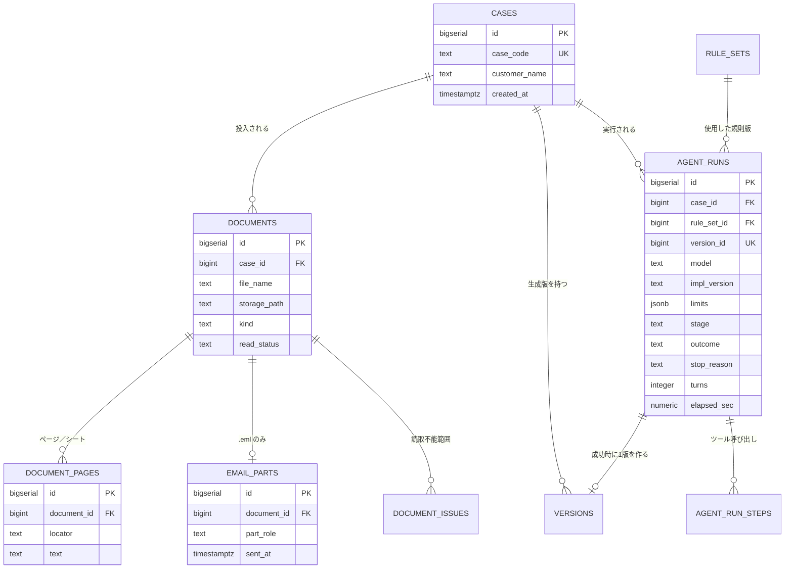
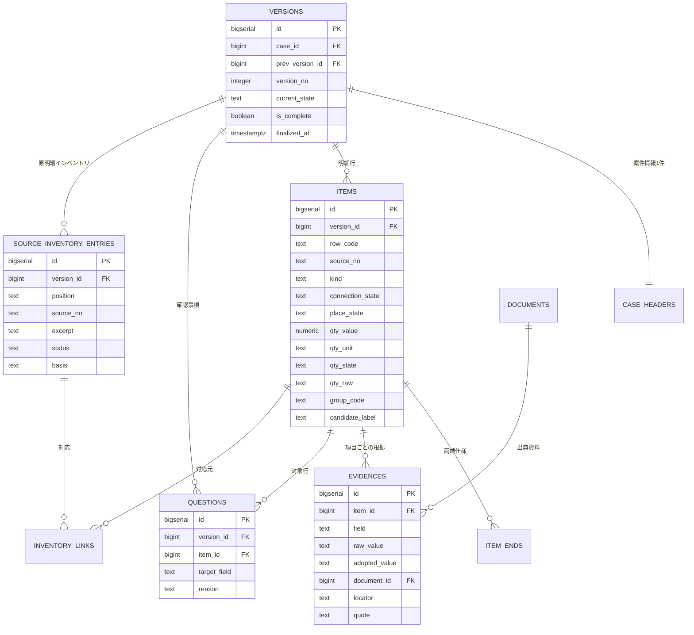
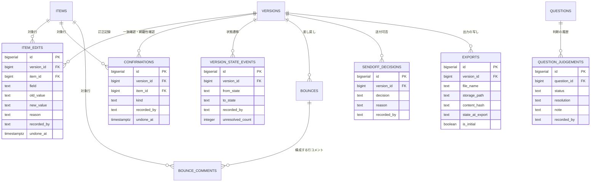

# DB設計書（詳細設計）: OCTG 引合 Item List 作成エージェント

> Vモデル: 詳細設計 / 対応する検証: 単体テスト
> 機能（②`02-requirement.md`）・画面（③`03-spec.md`）・エージェント（`agent-plan.md`）が扱うデータをテーブル設計に落とし込む。
> 業務ルールは 02 が正。本書は「データの持ち方」に限定する。実行可能な CREATE 文は Build の成果物（`db/schema.sql`）。
> 機能ID `FUNC-01`〜`FUNC-10`、規則 R01〜R08、非機能 N01〜N06、確定事項 D01〜D06 は 02 と共通。

## 0. 前提と設計方針

### 0.1 実行環境

`07-infra.md` は無い。02 4章のとおり**ローカル単一利用者の PoC**（認証なし）であり、実行環境は Build フェーズのテンプレート（`CLAUDE.md` 技術スタック）に合わせる。

| 項目 | 決定 | 理由 |
|------|------|------|
| DBエンジン | **PostgreSQL 16（ローカル Docker・docker-compose）** | Build テンプレートの構成に合わせる。エージェントのジョブ（実行状態を書く）と API（読む）の**並行アクセス**があり、単一ファイル DB では書込ロックが競合する。`jsonb` がツール入出力・実行ログに合い、部分UNIQUE索引と複合外部キーを本設計がそのまま要求する |
| 接続 | アプリからは SQLAlchemy 2.0（AsyncSession）、スキーマ変更は Alembic | Build テンプレートの依存に含まれる |
| 型表記 | **PostgreSQL の型で書く**（text / bigint / bigserial / integer / numeric / boolean / timestamptz / jsonb） | 論理型で書くと Build で型の決定が実装者に丸投げになる。`numeric` と `timestamptz` の選択は下表の理由による |
| 認証 | **users テーブルを作らない。認証基盤（Slice 0-4）は実装しない** | 02 4章 N02「認証なし。担当者・上司・業務責任者は記録上の役割でありアクセス制御ではない。確認者名は入力必須だが自己申告であり本人性は検証しない」。パスワードハッシュも外部IDも持たない |
| ファイル実体 | **DB に持たない。**`documents.storage_path` にローカルパスを保持 | 02 N01「入力資料は読取専用とし、処理失敗・再実行でも改変しない」。DB に取り込むと原本と写しの二重管理になる |
| 抽出テキスト | `document_pages.text` に保持（原本ではなく読取結果） | 再実行のたびに原本を再読しないため。原本は書き換えない |

### 0.2 貫く5つの設計原則

02 の業務ルールのうち、**テーブル構造で担保するもの**を先に決める。ここを外すと、アプリのバリデーションを1つ抜けただけでデータが壊れる。

| # | 原則 | 構造での担保 | 根拠 |
|---|------|------------|------|
| 1 | **追記型（旧値を上書きしない）** | 訂正・確認・判断・状態遷移・差し戻し・送付可否はすべて**イベント行の INSERT** で表現する。取り消しは行の DELETE ではなく `undone_at` の付与 | 02 FUNC-08「修正は旧値を上書きせず、旧値・新値・理由を残す」／3章「追記型のテーブルとして設計する」 |
| 2 | **版スコープ（版をまたいで引き継がない）** | 記録テーブルはすべて `version_id` に紐づく。さらに `items` に `UNIQUE(version_id, id)` を置き、`version_id` と `item_id` を**両方持つ5テーブル**（`evidences` / `questions` / `item_edits` / `confirmations` / `bounce_comments`）は**複合外部キー `(version_id, item_id)` → `items(version_id, id)`** で紐づける。これにより**別版の行を紐づけた記録を作れない**。`versions.prev_version_id` は系譜を示すだけで、記録をコピーしない | 02 FUNC-10「状態と記録は版に結び付け、版をまたいで自動で引き継がない」／X12 |
| 3 | **数値と単位の分離・未確定は状態** | 数量・寸法は `*_value` / `*_unit` / `*_state` / `*_raw` の列組。`qty_state<>'numeric'` のとき `qty_value` は NULL 固定（CHECK 制約）。**単位を伴う数値項目（数量・外径・肉厚・単重・定尺長）はすべて「値があれば単位も必須」を CHECK で担保する**（数量だけを守っても R04 は守れない） | 02 5章「TBA・記載なし・適用なしは状態として区別し、数値0や架空の仕様に変換しない」／R04 |
| 4 | **原表記の保持** | 整理後の値と別に `*_raw` を必ず持つ。`*_raw` は UPDATE しない（訂正は `item_edits` に積む） | 02 R01〜R05「原単位・数値を必ず保持する」／FUNC-05 |
| 5 | **記録者は実在の人の入力** | 記録テーブルの `recorded_by` は NOT NULL かつ空文字禁止（CHECK）。**AI が書き込む経路を持たない** | 02 7章「AI が承認者名や日時を作らない」／FUNC-08 |

### 0.3 テーブルの層

24テーブルを5層に分ける。**書き込む主体**が層ごとに違う。

| 層 | 書き込む主体 | テーブル |
|----|------------|---------|
| A 入力 | アプリ（FUNC-01・02 の受付処理） | `cases` `documents` `document_pages` `email_parts` `document_issues` |
| B 規則・実行 | アプリ／エージェント基盤 | `rule_sets` `agent_runs` `agent_run_steps` |
| C 成果物（版スコープ） | **AGENT-01 のみ**（write ツール） | `versions` `case_headers` `items` `item_ends` `evidences` `questions` `source_inventory_entries` `inventory_links` |
| D 人の記録 | **人のみ**（画面操作） | `item_edits` `confirmations` `question_judgements` `version_state_events` `bounces` `bounce_comments` `sendoff_decisions` |
| E 出力 | アプリ（人の操作） | `exports` |

**C層と D層を分けることが本設計の核**である。C は AI の出力、D は人の確認・判断。混ぜると「どこまでが AI の出力で、どこからが人の修正か」が判別できず、KPI の**介入割合**（人が変更した割合）を測れなくなる（01 の KPI・06 の採点式）。

### 0.4 型の選択理由

汎用表記ではなく PostgreSQL の型で書く。数量・日時の2つは**要件から型が決まる**ため、実装者の判断に委ねない。

| 型 | 使う場所 | 理由 |
|----|---------|------|
| `numeric` | 数量・外径・肉厚・単重・定尺長・経過秒 | **浮動小数点（`real` / `double precision`）を使わない。**06 の採点式が「整数数量は厳密一致」を求めるため、`300` が `299.9999...` になり得る型で保持すると採点が揺れる。`13-3/8 in` = 13.375 のような分数由来の値も10進で正確に持つ |
| `timestamptz` | すべての日時（`recorded_at` / `created_at` / `started_at` 等） | **タイムゾーンを落とさない。**見積期限の時刻・TZ を勝手に補わない方針（②5章）と同じ理由で、記録した時刻の TZ も落とさない。`timestamp`（TZ なし）は使わない |
| `jsonb` | `rule_sets.rules` / `agent_runs.validation_result` / `document_pages.cells` | 部分索引・キー検索が使える。規則セットや違反一覧を後から絞り込める |
| `bigserial` / `bigint` | 主キー / 外部キー | 版・記録が追記型で増え続けるため 32bit に収めない |
| `text` | 文字列全般 | PostgreSQL では `varchar(n)` に性能上の利点がなく、上限は CHECK で表現できる |

### 0.5 PostgreSQL の機能で担保する制約

0.2 の原則を「アプリのコード」ではなく「DBの機能」で守る。ここは Alembic のマイグレーションに落ちる。

| 機能 | 使う場所 | 備考 |
|------|---------|------|
| CHECK 制約 | 原則3（値と単位・未確定状態）／原則5（記録者名の空文字禁止）／送付可否の理由必須／除外の根拠必須 | **0.2 の原則3・5 の担保はここ**。アプリのバリデーションを1つ抜けても壊れない |
| 部分UNIQUE索引 | `evidences` の2本（`WHERE item_id IS NOT NULL` / `WHERE item_id IS NULL`）／`rule_sets`（`WHERE is_current`）／`confirmations` の2本（`WHERE kind='row_match' AND undone_at IS NULL` / `WHERE kind='coverage' AND undone_at IS NULL`） | `CREATE UNIQUE INDEX ... WHERE ...` で表現する。NULL 同士が重複と見なされない問題への対処（3.3）に加え、**現行規則版が2件になること・未取消の確認が二重に残ること**も同じ機構で防ぐ（3.2・3.4） |
| 複合外部キー | 原則2（版スコープ）。5テーブルから `(version_id, item_id) → items(version_id, id)` | 参照先に `UNIQUE(version_id, id)` があるため成立する。別版の行を紐づけた記録を作れない |
| 外部キーの強制 | 全テーブル | PostgreSQL は常に強制する（接続ごとの有効化は不要） |
| 全文検索 | `document_pages.text`（`search_documents` の検索対象） | `to_tsvector` + GIN 索引。日本語は形態素解析が入らないため、初版は `ILIKE` による部分一致で足りるかを Build で判断する（10件・数十ページ規模） |
| `enum` 型 | 使わない | 状態値は CHECK 制約で表現する。`enum` は値の追加にマイグレーションが必要で、規則の改訂に追随しにくい |

### 0.6 Docker（ローカル実行）

| 項目 | 内容 |
|------|------|
| 起動 | `docker-compose up -d`（PostgreSQL のみ） |
| Docker の用途 | **DB の起動だけ。**アプリのコンテナ化・デプロイには使わない（`CLAUDE.md` の決定事項） |
| データの永続化 | named volume。**評価のやり直しに備え、初期化手順（volume 削除 → Alembic 再適用）を Build で用意する**（06 共通手順1の「実装・入力版を固定して開始」に対応） |
| 接続情報 | `backend/.env`（`DATABASE_URL`）。**git 管理外**。`ANTHROPIC_API_KEY` と同じ扱い |

## 1. テーブル一覧

### A層 入力

| テーブル名 | 目的 | 関連機能(②) |
|-----------|------|-------------|
| `cases` | 案件。すべてのデータの最上位スコープ。他案件との混在を防ぐ境界 | FUNC-01, N01 |
| `documents` | 投入資料1件。原本はファイルのまま参照し、読取結果の状態を持つ | FUNC-01, N01 |
| `document_pages` | ページ／シート単位の抽出テキスト・セル値。参照解決（「本文3.2項による」）の検索対象 | FUNC-01, FUNC-04 |
| `email_parts` | .eml の構造（ヘッダ・本文・引用部・添付一覧）。表示順ではなく日時と訂正対象で新旧を判定するための素材 | FUNC-02 |
| `document_issues` | 読取不能・暗号化・未対応・未走査の範囲。部分成功を完全成功と表示しないための根拠 | FUNC-01, N03 |

### B層 規則・実行

| テーブル名 | 目的 | 関連機能(②) |
|-----------|------|-------------|
| `rule_sets` | 表記・単位・分割規則 R01〜R08 と論理項目定義。設定として分離し版を持つ | FUNC-05, FUNC-06, N04 |
| `agent_runs` | AGENT-01 の1実行。使用モデル・規則版・ターン数・経過秒・停止理由を残す | agent-plan, N04, N06 |
| `agent_run_steps` | 実行内のツール呼び出しトレース。外部送信を行っていないことの証跡にもなる | agent-plan, N02, N04 |

### C層 成果物（版スコープ・AGENT-01 が書く）

| テーブル名 | 目的 | 関連機能(②) |
|-----------|------|-------------|
| `versions` | 生成版。状態（作成案／担当者確認済み／評価確認済み）と系譜を持つ | FUNC-09, FUNC-10, N04 |
| `case_headers` | 案件情報を**原文の粒度で**保持。②5章 領域1 | FUNC-04, FUNC-09 |
| `items` | Item List 明細。②5章 領域2。数値と単位を分離し、未確定は状態で持つ | FUNC-03, FUNC-05, FUNC-06 |
| `item_ends` | クロスオーバー等の両端仕様（径・接続・BOX／PIN）。単一径に潰さないための補足 | FUNC-05, FUNC-06 |
| `evidences` | 項目ごとの原値・採用値・出典・引用・適用条件・変更理由。②5章 領域3 | FUNC-04, FUNC-07 |
| `questions` | 確認事項（対象行または案件・理由・候補／不足条件）。②5章 領域4 | FUNC-07 |
| `source_inventory_entries` | 原資料側のインベントリ（明細＋除外要素と除外理由）。②5章 領域6。SCR-05 の左表 | FUNC-03, FUNC-06 |
| `inventory_links` | インベントリ要素 ↔ 明細行の対応（0〜n）。分割・除外・欠落・余分の判定根拠 | FUNC-03, FUNC-06 |

### D層 人の記録（追記型・人のみが書く）

| テーブル名 | 目的 | 関連機能(②) |
|-----------|------|-------------|
| `item_edits` | 訂正記録（対象項目・旧値・新値・理由・修正者）。取消も履歴として残す | FUNC-08 |
| `confirmations` | 担当者の確認記録。行ごとの一致確認と版ごとの網羅性確認を種別で持つ | FUNC-08 |
| `question_judgements` | 確認事項の判断（対応状況・解決状態・判断内容・判断者）。追記型で履歴を残す | FUNC-07, FUNC-08 |
| `version_state_events` | 状態遷移の記録（担当者確認済み・評価確認済み）。状態の真実源 | FUNC-10 |
| `bounces` | 上司の差し戻し（理由・判断者）。状態は戻さず記録だけを残す | FUNC-10 |
| `bounce_comments` | 差し戻しの行ごとのコメント。差し戻し理由の構成要素 | FUNC-10 |
| `sendoff_decisions` | 送付可否（未判断／保留／承認・理由条件・判断者）。評価確認とは別の記録 | FUNC-10 |

### E層 出力

| テーブル名 | 目的 | 関連機能(②) |
|-----------|------|-------------|
| `exports` | .xlsx 出力の記録。どの版・どの記録時点の写しかを判別する | FUNC-09, N04 |

## 2. ER図

規模が大きいため3枚に分ける。`versions` が C・D・E 層をつなぐハブになる。

### 2.1 入力・実行系（A・B層）

### 2.2 成果物（C層・版スコープ）

### 2.3 人の記録・出力（D・E層）

## 3. テーブル定義

共通: すべてのテーブルに `id bigserial PK` と `created_at timestamptz NOT NULL DEFAULT now()` を置く。**D層には `updated_at` を置かない**（追記型のため更新しない）。

### 3.1 A層 入力

#### cases

**目的**: 案件。他案件とのデータ混在を防ぐ最上位スコープ（N01）。

| カラム | 型 | 制約 | 説明 |
|-------|-----|------|------|
| id | bigserial | PK | |
| case_code | text | NOT NULL, UNIQUE | 案件ID（例 `S06`）。出力ファイル名にも含める |
| customer_name | text | | 客先名。資料に無ければ NULL（「記載なし」は `case_headers` 側で状態として持つ） |
| title | text | | 案件名・件名 |
| created_at | timestamptz | NOT NULL | |

> **`customer_name` / `title` は画面の入力値**（⑤ FLOW-01 step1 `POST /cases` の任意項目）であり、**エージェントは書かない**（A層はアプリの領域・0.3）。資料から読み取った客先名は版スコープの `case_headers.customer_name` が出典つきで持つ。両者が食い違う場合、`case_headers` が「資料に書かれていた事実」、`cases` が「案件の呼び名」であり、**片方を他方へ同期しない**。

#### documents

**目的**: 投入資料1件。**原本は改変しない**ため実体は持たず、パスと読取結果のみ保持する（N01）。

| カラム | 型 | 制約 | 説明 |
|-------|-----|------|------|
| id | bigserial | PK | |
| case_id | bigint | NOT NULL, FK→cases | |
| file_name | text | NOT NULL | 原ファイル名 |
| storage_path | text | NOT NULL | ローカルパス。**読取専用で開く** |
| kind | text | NOT NULL, CHECK IN ('pdf','xlsx','eml','text','unsupported') | 形式。**`unsupported` は未対応形式の投入を記録するための値**（②FUNC-01 X01「投入の事実は資料一覧に残す」。この場合 `read_status` も `unsupported` で、`document_pages` は作らない） |
| page_count | integer | | ページ／シート数 |
| read_status | text | NOT NULL, CHECK IN ('success','partial','unreadable','encrypted','unsupported') | 読取結果。**`partial` を `success` と同一に扱わない**（N03） |
| content_hash | text | | 二重投入の検知用。投入の事実は残し、明細の二重計上は FUNC-03 で防ぐ |
| received_at | timestamptz | NOT NULL | 投入日時 |

#### document_pages

**目的**: ページ／シート単位の抽出テキスト。参照解決（`search_documents`）の検索対象。

| カラム | 型 | 制約 | 説明 |
|-------|-----|------|------|
| id | bigserial | PK | |
| document_id | bigint | NOT NULL, FK→documents | |
| locator | text | NOT NULL | 位置の正規表記（`p.2` / `Sheet1!A10:F10` / `body:3.2`）。**`evidences.locator` と同じ表記体系**にして突合可能にする |
| seq | integer | NOT NULL | 表示順 |
| text | text | | 抽出テキスト。読めなかったページは NULL とし `document_issues` に記録 |
| cells | jsonb | | .xlsx のセル値と結合見出しの構造 |
| | | UNIQUE(document_id, locator) | |

#### email_parts

**目的**: .eml の構造保持（FUNC-02）。引用の表示順で新旧を決めないため、日時と役割を分けて持つ。

| カラム | 型 | 制約 | 説明 |
|-------|-----|------|------|
| id | bigserial | PK | |
| document_id | bigint | NOT NULL, FK→documents | |
| part_role | text | NOT NULL, CHECK IN ('latest_body','quoted_body','postscript','forward_note','attachment') | 本文／引用部／P.S.／転送注記／添付 |
| seq | integer | NOT NULL | 出現順（**新旧の判定には使わない**） |
| sent_at | timestamptz | | Date ヘッダ。**新旧判定はこの値と明示された訂正対象で行う** |
| from_addr | text | | |
| subject | text | | |
| body | text | | |
| attachment_name | text | | `part_role='attachment'` のときのファイル名 |

#### document_issues

**目的**: 読取不能・未走査の範囲（N03）。エージェントの `report_unreadable` が書く。

| カラム | 型 | 制約 | 説明 |
|-------|-----|------|------|
| id | bigserial | PK | |
| document_id | bigint | NOT NULL, FK→documents | |
| agent_run_id | bigint | FK→agent_runs | 実行中に検出した場合 |
| locator | text | | 対象範囲（`p.2` 等）。資料全体なら NULL |
| issue_type | text | NOT NULL, CHECK IN ('unreadable_page','encrypted','unsupported','reference_missing','not_scanned') | |
| detail | text | NOT NULL | 表示する説明 |

### 3.2 B層 規則・実行

#### rule_sets

**目的**: R01〜R08 と論理項目定義を設定として分離し、版で固定する（N04）。エージェントは読取のみ。

| カラム | 型 | 制約 | 説明 |
|-------|-----|------|------|
| id | bigserial | PK | |
| rule_version | text | NOT NULL, UNIQUE | 規則版（例 `R-2026.09`） |
| rules | jsonb | NOT NULL | R01〜R08 の対応表・分割条件・禁止事項 |
| is_current | boolean | NOT NULL, DEFAULT false | **「現行」の規則版を1件だけ真にする**（部分UNIQUE索引 `WHERE is_current`）。`get_rules`／⑤API 11 の「省略時は現行」をこの列で決め、**最大 id や `rule_version` の文字列順に依存させない**（N04 の規則版固定） |
| conversion_enabled | boolean | NOT NULL, DEFAULT false | **D03 未承認のため既定 false。**true にできるのは換算表・精度・丸めの承認後 |
| note | text | | |

#### agent_runs

**目的**: AGENT-01 の1実行。N04（実装・モデル・規則版・入力版・出力版を残す）と N06（経過時間）の根拠。

| カラム | 型 | 制約 | 説明 |
|-------|-----|------|------|
| id | bigserial | PK | |
| case_id | bigint | NOT NULL, FK→cases | |
| rule_set_id | bigint | NOT NULL, FK→rule_sets | 使用した規則版。**`versions.rule_set_id` と同値**を同一トランザクションで入れる（成果物側の正は `versions`、本列は実行記録としての写し。版を作れなかった実行でも規則版を残せるよう別に持つ・4章） |
| version_id | bigint | UNIQUE, FK→versions | 起動時に作る版。**1実行1版**のため UNIQUE（「どの実行がこの版を作ったか」を一意に引く）。起動に失敗して版を作れなかった場合のみ NULL |
| model | text | NOT NULL | 使用モデル識別子。**D05 未承認のため初版はダミー応答の識別子** |
| impl_version | text | NOT NULL | 実装版（git のコミット SHA 等）。N04「使用した**実装**・モデル／設定・変換規則・入力版・出力版を評価記録に残す」の担保 |
| limits | jsonb | NOT NULL | **その実行に適用した停止閾値**（`max_turns` / `inner_timeout_s` / `inactivity_timeout_s` / `outer_timeout_s`）。D06 は仮値のまま実測して見直す前提なので、閾値を設定ファイルだけに置くと「どの閾値で走った実行か」が後から分からない（7章 D06） |
| started_at | timestamptz | NOT NULL | |
| ended_at | timestamptz | | |
| elapsed_sec | numeric | | 経過秒。**人の作業時間には含めない**（N06・01 の KPI） |
| turns | integer | NOT NULL, DEFAULT 0 | ツール呼び出し回数。上限 40（D06 仮値） |
| stage | text | CHECK IN ('reading','extracting','self_checking','done') | **進捗の段階**（資料読取中／抽出中／自己点検中／終了）。SCR-02 の生成中表示（⑤3.2）の取得元。`outcome='running'` の間だけ UPDATE で進む |
| stage_detail | text | | 段階の内訳（`資料 2/5` 等）。表示文言そのものではなく件数の材料を入れる |
| outcome | text | NOT NULL, CHECK IN ('running','success','failed','stopped') | |
| stop_reason | text | CHECK IN ('completed','failed','max_turns','inner_timeout','inactivity_timeout','outer_timeout','repeated_call','no_readable_document','validation_loop') | **語彙は `.claude/rules/agent-development.md` §3 と一致させる。**タイムアウトは**無応答（`inactivity_timeout`）< 内側（`inner_timeout`）< 外側（`outer_timeout`）**の2層を区別して残す。単一の `timeout` に丸めると、外側発火（＝内側が機能しなかった異常・§6）を評価時に切り分けられない |
| validation_result | jsonb | | 最終 `validate_draft` の違反一覧（成功時は空配列）。**書くのは `finalize_draft`（⑤API 21）と中断時のジョブ**。`GET /versions/{id}/validation`（⑤API 20）は読み取りのみで本列を更新しない（安全メソッドに副作用を持たせない・⑤3.4） |

> **`stage` / `stage_detail` は UPDATE する。**原則1（追記型）はD層（人の記録）と成果物に適用する規律であり、B層の実行状態は「今どこを走っているか」の1値でよい。段階の履歴が必要な場面は `agent_run_steps` のトレースで足りるため、進捗を追記型にはしない。

#### agent_run_steps

**目的**: ツール呼び出しのトレース。**外部送信を行っていないことの証跡**にもなる（N02・AE06）。

| カラム | 型 | 制約 | 説明 |
|-------|-----|------|------|
| id | bigserial | PK | |
| agent_run_id | bigint | NOT NULL, FK→agent_runs | |
| parent_step_id | bigint | FK→agent_run_steps | サブエージェント化した場合の親子関係（初版は常に NULL） |
| seq | integer | NOT NULL | 実行順 |
| tool_name | text | NOT NULL | `read_document` 等。ツール一覧（agent-plan）に無い名前は記録しない |
| args_digest | text | NOT NULL | 引数のハッシュ。**同一ツール・同一引数の3回連続**の検知に使う |
| args_summary | text | | 要約のみ。**資料全文・認証情報は残さない**（N02） |
| locator | text | | **読んだ／記録した範囲の正規表記**（`p.2` / `Sheet1!A10:F10` / `body:3.2`）。`document_pages.locator` と同じ表記体系にし、走査済み範囲の機械判定（完了条件①）に使う |
| document_id | bigint | FK→documents | `locator` の対象資料。read 系ツールで資料を指定した場合に入れる |
| result_status | text | NOT NULL, CHECK IN ('ok','error','unreadable') | |
| duration_ms | integer | | |
| | | UNIQUE(agent_run_id, seq) | |

> **完了条件①「読取成功範囲すべてを走査した」はこの2列で機械判定する。**`document_pages`（読取成功ページ）から、当該実行の `agent_run_steps`（`result_status='ok'`）が `(document_id, locator)` で覆った範囲と `document_issues`（読取不能・未走査として記録済みの範囲）を差し引き、残りが0であることを確認する。`args_summary` は要約のみで全文を残さないため、範囲の判定を要約文から行わない。

> **トレース（`backend/traces/{run_id}.jsonl`）との関係。**一次記録は JSONL（`CLAUDE.md`・`agent-development.md` §3「すべての実行をトレースに記録する」）、`agent_run_steps` は**同一処理内で書く DB 側の写し**であり、画面・⑤API 14 と `validate_draft` の走査範囲判定（上記）はこちらを読む。`run_id` は `agent_runs.id`（= JSONL のファイル名）で対応づける。**片方だけに書く経路を作らない**。両者が食い違った場合は JSONL を正とし、齟齬自体をバグとして調査する。

### 3.3 C層 成果物（版スコープ）

#### versions

**目的**: 生成版。**記録はすべてこの版に属し、版をまたいで引き継がない**（FUNC-10・X12）。

| カラム | 型 | 制約 | 説明 |
|-------|-----|------|------|
| id | bigserial | PK | |
| case_id | bigint | NOT NULL, FK→cases | |
| version_no | integer | NOT NULL | 案件内の連番。UNIQUE(case_id, version_no) |
| prev_version_id | bigint | FK→versions | 再実行元の版。**系譜を示すだけで記録はコピーしない** |
| rule_set_id | bigint | NOT NULL, FK→rule_sets | 生成に使った規則版 |
| current_state | text | NOT NULL, DEFAULT 'draft', CHECK IN ('draft','staff_checked','review_checked') | **`version_state_events` の最新値のキャッシュ**（3.6）。差し戻しでは変化しない |
| is_complete | boolean | NOT NULL, DEFAULT true | `false` = 一部未完了（`document_issues` あり）。**完全成功と表示しない**（N03） |
| finalized_at | timestamptz | | `finalize_draft` で作成案として確定した日時。NULL の版は画面に出さない |
| | | CHECK(finalized_at IS NOT NULL OR current_state='draft') | 未確定の版が状態を進めない |

#### case_headers

**目的**: 案件情報（②5章 領域1）。**原文の粒度を落とさない**ことがこのテーブルの存在理由。

| カラム | 型 | 制約 | 説明 |
|-------|-----|------|------|
| id | bigserial | PK | |
| version_id | bigint | NOT NULL, UNIQUE, FK→versions | 版に1件 |
| inquiry_no | text | | 照会番号。無ければ NULL |
| inquiry_no_state | text | NOT NULL, CHECK IN ('stated','not_stated') | 「記載なし」を空欄と区別する |
| customer_name | text | | |
| customer_name_state | text | NOT NULL, CHECK IN ('stated','not_stated') | 客先名の「記載なし」を空欄と区別する |
| due_raw | text | | 要求納期の**原文**（例 `2027年2月`） |
| due_state | text | NOT NULL, CHECK IN ('stated','tba','not_stated') | 要求納期の状態。`due_granularity` は**粒度**であり有無ではないため別に持つ |
| due_granularity | text | CHECK IN ('date','month','quarter','period','month_end','unknown') | 粒度。**任意の日に変換しない**（②5章） |
| due_basis | text | CHECK IN ('shipment','arrival','unknown') | 荷揚／船積。不明なら `unknown` |
| place_raw | text | | 納地の原文 |
| place_state | text | NOT NULL, CHECK IN ('stated','not_stated','not_applicable') | **②5章「納地等が記載されない資料では記載なしとする」**の担保 |
| incoterms | text | | DDP／CIF／FCA 等。原表記のまま |
| incoterms_state | text | NOT NULL, CHECK IN ('stated','not_stated','not_applicable') | 受渡条件の状態 |
| quote_deadline_raw | text | | 見積期限の**原文**（例 `Friday COB`） |
| quote_deadline_at | timestamptz | | 時刻・TZ が資料から確定できる場合のみ。**補完しない**（AE02） |
| quote_deadline_tz_state | text | NOT NULL, CHECK IN ('stated','missing') | `missing` なら確認事項が立つ |
| | | CHECK((customer_name_state='stated') = (customer_name IS NOT NULL)) | 値と状態を対にする（`items` と同じ規律・3.3） |
| | | CHECK((due_state='stated') = (due_raw IS NOT NULL)) | 同 |
| | | CHECK((place_state='stated') = (place_raw IS NOT NULL)) | 同 |
| | | CHECK((incoterms_state='stated') = (incoterms IS NOT NULL)) | 同 |
| | | CHECK((inquiry_no_state='stated') = (inquiry_no IS NOT NULL)) | 同（既存の状態列にも対の CHECK を掛ける） |

#### items

**目的**: Item List 明細（②5章 領域2）。**0.2 の原則3・4 を最も強く適用するテーブル**。

| カラム | 型 | 制約 | 説明 |
|-------|-----|------|------|
| id | bigserial | PK | |
| version_id | bigint | NOT NULL, FK→versions | **UNIQUE(version_id, id)** を併せて置く。記録テーブルからの複合外部キーの参照先（原則2） |
| row_code | text | NOT NULL | 表示用行ID（`1` / `1a` / `4b`）。UNIQUE(version_id, row_code) |
| source_no | text | NOT NULL | 原項番。**全行に必須**（agent-plan 完了条件②） |
| seq | integer | NOT NULL | 表示順 |
| kind | text | NOT NULL | 品種（ケーシング等・R01 で整理後） |
| kind_raw | text | NOT NULL | 原品名（CSG / PUP JT 等）。**併記する**（R01） |
| usage_note | text | | ライナー等の用途 |
| od_value | numeric | | 外径 |
| od_unit | text | | `in` / `mm`。**mm を公称 inch に丸めない**（R04） |
| od_raw | text | | 原表記（`13-3/8"` 等） |
| od_state | text | NOT NULL, CHECK IN ('stated','tba','not_stated','not_applicable') | **完了条件③の担保**。値が無い理由を状態で持つ（記載あり／未確定 TBA／記載なし／適用なし） |
| wall_value | numeric | | 肉厚。**単重とは別項目**（②5章） |
| wall_unit | text | | |
| wall_raw | text | | |
| wall_state | text | NOT NULL, CHECK IN ('stated','tba','not_stated','not_applicable') | 同（肉厚）。**単重が書かれ肉厚が無い資料**を「肉厚 記載なし」として残す |
| weight_value | numeric | | 単重 |
| weight_unit | text | | `lb/ft` 等。`#` `ppf` は文脈確認のうえ `lb/ft` として保持（R02） |
| weight_raw | text | | |
| weight_state | text | NOT NULL, CHECK IN ('stated','tba','not_stated','not_applicable') | 同（単重）。**肉厚から単重を推定しない**（R04）ため、無い場合は状態で持つ |
| grade | text | | 材質（K55／L80／SM95TT／13CR-95 等） |
| grade_raw | text | NOT NULL | **他仕様へ置換しない**（R03）。整理前の表記 |
| grade_state | text | NOT NULL, CHECK IN ('stated','tba','not_stated','not_applicable') | 同（材質） |
| connection | text | | 接続（VAM TOP／VAM 21／BTC 等） |
| connection_raw | text | | |
| connection_state | text | NOT NULL, CHECK IN ('stated','tba','not_stated','not_applicable') | 同（接続）。**S01 の No.5「接続は未確定」を他行から補完せずに保持する**（⑥S01） |
| range_class | text | | R2／R3。**定尺長とは別項目** |
| length_value | numeric | | 定尺長 |
| length_unit | text | | `FT` / `m` |
| length_raw | text | | |
| length_state | text | NOT NULL, CHECK IN ('stated','tba','not_stated','not_applicable') | 同（レンジ・定尺長の対）。`range_class` と `length_value` の**両方**に掛かる |
| qty_value | numeric | | 数量。**`qty_state<>'numeric'` のとき必ず NULL** |
| qty_unit | text | | `本` / `個` / `MT` / `t`（R02） |
| qty_state | text | NOT NULL, CHECK IN ('numeric','tba','not_stated','not_applicable') | **0 や空欄に変換しない**（②5章） |
| qty_raw | text | NOT NULL | 原表記（`150 MT`・`TBA` 等） |
| qty_reference_note | text | | 括弧内の概算長・概算本数。**主数量を置換しない**（R05） |
| due_raw | text | | 行個別の要求納期（原文）。無ければ共通条件を適用し `evidences` に適用元を残す |
| due_state | text | NOT NULL, CHECK IN ('stated','tba','not_stated','not_applicable') | 同（要求納期）。共通条件を適用した場合も値が入るので `stated` |
| place_raw | text | | 行個別の納地 |
| place_state | text | NOT NULL, CHECK IN ('stated','tba','not_stated','not_applicable') | 同（納地）。**S01「納地は記載なし」を空欄と区別する**（⑥S01） |
| note | text | | 備考（脚注条件・NACE 準拠等） |
| group_code | text | | 選択グループID。**候補行の関連付け**。命名で用途を区別する: `ALT-n` = 客先が選ぶ択一（R06）、`CFL-n` = **資料の記載が相反し優先関係を判定できない場合の併記**（X04） |
| candidate_label | text | | 候補区分（`A` / `B` / `5FT` / `10FT`）。単独行は NULL |
| is_inherit_candidate | boolean | NOT NULL, DEFAULT false | 継承候補（R08）。**確定扱いにしない** |
| | | CHECK((qty_state='numeric' AND qty_value IS NOT NULL AND qty_unit IS NOT NULL) OR (qty_state<>'numeric' AND qty_value IS NULL)) | **原則3の担保**。単位なし数量・状態なし未確定を作れない（X11） |
| | | CHECK((od_state='stated') = (od_value IS NOT NULL)) | **原則3の担保（状態）**。値と状態を対にし、値も状態も無い行を作れない（完了条件③） |
| | | CHECK((wall_state='stated') = (wall_value IS NOT NULL)) | 同（肉厚） |
| | | CHECK((weight_state='stated') = (weight_value IS NOT NULL)) | 同（単重） |
| | | CHECK((grade_state='stated') = (grade IS NOT NULL)) | 同（材質） |
| | | CHECK((connection_state='stated') = (connection IS NOT NULL)) | 同（接続） |
| | | CHECK((length_state='stated') = (range_class IS NOT NULL OR length_value IS NOT NULL)) | 同（レンジ・定尺長。どちらかがあれば `stated`） |
| | | CHECK((due_state='stated') = (due_raw IS NOT NULL)) | 同（要求納期） |
| | | CHECK((place_state='stated') = (place_raw IS NOT NULL)) | 同（納地） |
| | | CHECK(candidate_label IS NULL OR group_code IS NOT NULL) | 候補区分だけの行を作らせない |
| | | CHECK(od_value IS NULL OR od_unit IS NOT NULL) | **原則3の担保（外径）**。単位なしの外径を作れない（R04） |
| | | CHECK(wall_value IS NULL OR wall_unit IS NOT NULL) | 同（肉厚） |
| | | CHECK(weight_value IS NULL OR weight_unit IS NOT NULL) | 同（単重） |
| | | CHECK(length_value IS NULL OR length_unit IS NOT NULL) | 同（定尺長） |
| | | UNIQUE(version_id, id) | 原則2の担保。記録テーブルの複合FKの参照先 |

> **重要項目の状態列（完了条件③の構造的担保）。**`agent-plan` の完了条件③は「重要項目が**値または状態**（TBA／記載なし／適用なし）で埋まっている」ことを要求する。`qty_state` だけでは残りの項目の NULL が「未確定」「記載なし」「適用なし」「エージェントの埋め忘れ」の4つを兼ねてしまい、③を機械判定できない（⑥S01 は「No.5 接続は**未確定**」「納地は**記載なし**」を期待値に含む）。そこで重要項目ごとに `*_state` を **NOT NULL・既定値なし**で置き、値と状態を対にする CHECK を掛ける。これにより `propose_items` は全行・全重要項目について状態を明示せざるを得ず、③は登録時に構造で担保される（`validate_draft` の機械判定リストには置かない＝空振りするチェックを並べない）。語彙は `qty_state` の `numeric` が他項目の `stated` に相当する（数量だけ「数値である」ことを示す既存の語を残した）。品種（`kind` / `kind_raw`）は `NOT NULL` のため状態を持たない。

> **相反する数量の保持（X04）**。同一項目に相反する数量が書かれ、優先関係が資料から判定できない場合は、**どちらかを採用せず両方を別行として残す**。同一 `group_code`（`CFL-n`）・別 `candidate_label` の2行にし、各行の `evidences` にそれぞれの出典と原文抜粋を持たせ、`questions`（`category='conflict'`・対象は当該グループの行）で判断を人に差し出す。`qty_reference_note` に併記して1行に潰す運用は採らない（R05 の主数量が2つになり、出典も1つしか付かなくなる）。`ALT-n` との違いは**客先に選ばせる候補か、資料の矛盾か**であり、`orphan_candidate`（候補1件のグループ）の機械判定はどちらにも同じく効く。

> **合計数量の列は置かない。**択一グループの数量を合算した値を持つ列を作ると R07（候補数量を合算して発注数量と表示しない）を構造的に破れるため、集計列そのものを設けない。

#### item_ends

**目的**: クロスオーバー等の両端仕様。**単一径に潰さない**ための補足（②5章）。

| カラム | 型 | 制約 | 説明 |
|-------|-----|------|------|
| id | bigserial | PK | |
| item_id | bigint | NOT NULL, FK→items | |
| side | text | NOT NULL, CHECK IN ('end_a','end_b') | 両端 |
| od_value | numeric | | |
| od_unit | text | | |
| od_raw | text | | |
| connection | text | | |
| thread_end | text | CHECK IN ('BOX','PIN') | BOX／PIN を保持 |
| | | UNIQUE(item_id, side) | |

#### evidences

**目的**: 項目ごとの根拠（②5章 領域3）。**出典が無い値を作らせない**ための表。

| カラム | 型 | 制約 | 説明 |
|-------|-----|------|------|
| id | bigserial | PK | |
| version_id | bigint | NOT NULL, FK→versions | 案件レベルの根拠も引ける |
| item_id | bigint | FK→items | 行に紐づく根拠。案件情報の根拠なら NULL |
| | | FK(version_id, item_id)→items(version_id, id) | **原則2の担保**。別版の行を出典に紐づけられない（`item_id` が NULL の行では成立） |
| field | text | NOT NULL | 対象項目（`qty` / `grade` / `due` 等） |
| raw_value | text | NOT NULL | 原値（資料の表記そのまま） |
| adopted_value | text | NOT NULL | 採用値 |
| document_id | bigint | NOT NULL, FK→documents | 出典資料 |
| locator | text | NOT NULL | 位置（`document_pages.locator` と同じ表記体系） |
| quote | text | NOT NULL | 原文抜粋。**シグネチャの引用ブロックで表示**（③3章） |
| applied_condition | text | | 共通条件・個別例外の適用元（FUNC-04） |
| conversion_note | text | | 換算条件。**未承認のため通常は「換算：未実施（不足条件）」**（D03） |
| change_reason | text | | 変更の採用理由（P.S.／Rev. 等） |
| prior_value | text | | **資料上の**変更前の値 |
| | | 部分UNIQUE(item_id, field) WHERE item_id IS NOT NULL | 行の根拠は1項目1根拠。複数出典は `applied_condition` に併記 |
| | | 部分UNIQUE(version_id, field) WHERE item_id IS NULL | **案件レベルの根拠も1項目1根拠**。`UNIQUE(item_id, field)` だけでは NULL 同士が重複と見なされず、同じ `field` の案件レベル根拠を何行でも作れてしまうため、索引を2本に分ける |

> `evidences.prior_value` と `item_edits.old_value` は**別物**。前者は「資料上で変更された旧値」（AI が読んだ事実）、後者は「人が訂正した旧値」（人の介入）。混ぜると KPI の介入割合が測れない（0.3 の C／D 分離）。

#### questions

**目的**: 確認事項（②5章 領域4）。**行に紐づかない案件レベルの事項**も持つ。

| カラム | 型 | 制約 | 説明 |
|-------|-----|------|------|
| id | bigserial | PK | |
| version_id | bigint | NOT NULL, FK→versions | |
| question_code | text | NOT NULL | 確認ID。UNIQUE(version_id, question_code) |
| item_id | bigint | FK→items | 対象行。**NULL なら案件レベル**（例: Friday COB の時刻・TZ 不足） |
| | | FK(version_id, item_id)→items(version_id, id) | 原則2の担保（`item_id` が NULL の行では成立） |
| target_field | text | | 対象項目 |
| reason | text | NOT NULL | 理由 |
| candidates | text | | 候補・不足条件 |
| category | text | CHECK IN ('unknown','conflict','reference_missing','alternative','condition_missing','inherit_candidate') | |

> 現在の対応状況・解決状態は**このテーブルに持たない**。`question_judgements` の最新行から導出する（原則1）。

#### source_inventory_entries

**目的**: 原資料側のインベントリ（②5章 領域6）。**明細にしなかった要素も除外理由つきで棚卸しする**（SCR-05 左表）。

| カラム | 型 | 制約 | 説明 |
|-------|-----|------|------|
| id | bigserial | PK | |
| version_id | bigint | NOT NULL, FK→versions | |
| document_id | bigint | NOT NULL, FK→documents | |
| position | text | NOT NULL | 位置（`p.2` / `A10:F10`） |
| source_no | text | | 原項番。注記・脚注なら `注)` 等 |
| seq | integer | NOT NULL | 表示順 |
| excerpt | text | NOT NULL | 原文行の抜粋 |
| status | text | NOT NULL, CHECK IN ('mapped','split','excluded','unmapped') | 対応済み／分割／除外／対応なし |
| status_detail | text | | `分割: 接続の択一（2行）` `除外（合計行）` 等の表示文言 |
| basis | text | | 除外・分割の**根拠** |
| | | CHECK(status<>'excluded' OR basis IS NOT NULL) | **根拠のない除外を作らせない**。根拠が無ければ `unmapped`（欠落の可能性）として扱う |

> `status` は**保存された値**であり、行IDの形（`5a` / `5b`）から推測して導出しない。sample-08 の 5a／5b は元資料が最初から別行であり「分割」ではないため、推測すると誤表示になる（③ SCR-05）。

#### inventory_links

**目的**: インベントリ要素と明細行の対応（0〜n）。欠落・余分・分割の判定根拠。

| カラム | 型 | 制約 | 説明 |
|-------|-----|------|------|
| id | bigserial | PK | |
| entry_id | bigint | NOT NULL, FK→source_inventory_entries | |
| item_id | bigint | NOT NULL, FK→items | |
| | | UNIQUE(entry_id, item_id) | |

> **欠落** = `status='unmapped'` かつ link 0件。**余分** = link を持たない `items`。**分割** = 1 entry に link 2件以上。いずれもクエリで判定でき、判定結果を列として持たない。

### T-201 補足（2026-09-12）：走査範囲と根拠項目の契約

- メールは `document_pages` に重複保存せず、既存の `email_parts` を走査対象にする。本文を持つ部分と添付一覧の各要素を `email:<part_role>:<seq>` で識別する（例 `email:postscript:2`）。`seq` は識別・出現順だけに用い、新旧判定には使わない。
- `read_email` が構造全体を返した成功トレースに限り `locator="email:*"` を記録し、その資料の全パーツを走査済みにする。部分読取は個別 locator を記録する。添付一覧の走査は添付内容の読取を意味しない。これは T-202/T-203 の読取・トレース実装にも適用する。
- PDF・Excel・テキストは読取成功した `document_pages.locator` 単位。走査済みにできるのは当該実行の成功した `read_document` / `read_email` のみ。検索・一覧取得・別実行の記録を代用しない。
- 相殺できる issue は受付時（`agent_run_id IS NULL`）または当該実行の、対象範囲が一致する `unreadable_page` / `encrypted` / `unsupported` / `not_scanned`。セル単位 issue はシート全体を相殺しない。locator が NULL の資料全体 issue も、読める部分を丸ごと相殺しない。
- `reference_missing` は参照先・日時等の付随情報の欠落であり、走査の代替にはしない。`not_scanned` は明示した範囲を実行中に走査できなかった記録。関連 issue が残る版は `is_complete=false` で保持する。
- `missing_evidence` は数値以外の記載値も対象。TBA 等の明示状態にも該当項目の根拠を要求する。両端は `end_a.od` / `end_a.connection` / `end_a.thread_end`（end_b も同様）を `evidences.field` に用い、値のある項目ごとに検査する。
- `questions.target_field` は完了条件⑥に合わせ必須・空白禁止。除外根拠、原項番、原表記、単位・出典も空白だけの値を許容しない。換算用の入力フィールドと合計数量列は作らない。`evidences.conversion_note` は NULL または「換算：未実施（不足条件）」だけとし、入力 DTO からは受け付けない。

### 3.4 D層 人の記録（追記型）

**この層の共通ルール**（原則1・5）:

- **UPDATE / DELETE を行わない。**取り消しは `undone_at` を持つテーブルでのみ、その列に日時を入れる
- `recorded_by` は `NOT NULL` かつ `CHECK(trim(recorded_by) <> '')`。**AI が書き込む経路を持たない**
- `recorded_at timestamptz NOT NULL`。実際の操作時刻を入れる（0.4 のとおり日時はすべて `timestamptz`。PostgreSQL に `datetime` 型は無い）

#### item_edits

**目的**: 訂正記録（FUNC-08）。旧値を上書きせず積む。

| カラム | 型 | 制約 | 説明 |
|-------|-----|------|------|
| id | bigserial | PK | |
| version_id | bigint | NOT NULL, FK→versions | |
| item_id | bigint | NOT NULL, FK→items | |
| | | FK(version_id, item_id)→items(version_id, id) | 原則2の担保。別版の行への訂正を作れない |
| field | text | NOT NULL, CHECK IN (編集可能項目のみ) | **原表記・出典・原項番・選択グループは含めない**（③ SCR-04・X11） |
| old_value | text | | 訂正前の値（**人の介入の旧値**） |
| old_state | text | | 訂正前の状態（`items` の `*_state` 系を訂正した場合） |
| new_value | text | | 新値。**状態だけを変える訂正（値を消して「記載なし」等にする）では NULL** |
| new_state | text | CHECK IN ('stated','tba','not_stated','not_applicable','numeric') | 訂正後の状態。③SCR-04 は「TBA・記載なし・適用なしは**状態として選ばせる**」ため、値を持たない訂正が正当に存在する（`numeric` は数量の `qty_state` 用） |
| reason | text | NOT NULL, CHECK(trim<>'') | 修正理由。**空では記録しない**（FUNC-08） |
| recorded_by | text | NOT NULL, CHECK(trim<>'') | 修正者 |
| recorded_at | timestamptz | NOT NULL | |
| undone_at | timestamptz | | 取消日時。**行は消さない**（取消も履歴） |
| | | CHECK(new_value IS NOT NULL OR new_state IS NOT NULL) | **値も状態も無い訂正を作れない。**逆に、値を消して状態だけを与える訂正（「記載なし」への訂正）は成立する（X11・⑤3.6） |

> 現在の表示値は「`items` の値と状態 ＋ 未取消の `item_edits` を時系列で適用」で導出する。**状態列も訂正の対象**であり、適用後も「値と状態が対」（3.3 の CHECK と同じ関係）を保つ。`items` の列を直接書き換えない（原則1・4）。数量の訂正は `qty_value` と `qty_unit` を**1トランザクションで2行**記録し、単位なし数量が生じないようにする（X11）。

#### confirmations

**目的**: 担当者の確認記録。行の一致確認と版の網羅性確認を1表で扱う。

| カラム | 型 | 制約 | 説明 |
|-------|-----|------|------|
| id | bigserial | PK | |
| version_id | bigint | NOT NULL, FK→versions | |
| kind | text | NOT NULL, CHECK IN ('row_match','coverage') | 一致確認／網羅性確認 |
| item_id | bigint | FK→items | `row_match` のとき必須、`coverage` のとき NULL |
| recorded_by | text | NOT NULL, CHECK(trim<>'') | 確認者 |
| recorded_at | timestamptz | NOT NULL | |
| undone_at | timestamptz | | チェックを外した記録（取消も履歴に残す） |
| | | CHECK((kind='row_match' AND item_id IS NOT NULL) OR (kind='coverage' AND item_id IS NULL)) | |
| | | 部分UNIQUE(version_id, item_id) WHERE kind='row_match' AND undone_at IS NULL | **有効な一致確認は1行1件。**追記型なので取消済みの行は何行あってもよいが、未取消が2件あると「照合済み n/N」（③ SCR-03・⑤API 23）が二重計上される |
| | | 部分UNIQUE(version_id) WHERE kind='coverage' AND undone_at IS NULL | 同（網羅性確認は版に1件） |
| | | FK(version_id, item_id)→items(version_id, id) | 原則2の担保（`coverage` の NULL 行では成立） |

> 「担当者確認済み」への遷移可否は、**未取消の `row_match` が全 `items` を覆い、かつ未取消の `coverage` が1件以上ある**ことで判定する（③ SCR-03 の遷移条件）。

#### question_judgements

**目的**: 確認事項の判断（FUNC-07・08）。**対応状況と解決状態を別の列で持つ**。

| カラム | 型 | 制約 | 説明 |
|-------|-----|------|------|
| id | bigserial | PK | |
| question_id | bigint | NOT NULL, FK→questions | |
| status | text | NOT NULL, CHECK IN ('open','in_progress','judged') | 対応状況（未対応／対応中／判断済み） |
| resolution | text | NOT NULL, CHECK IN ('unresolved','resolved') | 解決状態（未解決／解決） |
| note | text | | 判断内容 |
| recorded_by | text | NOT NULL, CHECK(trim<>'') | 判断者 |
| recorded_at | timestamptz | NOT NULL | |

> **`status='judged'` でも `resolution='unresolved'` が成立する。**「照会する」「保留する」と判断しても客先回答が無い限り未解決であるため、2列を1列にまとめない（②FUNC-07）。未解決件数は、各 `question` の最新判断が `unresolved`（判断が無い場合を含む）の件数。

#### version_state_events

**目的**: 状態遷移の記録。**`versions.current_state` の真実源**。

| カラム | 型 | 制約 | 説明 |
|-------|-----|------|------|
| id | bigserial | PK | |
| version_id | bigint | NOT NULL, FK→versions | |
| from_state | text | NOT NULL | 遷移前 |
| to_state | text | NOT NULL, CHECK IN ('staff_checked','review_checked') | 遷移後。**`draft` へは戻さない** |
| recorded_by | text | NOT NULL, CHECK(trim<>'') | 担当者名または確認者名 |
| recorded_at | timestamptz | NOT NULL | |
| unresolved_count | integer | NOT NULL | 遷移時点の未解決件数。**未解決があっても遷移可**だが件数を残す（FUNC-07・10） |

> 評価確認済みの後に担当者が訂正すると `review_checked` → `staff_checked` の再遷移イベントを積む（③ SCR-06）。これも**新しい行**であり、既存行は書き換えない。`recorded_by` には**訂正者の名前**（`item_edits.recorded_by` と同値）を入れ、訂正と同一トランザクションで積む（⑤3.6）。人の操作に付随するイベントであり、**AI が記録者名を作る経路にはならない**（②7章・0.3 のD層の原則と両立する）。

#### bounces

**目的**: 上司の差し戻し（FUNC-10）。**状態を戻さない**ことが構造上の要点。

| カラム | 型 | 制約 | 説明 |
|-------|-----|------|------|
| id | bigserial | PK | |
| version_id | bigint | NOT NULL, FK→versions | |
| reason | text | NOT NULL, CHECK(trim<>'') | 差し戻し理由（行コメントを連結した文言） |
| recorded_by | text | NOT NULL, CHECK(trim<>'') | 判断者 |
| recorded_at | timestamptz | NOT NULL | |

> **`version_state_events` に行を作らない。**差し戻しは独立した状態ではなく記録であり、状態は `staff_checked` のまま（②FUNC-10・X13）。

#### bounce_comments

**目的**: 行ごとの差し戻しコメント（③ SCR-06 の最右列）。

| カラム | 型 | 制約 | 説明 |
|-------|-----|------|------|
| id | bigserial | PK | |
| version_id | bigint | NOT NULL, FK→versions | 差し戻し記録前のコメントも保持するため版に紐づける |
| bounce_id | bigint | FK→bounces | 差し戻しとして確定した時点で紐づく。未確定なら NULL |
| item_id | bigint | NOT NULL, FK→items | 対象行 |
| | | FK(version_id, item_id)→items(version_id, id) | 原則2の担保 |
| comment | text | NOT NULL, CHECK(trim<>'') | |
| recorded_by | text | NOT NULL, CHECK(trim<>'') | |
| recorded_at | timestamptz | NOT NULL | |

#### sendoff_decisions

**目的**: 送付可否（FUNC-10）。**評価確認とは別の記録**。

| カラム | 型 | 制約 | 説明 |
|-------|-----|------|------|
| id | bigserial | PK | |
| version_id | bigint | NOT NULL, FK→versions | |
| decision | text | NOT NULL, CHECK IN ('undecided','hold','approved') | 未判断／保留／承認 |
| reason | text | | 理由・条件 |
| recorded_by | text | NOT NULL, CHECK(trim<>'') | 判断者 |
| recorded_at | timestamptz | NOT NULL | |
| | | CHECK(decision='undecided' OR (reason IS NOT NULL AND trim(reason)<>'')) | **保留・承認は理由必須**（③ SCR-06） |

> `version_state_events` と**別テーブルにすることが要件**。同じ表に混ぜると「評価確認済み＝送付承認」という誤解を構造が助長する（②FUNC-10）。

### 3.5 E層 出力

#### exports

**目的**: .xlsx 出力の記録。**どの版・どの記録時点の写しか**を判別する（FUNC-09）。

| カラム | 型 | 制約 | 説明 |
|-------|-----|------|------|
| id | bigserial | PK | |
| version_id | bigint | NOT NULL, FK→versions | |
| file_name | text | NOT NULL | 案件ID・版・評価状態を含む |
| storage_path | text | NOT NULL | 書き出したファイルの保存パス。**初回出力（`is_initial`）の保全をブラウザのダウンロード先任せにしない**（⑥共通手順3・4「初回出力を編集前の版として保全する」／⑤API 39） |
| content_hash | text | NOT NULL | 出力時点の内容ハッシュ。保全した .xlsx が後から差し替えられていないことを確認できる（採点の根拠を守る） |
| exported_at | timestamptz | NOT NULL | |
| state_at_export | text | NOT NULL | 出力時点の評価状態 |
| sendoff_at_export | text | NOT NULL | 出力時点の送付可否 |
| unresolved_at_export | integer | NOT NULL | 出力時点の未解決件数 |
| is_initial | boolean | NOT NULL, DEFAULT false | 初回出力（採点用の保全対象）。06 共通手順3 |

> **出力した .xlsx を読み戻す経路は作らない。**編集内容をアプリへ取り込むことは Out of Scope であり、そのための列もテーブルも設けない（②FUNC-09 記録の真実源）。

### 3.6 導出値と非正規化

| 値 | 導出元 | 扱い |
|----|-------|------|
| 現在の状態 | `version_state_events` の最新行 | `versions.current_state` に**キャッシュを持つ**。案件一覧（SCR-01）が全案件の状態を引くため。イベント挿入と同一トランザクションで更新する |
| 現在の表示値（明細） | `items` ＋ 未取消 `item_edits` | **キャッシュしない。**`items` を書き換えると原則1・4が壊れるため常に導出する |
| 一致確認 n/N | `confirmations`（`kind='row_match'`・`undone_at IS NULL`） | 都度集計。10〜30行規模で問題ない |
| 未解決件数 | 各 `questions` の最新 `question_judgements` | 都度集計。ただし `version_state_events.unresolved_count` と `exports.unresolved_at_export` には**その時点の値を保存**する（後から遡って変わってはいけない記録のため） |
| 網羅性の欠落・余分 | `source_inventory_entries` ＋ `inventory_links` | 都度クエリ。判定結果を列に持たない |

## 4. 正規化の検討

| 論点 | 判断 |
|------|------|
| 記録を1つの汎用テーブルにまとめるか | **まとめない。**訂正・確認・判断・状態・差し戻し・送付可否は必須列も制約も異なる。汎用化すると「保留・承認は理由必須」等を CHECK で担保できなくなる |
| `items` の値・単位・原表記を縦持ち（EAV）にするか | **しない。**項目ごとの制約（数量の状態、単位必須）を CHECK で表現でき、画面も横持ちの表であるため。EAV にすると原則3を構造で守れない |
| `versions.current_state` の重複 | **意図的な非正規化。**SCR-01 が全案件・全版を横断して状態を表示するため。真実源は `version_state_events` と明記し、更新は同一トランザクションに限る |
| `questions` に現在の対応状況を持つか | **持たない。**誰がいつ何を判断したかの履歴が要件。最新行から導出する |
| インデックス | `documents(case_id)` / `document_pages(document_id, locator)` / `items(version_id, seq)` / `items(version_id, id)`（UNIQUE・複合FKの参照先） / `evidences` の部分UNIQUE2本（3.3） / `evidences(version_id)`（版一括の根拠取得＝⑤API 40） / `questions(version_id)` / `agent_run_steps(document_id, locator)`（走査済み範囲の判定） / 各記録テーブルの `(version_id)`・`(item_id)` / `rule_sets(is_current)`（部分UNIQUE・現行規則版） / `confirmations` の部分UNIQUE2本（3.4・照合 n/N の二重計上防止）。**書込頻度は低く読取が主**のため索引を絞る必要はない |
| 論理削除 | 案件・資料・版の削除は初版では想定しない。**記録の削除経路を作らない**（監査可能性の維持） |
| 版スコープを FK で担保するか | **する。**`version_id` と `item_id` を両方持つ5テーブルは単独FKだけだと別版の行を紐づけられてしまう。原則3を CHECK で担保しているのと同じ水準に揃え、複合FKで構造的に防ぐ（3.3・3.4 の各定義） |
| `agent_runs.stage` を追記型にするか | **しない。**進捗は「今どこか」の1値で足り、履歴は `agent_run_steps` で追える。原則1はD層と成果物に適用する規律であり、B層の実行状態はキャッシュに近い（3.2 の注記） |
| 重要項目の状態を項目ごとの列で持つか | **持つ。**`qty_state` だけでは完了条件③（値または状態で埋まっている）を構造で担保できず、NULL が「未確定」「記載なし」「適用なし」「埋め忘れ」を兼ねる（⑥S01）。状態を縦持ちの別表にしない理由は EAV と同じ（3.3 の注記） |
| `rule_set_id` を `versions` と `agent_runs` の両方に持つか | **持つ。**成果物側の正は `versions.rule_set_id`、`agent_runs.rule_set_id` は実行記録の写し。起動に失敗して版を作れなかった実行でも「どの規則版で走ったか」を残す必要がある。**同一トランザクションで同値**を入れる（3.2） |
| 実行トレースを DB と JSONL に二重に持つか | **持つ。**SQL で走査範囲を判定するには DB 側（`agent_run_steps`）が必要で、評価はアプリ外から読める JSONL を要する（`agent-development.md` §3）。**同一処理内で両方に書き、齟齬は JSONL を正**とする（3.2 の注記） |
| 入力上限（D02）・停止閾値（D06）を専用テーブルにするか | **しない。**受付・起動時の設定値であり案件データではない。ただし**適用した閾値は実行ごとに `agent_runs.limits` に保存**する（設定ファイルだけに置くと過去の実行を再現・比較できない・N04） |

## 5. 機能・ツールとテーブルの対応

| 主体 | ツール／操作 | 書き込むテーブル |
|------|-------------|----------------|
| AGENT-01 | `record_case_header` | `case_headers` |
| AGENT-01 | `propose_items` | `items` / `item_ends` |
| AGENT-01 | `record_evidence` | `evidences` |
| AGENT-01 | `record_question` | `questions` |
| AGENT-01 | `record_source_inventory` | `source_inventory_entries` / `inventory_links` |
| AGENT-01 | `report_unreadable` | `document_issues` |
| AGENT-01 | `finalize_draft` | `versions.finalized_at` |
| AGENT-01 | 読取のみ（`list_case_documents` `read_document` `read_email` `search_documents` `get_rules` `validate_draft`） | 書き込みなし |
| エージェント基盤 | 実行トレース | `agent_runs` / `agent_run_steps` |
| 人（SCR-04） | 値を訂正 | `item_edits` |
| 人（SCR-03） | 照合チェック | `confirmations`（`row_match`） |
| 人（SCR-05） | 網羅性確認 | `confirmations`（`coverage`） |
| 人（SCR-03） | 確認事項の判断 | `question_judgements` |
| 人（SCR-03/06） | 状態遷移 | `version_state_events` |
| 人（SCR-06） | 差し戻し | `bounces` / `bounce_comments` |
| 人（SCR-06） | 送付可否 | `sendoff_decisions` |
| アプリ（SCR-02） | 資料投入 | `cases` / `documents` / `document_pages` / `email_parts` |
| アプリ（SCR-03） | .xlsx 出力 | `exports` |

**AGENT-01 が D層に書き込むツールを持たないこと**が、02 7章「AI が承認者名や日時を作らない」の構造的な担保である。

## 6. .xlsx 出力シートとの対応（FUNC-09）

| シート | 主なテーブル |
|--------|------------|
| 案件情報 | `cases` / `case_headers` / `versions` / 最新の `version_state_events`・`sendoff_decisions` / `agent_runs.elapsed_sec` |
| Item List | `items`（＋未取消 `item_edits` を適用した値）／ `item_ends` |
| 根拠 | `evidences` |
| 確認事項 | `questions` ＋ 最新の `question_judgements` |
| 変更・確認記録 | `item_edits` / `confirmations` / `version_state_events` / `bounces` / `sendoff_decisions` |

`source_inventory_entries`（②5章 領域6）は**出力しない**。アプリ内に保持し SCR-05 で参照する（③ SCR-03 の出力シート説明）。

## 7. 未確定事項

| ID | 内容 | DB設計への影響 |
|----|------|--------------|
| D01 | 正式なメーカー用テンプレートと列対応 | `items` の列は②5章の論理項目に基づく。正式書式が確定したら**出力マッピングだけを変える**（テーブルは変えない想定） |
| D02 | 入力上限 | `documents` に制約を持たせず受付処理で判定する（上限値は設定として保持） |
| D03 | 換算表・精度・丸め | `rule_sets.conversion_enabled` の既定は `false`。**換算値を保持する列は承認まで作らない**（作ると未承認換算が入り得る） |
| D05 | 外部LLM送信 | `agent_runs.model` に実モデル識別子が入るのは承認後。初版はダミー応答の識別子 |
| D06 | 強制停止閾値 | `agent_runs.turns` / `elapsed_sec` に実測を、`agent_runs.limits`（jsonb）に**その実行へ適用した閾値**を保存する。閾値を設定ファイルだけに置くと、仮値を見直した後で過去の実行がどの閾値で走ったか分からない（N04・3.2） |

---

> 実際に動く DDL は Build フェーズの成果物として **Alembic のマイグレーション**（`backend/alembic/versions/`）に作成する。
> 本書ではテーブル定義表・ER図・制約までを正とする。CHECK 制約・部分UNIQUE索引・複合外部キーは
> ORM のモデル定義だけでは表現しきれないため、**マイグレーションに明示的に書く**必要がある（0.5 節）。

## 次のステップ

→ `/r2b:design-api-ipo` でフローごとの IPO と API 一覧を作成する（`agent-plan.md` のツール13点に対応する API が主対象）
→ `02-requirement.md` の各機能に「対応テーブル」欄を追記する（5章の対応表がその材料）

### T-202 実行トレース補足

- `agent_run_steps.trace_event` (jsonb, NULL可) に本文を含まない出力イベントを保存する。旧記録はNULL。実行状態・step・出力イベントは同じDBトランザクションで確定する。
- JSONLは確定済みtrace_eventをseq順に再構築し、同一runのDBロック中に一時ファイルから置換する。DB保存失敗時には出力しない。開始・終了時の出力の再試行とプロセス起動で同じ内容へ回復でき、seqを重複追記しない。
- ディスク書込障害はDBの終了記録を取り消さない。予約直後（worker投入前）または成功終端時はfailedとする。稼働中workerの実行は終端せずtrace_write_failedとjob_trace_failureだけを記録する。既存の失敗/停止理由は保持する。進捗GETからは書込・再出力を呼ばない。

- 旧実行のJSONLは保持する。seq=1のjob_start出力イベントがない実行は、途中の回収イベントだけでは復元できないため再構築対象外とする。

### RV-015 / RV-016 補足（2026-09-12）

- T-202のジョブ管理イベントではDBにcommitしたtrace_eventをJSONL再構築の正とする（上記3.2のJSONL一次記録の説明に対する限定的な補足）。開始イベントのない旧トレースは保持する。T-203のdecision/observationを含むツールトレース統合は別スライスで扱う。
- stage_detailは読取段階の件数材料のほか、終端・障害の固定診断コードを保持する。現行値はworker_failed/process_interrupted/job_start_failed/draft_not_finalized/agent_implementation_pending/terminal_recovery/trace_write_failed。画面表示時の文言は別途対応づける。資料本文・例外内容は格納しない。
- 完了判定のreadable_rangesは空白だけのtextと空cellsを除く。メールは空白だけのbodyを除き、attachment_nameを持つ添付一覧パーツは読取範囲とする。
- 明細のtba/not_applicableは各項目の明示根拠を必要とする。not_statedは資料に記載がない状態のため、当該項目だけの根拠は要求しない。全行のkind根拠と原項番は必要であり、未定義のsource疑似項目は作らない。
- 版行FOR UPDATEによる書込・確定の直列化はPostgreSQLで2セッション検証が必要。SQLiteテストはキャッシュ再読込と拒否条件だけを検証し、ロック待機を保証しない。今回のDB検証保留中は未検証として残す。
- email_partsの(document_id, part_role, seq)一意制約は未追加。既存データの重複確認とG1側投入処理との調整を要するため、今回のG2修正で追加しない。
