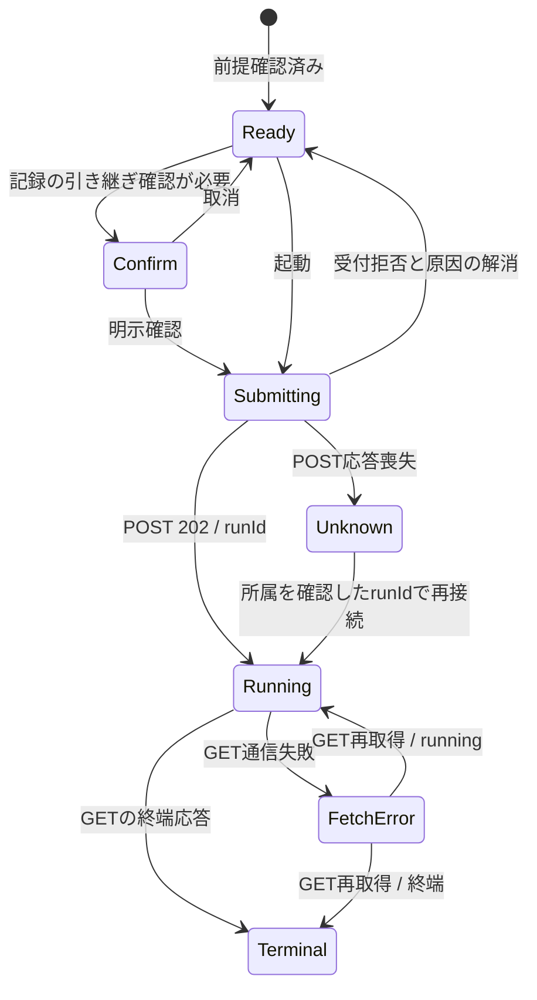

# T-204 引き継ぎ：画面状態・API契約・テスト観点

作成日: 2026-09-12。ユーザーの「T-204の画面状態・API契約・テスト観点の整理を進めてください」に基づく事前整理。

**今回の変更は本書のみ。実装は未着手。** T-203の独立レビュー、C-1の扱い、G1のSCR-02接続調整を待つ。memory・設計の正・レビュー対象コード・G1の作業ファイル・生成物は変更しない。T-204のバックログStatusはPLANNEDのまま。以下の「提案」は未承認であり、既存契約や完了条件を変更する決定ではない。

## 1. 参照と対象範囲

| 参照 | 本書で確認する内容 |
|---|---|
| [作業規約](reviews/CODEX-INSTRUCTIONS.md) §2・§5・§7 | レビュー中のコード保全、役割分担、実装前提 |
| [memory](../.claude/memory.md) AD-008・009・011、§3 | 実APIを使う、SCR-02は `/cases/{caseId}/intake`、起動はT-204、G2の実施順 |
| [画面仕様](requirements/03-spec.md) SCR-02 | 起動、段階と経過秒、記録の引き継ぎ警告、SCR-03への遷移 |
| [API設計](requirements/05-api-ipo.md) §3.1・3.2、FLOW-08、#22補足 | #12〜14、再実行の確認、未確定版の非公開 |
| [シナリオ](requirements/06-scenario-test.md) AE04・05・05b・07、TEST-16 | 一部未完了・停止・受付拒否・前版保全 |
| [エージェント設計](requirements/agent-plan.md) T-203補足 | 外部送信なし、現行ダミーの対応範囲 |
| [現行ルーター](../backend/app/api/ui/endpoints/agent_runs.py)／[DTO](../backend/app/api/schemas_runs.py)／[OpenAPI](../backend/openapi.json) | 現在接続できる契約。レビュー後・C-1移動後には再照合する |
| [RunService](../backend/app/services/run_service.py)／[RunRepository](../backend/app/repositories/run_repository.py) | 受付エラー、成功版の公開条件、進捗の実データ |
| [生成クライアント](../frontend/src/shared/api/generated/ui.ts)／[mutator](../frontend/src/shared/api/mutator.ts) | status/dataの包み、非2xxのApiError、AbortSignal |

対象は案件内の起動操作、実行状態のポーリング、停止理由、成功時の結果受渡し、記録付き再実行の確認。資料投入・読取結果一覧はT-103、明細画面はT-303、版履歴API #22はT-502の担当である。起動UIのためにこれらを黙って代行しない。

モックの「固定サンプルで案を作成」「任意ファイルは受付表示のみ」を実処理の説明として流用しない。AD-008では実案件・実APIへの接続が正。現行T-203はローカルの限定形式に対応するダミーで、S04/S06/S08/S10を精度検証済みとは表示できない。ボタン名は「案を作成」、近くに「ローカルダミーによる検証。対応形式に制限があります」と明示する案を提出する。

## 2. 画面状態

実行の業務状態と通信状態は分ける。APIの `outcome` が実行状態の正であり、GET失敗やブラウザ側の待機時間だけでサーバー実行をfailed/stoppedにしない。

| UI状態 | 条件・表示 | 操作・次の状態 |
|---|---|---|
| 前提確認中 | 案件・資料情報取得中。初期表示と取得失敗を区別 | 起動不可。取得失敗時は前提情報だけ再取得 |
| 起動不可 | 案件未選択、資料なし、読取可能候補なし、既知の上限超過、投入処理中 | 理由を文字で表示。投入・修正はG1へ。最終的な受付可否はPOSTのサーバー判定 |
| 起動可能 | 必要な前提が揃い、既知の実行が無い | 「案を作成」。件数付き引き継ぎ確認が必要なら確認へ |
| 引き継ぎ確認 | 訂正・照合・網羅性確認・判断の内訳と警告 | 取消はPOSTなし。明示確認後の1回だけacknowledgedCarryOver=true |
| 起動受付中 | POST応答待ち。「準備中…」 | 押下を即ロック。連打・Enter・再描画でもPOSTは1回 |
| 実行中 | 202でrunIdを取得、またはGETでoutcome=running | 段階・経過秒・適用閾値を表示。起動不可、途中の版や明細を公開しない |
| 通信中断 | 既知runIdのGETが失敗 | 最後に確認できた段階と「実行状況を取得できません」を表示。GET再取得だけを提供 |
| 起動結果不明 | POSTの通信切断、またはrunIdを得られないジョブ投入失敗 | 「起動結果を確認できません」。POSTの自動再送・即時の新規起動をしない。復旧経路は§6 |
| 案作成完了 | outcome=success、stopReason=completed、versionIdあり、isComplete=true | 「案を作成しました」。業務承認・送付可とは表示しない。結果画面の接続が決定済みなら受渡し |
| 一部未完了の案 | success／completed／versionIdあり、isComplete=false | 「案を作成しました（一部未完了）」。完全成功の表示をしない |
| 失敗／停止 | outcome=failedまたはstopped | 理由・経過秒・ターン数を表示。GETの定期取得を停止。途中版のリンクを作らない |
| 実行不明／契約不整合 | GETの404、未知outcome、successなのにversionId=null等 | 成功表示・結果遷移を止め、状況確認を案内。値を推測して補正しない |

`stage=done` 単独で完了判定しない。現在は失敗・停止でもdoneになる。既知の終端を受けたら、そのrunの古いrunning応答で表示を戻さない。

Unknownからの再接続には現行APIの不足があるため、矢印は必要な復旧設計を表す。現時点で実現済みとは扱わない。

### 段階・補助情報

- reading＝「資料を読取中」、extracting＝「明細を作成中」、self_checking＝「内容を確認中」。stage=nullは「実行中（段階情報なし）」とし、推測しない。
- 現行stageDetailは資料n/Nではなく、`{"completedTools": n}`または診断コード等の文字列。ツール数を資料件数に換算しない。n/Nやパーセント進捗を捏造しない。
- elapsedSecはサーバー値を表示する。ブラウザの補間を入れる場合も表示補助に限定し、期限判定・終端判定・人の作業時間の計測に使わない。
- limitsは当該runの返却値を使用し、nullは「記録なし」。40ターンや900秒等をFEに停止閾値として複製しない。残り時間の保証として表示しない。
- stageDetailは利用者向けの文章ではない。既知コードだけ日本語へ対応付け、未知コードやJSONをそのまま主要メッセージにしない。資料名・locatorもテキストとして扱い、リンクやHTMLとして実行しない。

## 3. 現行API契約

URLはすべて `/api/v1/ui` 配下。T-204からAGENT用の書込APIを呼ばない。

| API | Request | 正常応答 | UIでの用途 |
|---|---|---|---|
| #12 `POST /cases/{caseId}/agent-runs` | 正の整数caseId、JSON bodyは必須。初回は `{}` で可 | 202: runId, versionId, startedAt | runIdをポーリングに使用。返された作成中versionIdは結果として表示しない |
| #13 `GET /agent-runs/{runId}` | 正の整数runId | 200: 下表 | 実行状態の正。完了を待つ同期POSTにしない |
| #14 `GET /agent-runs/{runId}/steps` | 正の整数runId | 200: `{steps: [...]}` | 実行記録の補助表示。主ポーリングとは別の取得・エラー境界 |

POST bodyはcamelCaseのみ。ruleVersionは省略/null/`current`で現行規則を選び、明示文字列ならその版を使用する。空文字は不可。FEで最大IDや文字列順から規則を選ばず、外部モデル指定のフィールドを足さない。acknowledgedCarryOverはboolean、既定false。チェックを表示しただけでtrueにしない。

| GET #13のフィールド | 現行型・意味 | 注意 |
|---|---|---|
| runId | number | 要求中のrunと一致させる |
| outcome | running / success / failed / stopped | クライアント独自の状態をAPI値へ書き戻さない |
| stage | reading / extracting / self_checking / done / null | outcomeと別軸 |
| stageDetail | string / null | 資料件数の構造化DTOではない |
| turns / elapsedSec | number / number | 実測値。進捗率ではない |
| stopReason | 下表の9種類 / null | 内側・無応答・外側timeoutを区別 |
| limits | maxTurns / innerTimeoutS / inactivityTimeoutS / outerTimeoutS | 各値はnumber / null。旧runの欠落を固定値で補わない |
| versionId | number / null | 確定済み成功版のみ。202応答のversionIdで代用しない |
| isComplete | boolean | falseなら一部未完了、またはまだ公開可能な成功版が無い |

GET #14の各step: stepId, seq, toolName, argsDigest, argsSummary, locator, documentId, resultStatus, durationMs, parentStepId。argsSummary/locator/documentId/durationMs/parentStepIdはnull可。resultStatusはok/error/unreadable。seq順に表示し、stepIdで識別する。job_start/job_finish/job_trace_failure/job_interruptedは管理イベント。子stepや管理イベントを「新しい資料を1件読み終えた」と数えない。stepが空でも実行失敗としない。現行の開始直後stepはresultStatus=errorの仮記録であり、これだけでrun失敗や全件失敗を表示しない。

### 停止理由の表示対応（文言案）

| stopReason | 現行の通常outcome | 文言・扱い |
|---|---|---|
| completed | success | 案を作成しました。isComplete=falseは一部未完了を併記 |
| failed | failed | 案の作成に失敗しました。既知のstageDetailがあれば説明を補う |
| max_turns | stopped | 処理回数の上限に達したため停止しました |
| inner_timeout | stopped | 実行時間の上限に達したため停止しました |
| inactivity_timeout | stopped | 処理の応答が一定時間なかったため停止しました |
| outer_timeout | stopped | 処理を完了できず、監視側の制限時間で停止しました |
| repeated_call | stopped | 同じ処理の繰り返しを検知して停止しました |
| no_readable_document | stopped | 読取可能な資料がないため停止しました。HTTP 400の受付拒否とは区別 |
| validation_loop | stopped | 同じ確認エラーを解消できず停止しました |

上表は [finish処理](../backend/app/repositories/run_repository.py) の通常経路。たとえばJSONL出力失敗でoutcome=failed、stopReason=completedが残る場合もあるため、stopReasonだけで成功判定しない。既知のlocal_dummy_unsupportedは「現在のローカルダミーでは資料を解釈できません」と説明できるが、未知診断は汎用表示とする。

### エラー応答と操作

共通形は `{code, message, details}`。生成型上のdetailsは構造が保証されていないため、必要なキーと型を検証してから表示する。

| HTTP / code | 扱い |
|---|---|
| 400 / E_NO_READABLE_DOCUMENT | 起動受付拒否。実行を作成済みとして表示しない。G1の資料読取結果へ案内 |
| 400 / E_CARRY_OVER_NOT_ACKNOWLEDGED | 人の記録がある。自動でtrueを付けて再送しない。現在は件数内訳が返らない点に注意 |
| 409 / E_RUN_IN_PROGRESS | 二重起動を止める。既知の同案件runIdがある場合だけ状況取得へ。エラーにはrunIdがない |
| 413 / E_LIMIT_EXCEEDED | `details.kind`=documents/fileBytes/pdfPages/xlsxSheets、actual、limit、任意documentIdを表示用に変換。入力修正まで起動しない |
| 404 / E_NOT_FOUND（POST） | 案件または指定/現行規則が無い。コードだけで案件削除と断定しない |
| 404 / E_NOT_FOUND（GET） | 実行を取得できない。poll停止。POSTで代わりのrunを勝手に作らない |
| 400 / E_REQUEST_INVALID、422 / E_REQUEST_INVALID | UI入力・契約不整合を案内。details.errorsの入力値本文を表示しない。自動再送しない |
| 503 / E_EXTERNAL_SEND_NOT_APPROVED | 未承認の外部送信構成。ローカルUIから外部送信へ切り替えない |
| 503 / E_JOB_START_FAILED | 予約したrunが保存済みの可能性がある。runIdを返さないため起動結果不明として扱う |
| 通信切断／その他5xx | POSTは結果不明、GETは通信中断。元のエラー文字列をそのまま画面へ出さない |

#12の上限detailsは、G1の資料投入API #5の `details.limit` 識別子契約とは異なる。UIメッセージを共通化する場合でも、APIごとのdecoderを分けてから表示モデルへ変換する。413のlimitを常に文字列または常に数値と仮定しない。

OpenAPIは共通ERROR_RESPONSESによりGETにも400/409/413/422/503を列挙している。列挙があるだけで「GETがcarry-over確認を要求する」といった業務フローは作らない。

## 4. ポーリングと重複防止（実装案）

1. 202後、返却されたrunIdでGETを直ちに開始する。query keyにrunIdを含め、UIの案件スコープも別に保持する。202のcaseId/runId対応以外を推測しない。
2. ポーリング間隔は **2秒を候補**とし、UI側の1か所で管理する。これは表示更新間隔の案であり、エージェントの停止閾値やAPI契約ではない。
3. 正のrunIdがあり、通信中断中でなく、終端を受けていない場合だけ継続。最初のGETがすぐsuccess/stoppedでも中間段階を捏造しない。完了後のGET・遷移・キャッシュ更新を多重実行しない。
4. GETの自動retryは初版では0を候補とし、失敗時は手動の「状況を再取得」で再開する。最後の成功レスポンスは保持し、古い情報である旨を表示する。
5. POST mutationは **retry:falseを明示**。現行providersの既定mutations.retry=1を継承しない。タイムアウト・ネットワーク復帰・フォーカス復帰・再マウント時にPOSTを再実行しない。
6. 案件変更・run変更・unmountでは進捗/step GETを中止し、前runの遅延応答を現画面へ反映しない。GET中止やページ離脱はサーバーrunのキャンセルではない。現行APIにキャンセル操作は無い。
7. 非表示タブでは定期GETを休止し、復帰時は既知runのGETを再取得する案。前景化しても起動POSTを発行しない。旧runの応答を新runへ混ぜない。
8. 成功後はG1の案件/資料キャッシュを必要に応じて無効化するが、再実行そのものはユーザー操作からのみ開始する。記録付き再実行の同意は案件・実行要求ごとにリセットする。
9. step取得は実行記録を開いた時のGETと手動再取得を初版案とする。記録取得の失敗で主進捗を失敗へ変更しない。資料や引数の全文を詳細UIで復元しない。

再接続のためにブラウザへ保持する場合は、自分の202で確認したcaseId/runIdの組だけを保存する案とする。資料本文・全trace・同意済みフラグは保存しない。現行GET #13にcaseIdが無いため、任意URLのrunIdの案件所属を確認できるとは扱わない。

## 5. 実装時の配置とG1接続案

| 境界 | 担当候補・責務 |
|---|---|
| Data Access | `frontend/src/features/agent-runs/api.ts`。生成関数をwrapし、期待statusを検証して成功dataを返す。APIの型を手書きで複製しない |
| 状態管理 | 同ディレクトリの `hooks.ts`。mutationの再送禁止、runごとのGET、取消・遅延応答・終端管理 |
| 表示変換 | `run-state.ts`等の決定的関数。outcome/stage/stopReasonの日本語表示と不整合処理。API型は生成型から参照 |
| Presentation | `components/RunPanel.tsx`、進捗・再実行確認の子部品。caseIdと結果受渡しを明示的に受ける。資料投入を重複実装しない |
| G1接続 | G1のIntakePageに起動パネルを組み込む。挿入位置・投入中フラグ・query key・翻訳キーを担当間で調整してから変更 |
| G3接続 | 確定したversionIdを受け取る結果表示先。T-303のURLを独自に確定しない |

生成クライアントは `{status, data, headers}` を返し、型上は成功/エラーのユニオン。mutatorは非2xxでApiErrorをthrowするが、TSはそれだけでユニオンを絞り込まない。`as AgentRunResponse`で隠さず、wrapperで期待statusを確認する。テストでは実際のApiErrorインスタンスを使用する。

この配置は提案のみ。既存のG1ファイル、providers、i18n、orval設定を今回編集しない。新規コードのファイル名にチケットIDを付けない。

## 6. 実装前に解決する契約不足・判断点

| ID | 仕様と現状の差 | 推奨する整理／未決事項 |
|---|---|---|
| D1：記録付き再実行 | #22 `GET /cases/{caseId}/versions` は現行OpenAPIに無い。E_CARRY_OVER_NOT_ACKNOWLEDGEDも件数を返さない。FEだけではボタン直前の「訂正n件・照合n/N・網羅性確認・判断n件」を作れない | 必要最小限の読取APIを先行スライスにするか、T-204の初版受入範囲を分けるか、orchestrator判断。現状でTEST-16/X12達成としない。件数を0で補わず、ack=trueで迂回しない |
| D2：成功後の遷移 | SCR-03はT-303、要約API #23 `GET /versions/{versionId}` はT-302で未実装。AD-013のSCR-01暫定方針はSCR-02の完了後遷移を決めていない | T-204時点はSCR-02で確定/一部未完了を表示し、結果遷移の接続はG3で行う案。承認前は正式な完了条件の削減としない。存在しないURLへ遷移させない |
| D3：runId喪失・再接続 | #13はrunId必須。案件ごとの実行一覧/activeRunIdが無く、409・503にもrunIdが無い。POST応答喪失時に実行を特定できない | 既知runは再GET可能。未知runは状態不明表示。案件スコープの実行照会を追加するかを別途決定。latest runの推測、POST連打による探索はしない |
| D4：資料n/N | #13のstageDetailはJSON文字列や診断コード。構造化された資料完了数/総数は無い | 初版は段階・経過秒・ターン数・適用閾値を表示する案。n/Nが必須ならAPI契約追加を依頼。step数から捏造しない |
| D5：部分結果の範囲 | #13は失敗/停止時versionId=null。#14は資料ID/locator等を返すが、本文や完全な未走査範囲一覧ではない | 停止理由・実行記録までを表示。途中版や全不足範囲の表示を受入に含めるなら読取契約を調整。202のversionIdで非公開制約を迂回しない |
| D6：前提とレビュー | T-203はREVIEWING、C-1は未実施、G1 IntakePageは作業中。規則一覧/設定APIもT-204に無い | T-203レビュー後の契約を再確認。G1接続点と現行規則の準備は担当に確認。FEが勝手に規則を新設・選定しない |

RunRepositoryの人の記録検査は案件内の過去版全体を見る。将来#22から最新の1版だけ取り出して警告を出すと、受付側と不一致になる可能性がある。どの版の内訳を示すかもD1で定義する。単にrowMatchTotal（全明細数）が正であることを「人の記録あり」の判定に使わない。

## 7. テスト観点（未実装・未実行）

以下を実装時のRED設計に使用する。エージェントループの単体テストではなく、FEのAPI境界・状態変換・ユーザー操作を対象にする。API mockではHTTP statusとJSON bodyを同時に与え、送信内容・呼出し回数・表示・遷移を確認する。

| ID／層 | Given / When | Then：確認する外部挙動 |
|---|---|---|
| A01／API | POSTが202を返す | camelCaseのbodyと案件URL、runIdを採用。202のversionIdは結果リンクに出ない |
| A02／API | 202/200以外または非2xx | wrapperが成功型へcastせず拒否。400/409/413/422/503のApiError分岐が実responseで成立 |
| A03／API | POST413でdocuments/fileBytes/pdfPages/xlsxSheets、details欠落・未知kind | 正しい単位とactual/limitを表示、未知/欠落は汎用文言。G1の投入API契約を誤適用しない |
| A04／API | #13の404、POSTの404 | GETは実行不明、POSTは案件/規則の確認。別runを自動作成しない |
| S01／状態 | 9種のstopReason、4種のoutcome、stage=null/done | 停止理由を潰さず表示。doneやcompleted単独では成功にならない |
| S02／状態 | success/completedとisComplete=true/false | 完全な案と一部未完了の案を区別。担当者確認済み/送付可を表示しない |
| S03／状態 | successでもversionId=null、未知値・欠落 | 成功遷移をしない。型不整合を汎用エラーとして扱う |
| S04／状態 | limits各null、stageDetailのJSON/未知診断 | 閾値を固定値で補わず、ツール数を資料n/Nに変換しない |
| H01／hooks | 未起動、202、running、終端の順に応答 | 202前はGETなし、以後runIdで取得し終端後は停止。fake timerを進めても余分なGETなし |
| H02／hooks | 最初のGETが即座にsuccess/failed/stopped | 中間段階を作らず、確定条件を満たす時だけ結果受渡しを1回実行 |
| H03／hooks | 既定mutations.retry=1のQueryClientでPOST通信エラー | T-204のretry:falseが効き、POST呼出しは1回。テスト用既定retry:falseだけでは検証を済ませない |
| H04／hooks | GET中に通信断、その後手動再取得 | 最終情報＋取得失敗を表示。サーバーfailedへ変換せず、POSTなしで追跡を再開 |
| H05／hooks | A案件の遅延GET中にB案件へ切替／新run開始／unmount | Aの応答や終端をBへ反映しない。旧要求のsignalを中止し、キャッシュと同意状態も分離 |
| H06／hooks | 非表示タブから復帰、再描画、再マウント | 実装方針どおり既知runのGETだけを再開。POSTや結果遷移を重複させない |
| H07／hooks | キャッシュ無効化で案件/資料を再取得 | 同一Reactルートで結果更新を確認する。renderHookを2つ作る既存G1テストの落とし穴を再現しない |
| U01／UI | 準備不足・投入中・POST中・running中に連打/Enter | 起動不可理由が分かり、POSTが重複しない。実行のキャンセルと誤認する操作を出さない |
| U02／UI | 記録の内訳あり、確認取消/承認、案件変更 | n/N・件数・前版保全の警告。取消POST=0、承認POST=1/ack=true、同意を別案件へ持ち越さない（D1解決後） |
| U03／UI | E_CARRY_OVER_NOT_ACKNOWLEDGEDを受信 | 自動再送なし。件数が無ければ0件表示や確認済み扱いにしない |
| U04／UI | E_RUN_IN_PROGRESSで既知runIdあり/なし | 既知runのみ状況取得。未知runにIDを作って割り当てず、二重起動しない（D3） |
| U05／UI | POST応答喪失またはE_JOB_START_FAILED | 「起動結果不明」。自動retryなし、GETの通信失敗とも表示を区別 |
| U06／UI | 実行記録が空／取得失敗／子step・管理イベントあり | 主進捗を保持。全stepを資料数や失敗件数にしない。nullの所要を0msと捏造しない |
| U07／UI | キーボード/読み上げ/色なしで操作 | 状態名と停止理由が文字で伝わり、警告確認を操作可能。段階の変更を通知し、毎秒の経過表示で読み上げを占有しない |
| U08／UI | URLやHTML風文字列を含む診断・資料名 | リンク取得/HTML実行なし。生の例外・未知コードを主要メッセージへ漏らさない |
| I01／実API | 合意済みの架空ローカル対応資料で起動→ポーリング | 202→runningまたは即終端→success、確定版だけ受渡し。D2の暫定範囲と正式SCR-03接続を混同しない |
| I02／実API | 起動前読取不能・上限超過と、実行中の停止 | 受付拒否と停止済みrunを区別。AE05/05b/07に対応。明細0件の正常成功を作らない |
| I03／実API | 記録のある既存版から再実行 | 件数警告→明示確認→新版→前版保全。#22/23等が未実装ならTEST-16/X12は未実施として残す |

変異による強度確認の候補: mutationのretry:falseを外すとH03が落ちる、成功判定をstage=doneだけにするとS01/S03が落ちる、終端後のinterval停止を外すとH01が落ちる、ack=trueを常設するとU02/U03が落ちる、query keyからrunIdを除くとH05が落ちる。今回は変異試験も実行していない。

FEのAPI/hook/componentテストは実装後に通常のMakefileゲートで確認する。G1の全体エラーを専用tsconfigで隠さず、担当と調整して解消する。UI実APIの確認もエージェントの抽出精度評価とは分け、ローカルダミーの13ケース合格をS01〜S10の達成に読み替えない。

## 8. 今回の確認結果と終了

- 既存の設計文書、ソース、保存済みOpenAPIを読み取り専用で照合した。#12〜14の存在、DTOの全フィールド、4 outcome・9 stopReason、#22/23の未実装を確認した。
- 文書内のローカルリンク14件の存在、OpenAPIの4 DTOのフィールド記載、outcome/stopReasonの列挙網羅、テスト観点26件のID重複なし、末尾空白なしを静的確認した。git diff --checkもPASS。実APIの動作検証を意味しない。
- 新規のUI/API実装、テストコード、API呼出し、DB操作、migration、OpenAPI/orval再生成、全体回帰は行っていない。既存の回帰結果を今回のT-204の合格として数えない。
- 今回は整理文書のみでありTDDのRED/GREENは未実施。T-204実装着手はT-203レビュー結果と上記の接続・受入範囲の調整後。

**再レビュー依頼（T-204の事前整理文書）。** 本書の整理作業を完了し、ここで停止する。T-204本体はPLANNEDを維持し、memoryは編集しない。
